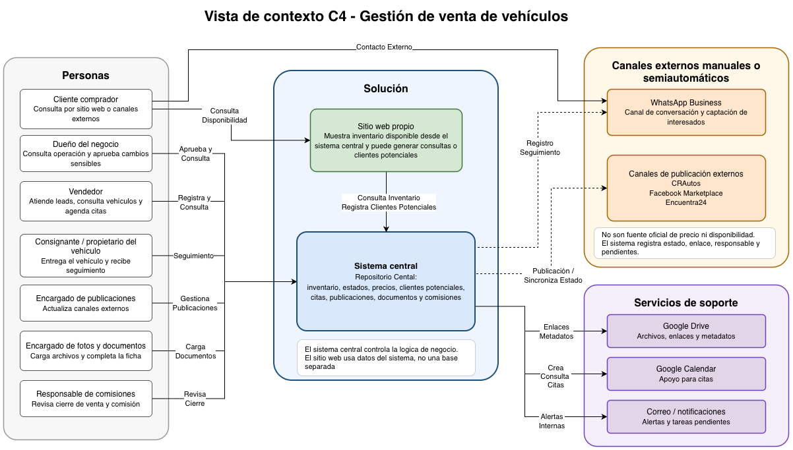

# Avance 1

## 1. Descripción y alcance

### 1.1 Nombre del sistema

**Gestión de venta de vehículos**

Plataforma para apoyar la venta de vehículos por consignación, con control de inventario, clientes, publicaciones, citas, documentos y comisiones.

### 1.2 Descripción general

Gestión de venta de vehículos apoya la operación diaria de un negocio que recibe vehículos de terceros para venderlos por consignación. El sistema registra el vehículo, sus datos comerciales, su estado, las fotos, los documentos, los clientes interesados, las citas y el cierre de la venta o el retiro del vehículo.

Hoy la información queda repartida entre WhatsApp, hojas de cálculo, carpetas de fotos, publicaciones en plataformas externas y mensajes separados con clientes. Esa forma de trabajo provoca datos duplicados, precios desactualizados, seguimiento incompleto de clientes potenciales y poca claridad sobre el estado real de cada vehículo.

El sistema no busca reemplazar todos esos canales. Su función principal es ordenar la operación y dejar un repositorio centralizado. Los canales externos siguen existiendo, pero el negocio deja de depender de cada conversación o publicación como si fuera el registro oficial.

### 1.3 Problema arquitectónico central

El problema principal no es solo administrar vehículos. El punto crítico es mantener información confiable sobre cada vehículo mientras esa información se consulta, copia o actualiza en varios canales: WhatsApp Business, Google Drive, Google Calendar, CRAutos, Facebook Marketplace, Encuentra24 y el sitio web propio.

La arquitectura resuelve cómo conservar un repositorio centralizado cuando algunos canales permiten integración automática y otros dependen de tareas manuales. También debe mostrar cuándo una publicación externa ya no coincide con el precio, estado o disponibilidad registrados en el sistema.

Para evitar que el sistema termine siendo solo un CRUD de inventario convencional, se toman las siguientes reglas de base:

- El sistema interno es un repositorio centralizado del precio, estado comercial, disponibilidad, datos del vehículo, clientes potenciales, citas, documentos registrados y comisiones.
- Google Drive guarda archivos, pero el sistema guarda el vínculo, el estado del archivo, quién lo cargó y a qué vehículo pertenece.
- Google Calendar puede apoyar la agenda, pero la cita comercial queda registrada en el sistema.
- WhatsApp Business es un canal de contacto. El cliente potencial y su seguimiento quedan registrados en el sistema.
- CRAutos, Facebook Marketplace y Encuentra24 se tratan como canales externos. Cuando no exista integración confiable, el sistema registra el estado de publicación y genera tareas manuales.
- El sitio web propio se considera parte de la solución cuando muestra el inventario desde la fuente de verdad interna.

### 1.4 Relación del comprador con la solución

En este proyecto aplican ambos modelos de interacción con el comprador.

El comprador puede consultar el sitio web propio para revisar vehículos disponibles, fotos, precio, disponibilidad y opciones para solicitar una visita. En ese caso, el sitio web actúa como canal público de la solución, pero no reemplaza al sistema central. La información que muestra debe salir del repositorio interno.

El comprador también puede llegar por canales externos, como WhatsApp Business, CRAutos, Facebook Marketplace o Encuentra24. En esos casos, el vendedor registra el contacto como cliente potencial, lo asocia con el vehículo de interés y define la siguiente acción comercial.

En ambos caminos, el seguimiento formal queda dentro del sistema. Las conversaciones, publicaciones externas o consultas del sitio web no son la fuente oficial del estado del vehículo; sirven como canales de entrada o consulta.

### 1.5 Reglas de consistencia con canales externos

| Situación | Respuesta esperada del sistema |
|---|---|
| Cambio de precio | Actualiza el precio interno de inmediato, guarda el valor anterior y marca las publicaciones externas como actualizadas, pendientes o fallidas según el canal. |
| Publicación externa desactualizada | Muestra una alerta al vendedor y al encargado de publicaciones. Si el canal es manual, crea una tarea para corregir la publicación. |
| Vehículo reservado | Bloquea nuevas reservas, advierte al vendedor y marca las publicaciones como pendientes de actualización de disponibilidad. |
| Vehículo vendido o retirado | Cierra el ciclo comercial del vehículo, bloquea nuevas citas y genera tareas para retirar o actualizar publicaciones externas. |
| Falla de integración | No revierte el cambio interno. Registra el error, programa reintento cuando aplique y deja visible la tarea pendiente. |
| Datos recibidos por WhatsApp | Permite convertir la conversación en cliente potencial, asociarlo a un vehículo y registrar la siguiente acción. |

### 1.6 Alcance dentro del sistema

- Registro y administración de vehículos en consignación.
- Control del estado del vehículo mediante un ciclo de vida definido.
- Gestión diferenciada de cliente vendedor o consignante y cliente comprador.
- Registro de clientes potenciales provenientes de WhatsApp, redes sociales, sitio web o plataformas externas.
- Agenda de citas para ver vehículos y seguimiento de la cita.
- Gestión de fotos y documentos mediante enlaces y metadatos asociados al vehículo.
- Control de publicaciones externas con estado por canal.
- Notificaciones internas para vendedores, administrador y encargado de publicaciones.
- Reportes básicos de inventario, clientes potenciales, citas, ventas y comisiones.
- Registro de comisiones o montos ligados a la venta.
- Auditoría de cambios de precio, estado, publicación, documentos y citas.

### 1.7 Alcance fuera del sistema

- Procesamiento directo de pagos bancarios.
- Traspaso legal completo del vehículo.
- Validación automática con Registro Nacional.
- Publicación automática garantizada en todas las plataformas externas.
- Sistema contable completo.
- Chatbot avanzado con IA generativa.
- Tasación oficial automática del valor del vehículo.

### 1.8 Justificación del alcance

El alcance se concentra en la operación comercial y administrativa de la consignación. La solución ordena el trabajo de inventario, clientes potenciales, citas, publicaciones, documentos y comisiones, sin asumir tareas legales, bancarias o contables que pertenecen a otros procesos.

Esta delimitación permite tratar problemas arquitectónicos reales: consistencia entre canales, historial de cambios, ciclo de vida del vehículo, permisos por rol, integración por adaptadores y manejo de fallas externas.

## 2. Ciclo de vida del vehículo

La lógica del ciclo de vida del vehículo es una regla central del dominio. Cada cambio de estado debe tener un responsable, una transición válida y un registro de auditoría. El estado no es solo una etiqueta visual; controla qué acciones puede hacer el negocio.

### 2.1 Estados principales

| Estado | Descripción | Acciones permitidas |
|---|---|---|
| Ingresado | El vehículo fue registrado por primera vez. | Completar datos básicos, asignar consignante, iniciar revisión. |
| Pendiente de documentación | Faltan documentos requeridos para seguir el proceso. | Cargar documentos, solicitar datos al consignante, bloquear publicación. |
| Pendiente de fotos | Los datos mínimos existen, pero faltan fotos comerciales. | Cargar fotos, asignar tarea al encargado de fotos, bloquear publicación. |
| Listo para publicar | El vehículo tiene datos, fotos y documentos mínimos. | Preparar texto, definir canales, aprobar publicación. |
| Publicado | El vehículo aparece en el sitio web propio o en canales externos. | Registrar clientes potenciales, agendar citas, cambiar precio, pausar publicación. |
| Con cliente potencial activo | Existe al menos un comprador con seguimiento pendiente. | Registrar interacción, agendar cita, descartar cliente potencial, mantener publicación. |
| Cita agendada | Hay una visita o revisión coordinada con un comprador. | Confirmar cita, reprogramar, cancelar, registrar resultado. |
| Reservado | El vehículo está apartado por un comprador. | Bloquear nuevas reservas, actualizar disponibilidad, preparar cierre. |
| Vendido | La venta fue cerrada. | Cerrar publicación, registrar comisión, bloquear nuevos clientes potenciales y citas. |
| Retirado | El consignante retiró el vehículo o el negocio dejó de ofrecerlo. | Cerrar publicación, bloquear nuevos clientes potenciales y citas, guardar motivo. |

### 2.2 Flujo base

Flujo principal:

```text
ingresado -> pendiente de documentación -> pendiente de fotos -> listo para publicar -> publicado -> con cliente potencial activo -> cita agendada -> reservado -> vendido
```

Rutas alternas permitidas:

- ingresado -> retirado, cuando el vehículo no cumple las condiciones para venderse.
- publicado -> retirado, cuando el consignante decide sacarlo de la venta.
- reservado -> publicado, cuando la reserva se cae y el vehículo vuelve a estar disponible.
- con cliente potencial activo -> publicado, cuando el cliente potencial se descarta y no queda seguimiento pendiente.
- cita agendada -> publicado, cuando la cita no concreta y no hay reserva.

### 2.3 Reglas de transición

| Transición | Quién puede hacerla | Regla de control | Evento auditado |
|---|---|---|---|
| Ingresado -> pendiente de documentación | Vendedor o encargado de documentos | Debe existir consignante asociado. | Cambio de estado, usuario, fecha y campos faltantes. |
| Pendiente de documentación -> pendiente de fotos | Encargado de documentos | Deben estar marcados los documentos mínimos. | Documentos completados y responsable. |
| Pendiente de fotos -> listo para publicar | Encargado de fotos o vendedor autorizado | Debe existir una galería mínima de fotos. | Fotos agregadas, fecha y responsable. |
| Listo para publicar -> publicado | Encargado de publicaciones o dueño del negocio | Debe existir precio aprobado y descripción comercial. | Canales seleccionados, texto usado y fecha. |
| Publicado -> con cliente potencial activo | Vendedor | Debe registrarse canal de origen y vehículo de interés. | cliente potencial creado, canal, fecha y siguiente acción. |
| Con cliente potencial activo -> cita agendada | Vendedor | Debe existir fecha, hora y responsable de atención. | Cita creada, comprador y vehículo. |
| Cita agendada -> reservado | Vendedor autorizado o dueño del negocio | Debe confirmarse comprador y monto o condición de reserva. | Reserva creada, fecha, usuario y condiciones. |
| Reservado -> vendido | Dueño del negocio o responsable financiero | Debe registrarse cierre y comisión. | Venta cerrada, monto, comisión y responsable. |
| Publicado / reservado -> retirado | Dueño del negocio o vendedor autorizado | Debe indicarse el motivo del retiro y si fue solicitado por el consignante. | Retiro, motivo, fecha y responsable. |

### 2.4 Transiciones prohibidas y bloqueos

- No se puede publicar un vehículo si faltan documentos o fotos.
- No se puede vender un vehículo que nunca fue reservado o aprobado por el dueño del negocio o por un responsable autorizado.
- No se pueden crear nuevas citas para un vehículo vendido o retirado.
- No se pueden crear nuevas reservas para un vehículo reservado, vendido o retirado.
- No se puede cambiar el precio sin guardar valor anterior, valor nuevo, usuario y fecha.
- No se puede borrar una publicación externa del historial; solo se cambia su estado.

### 2.5 Efecto sobre publicaciones externas

| Cambio en el vehículo | Efecto en publicaciones |
|---|---|
| Pasa a listo para publicar | Habilita creación de publicación interna y tareas por canal externo. |
| Pasa a publicado | Registra canal, fecha, enlace si existe, responsable y estado inicial. |
| Cambia el precio | Marca cada publicación como actualizada, pendiente de actualización o fallida. |
| Pasa a reservado | Marca publicaciones como pendientes de cambio de disponibilidad y alerta a ventas. |
| Pasa a vendido | Genera tarea de retiro o cierre por canal y bloquea nuevas citas. |
| Pasa a retirado | Genera tarea para pausar o eliminar publicaciones y guarda motivo. |

## 3. Stakeholders y drivers arquitectónicos

Las decisiones de arquitectura se justifican por los intereses de los actores, las restricciones de los canales externos y los atributos de calidad que el sistema necesita cuidar desde el inicio.

### 3.1 Stakeholders principales

| Stakeholder | Interés principal | Necesidad o expectativa |
|---|---|---|
| Dueño del negocio | Control general de la operación. | Ver inventario, clientes potenciales, ventas, citas, comisiones y problemas de publicación desde un solo lugar. |
| Vendedor | Atender compradores sin perder tiempo. | Consultar datos del vehículo, fotos, precio, estado y disponibilidad sin revisar varias fuentes. |
| Cliente vendedor o consignante | Dar seguimiento al vehículo que dejó en consignación. | Saber si el vehículo fue publicado, si tiene interesados y si hubo cambios de precio o estado. |
| Cliente comprador | Recibir información confiable. | Ver precio, fotos, disponibilidad y poder coordinar una visita sin recibir datos contradictorios. |
| Encargado de publicaciones | Mantener canales externos al día. | Saber cuáles vehículos están listos para publicar y cuáles publicaciones quedaron pendientes o fallidas. |
| Encargado de fotos y documentos | Completar la ficha del vehículo. | Identificar qué archivos faltan y dejar evidencia de carga o revisión. |
| Responsable financiero o de comisiones | Calcular los montos de cierre. | Revisar precio final, comisión, venta y responsable del cierre. |
| Administrador técnico del sistema | Mantener operación y permisos. | Administrar usuarios, roles, integraciones, errores y disponibilidad del sistema. |

### 3.2 Plataformas externas como restricciones técnicas

| Canal o sistema externo | Tipo de relación | Implicación arquitectónica |
|---|---|---|
| WhatsApp Business | Canal de entrada y seguimiento comercial. | El sistema debe asociar contactos y conversaciones a clientes potenciales sin asumir que todo se automatiza. |
| Google Drive | Almacenamiento externo de archivos. | La ficha del vehículo guarda enlaces, estado y metadatos; no depende de carpetas sueltas. |
| Google Calendar | Apoyo para agenda. | Las citas comerciales se registran internamente y se sincronizan cuando sea posible. |
| CRAutos | Publicación externa. | Puede manejarse como registro de estado o integración si el canal lo permite. |
| Facebook Marketplace | Publicación externa y captación. | Requiere control manual o semiautomático porque no debe asumirse publicación garantizada. |
| Encuentra24 | Publicación externa. | El sistema registra enlace, fecha, responsable y estado de actualización. |
| Correo / notificaciones | Avisos internos. | Se usa para alertar cambios de estado, fallas de integración o tareas pendientes. |
| Sitio web propio | Canal propio de consulta. | Forma parte de la solución cuando consume inventario desde la fuente de verdad interna. |

### 3.3 Drivers arquitectónicos

| Driver | Preocupación real | Decisión estructural que provoca |
|---|---|---|
| Repositorio centralizado interno | Precio, estado, disponibilidad y datos del vehículo no pueden depender de hojas, chats o publicaciones externas. | Usar un módulo central de inventario con reglas de estado, validaciones y auditoría. |
| Consistencia con publicaciones externas | Un cambio interno puede tardar en llegar a CRAutos, Marketplace o Encuentra24. | Separar inventario de publicaciones y manejar estados por canal: actualizado, pendiente, fallido o manual. |
| Ciclo de vida del vehículo | El negocio necesita saber qué acciones son válidas en cada etapa. | Modelar estados y transiciones como regla de dominio, no como texto libre. |
| Trazabilidad comercial | Se necesita saber quién cambió precio, estado, documentos, cita o publicación. | Guardar eventos de auditoría con usuario, fecha, valor anterior, valor nuevo y canal afectado. |
| Integraciones con distinto nivel de madurez | No todos los canales permiten la misma automatización. | Usar adaptadores por canal y evitar que módulos internos llamen directamente a servicios externos. |
| Respuesta rápida a vendedores | Durante una conversación, el vendedor necesita datos en segundos. | Priorizar consultas de ficha de vehículo y búsquedas comunes con datos preparados para lectura. |
| Seguridad y privacidad | Hay teléfonos, documentos, fotos y datos comerciales sensibles. | Aplicar roles, permisos por acción y registro de acceso a documentos. |
| Crecimiento de canales | El negocio puede agregar otro marketplace o canal propio. | Mantener bajo acoplamiento entre inventario, clientes potenciales, publicaciones, agenda e integraciones. |

## 4. Escenarios de calidad

Los escenarios siguientes se enfocan en condiciones que afectan la arquitectura. Cada uno usa una medida verificable para evitar que el atributo quede como una intención general.

### Escenario 1 - Consulta rápida de inventario

| Elemento | Descripción |
|---|---|
| Atributo de calidad | Rendimiento |
| Fuente | Vendedor |
| Estímulo | El vendedor necesita consultar un vehículo mientras atiende a un comprador. |
| Entorno | Horario comercial, desde navegador o dispositivo móvil. |
| Artefacto afectado | Módulo de inventario y API de consulta. |
| Respuesta | El sistema muestra ficha del vehículo con datos principales, fotos, precio, estado, disponibilidad y estado de publicaciones. |
| Medida | El 95% de las consultas de ficha debe responder en menos de 3 segundos bajo carga normal de horario comercial. |

Justificación: si la consulta tarda demasiado, el vendedor vuelve a buscar datos en WhatsApp, hojas de cálculo o carpetas, y el sistema pierde su valor operativo.

### Escenario 2 - Cambio de precio y consistencia de publicaciones

| Elemento | Descripción |
|---|---|
| Atributo de calidad | Integridad de datos y consistencia operacional |
| Fuente | Dueño del negocio o vendedor autorizado |
| Estímulo | Se actualiza el precio de un vehículo ya publicado. |
| Entorno | El vehículo tiene publicaciones en uno o varios canales externos. |
| Artefacto afectado | Inventario, historial de cambios, módulo de publicaciones e integraciones. |
| Respuesta | El sistema actualiza el precio interno, registra el cambio y marca cada publicación como actualizada, pendiente de actualización, fallida o manual. |
| Medida | El precio interno queda actualizado en menos de 2 segundos. El 100% de los cambios guarda usuario, fecha, valor anterior y valor nuevo. Las tareas o estados de publicación se crean en menos de 1 minuto. En canales con integración disponible, se intenta sincronizar antes de 20 minutos. |

Justificación: el alcance no promete publicación automática en todos los canales. Por eso se separa el cambio interno de la actualización externa y se deja visible cualquier diferencia.

### Escenario 3 - Estado reservado, vendido o retirado

| Elemento | Descripción |
|---|---|
| Atributo de calidad | Consistencia de estado |
| Fuente | Vendedor o dueño del negocio |
| Estímulo | Un vehículo cambia a reservado, vendido o retirado. |
| Entorno | Existen clientes potenciales abiertos, citas futuras o publicaciones activas. |
| Artefacto afectado | Ciclo de vida del vehículo, agenda, clientes potenciales y publicaciones. |
| Respuesta | El sistema bloquea nuevas reservas o citas según el estado, alerta a vendedores y crea tareas para actualizar o cerrar publicaciones. |
| Medida | El bloqueo interno se aplica en menos de 2 segundos. Las alertas y tareas de publicación se generan en menos de 1 minuto. Ningún usuario sin permiso puede revertir el estado sin registrar motivo. |

Justificación: cuando el estado real del vehículo no se refleja en la operación, se ofrecen vehículos no disponibles y se da información incorrecta al comprador.

### Escenario 4 - Falla de integración externa

| Elemento | Descripción |
|---|---|
| Atributo de calidad | Interoperabilidad y resiliencia |
| Fuente | Google Drive, Google Calendar, WhatsApp Business o canal de publicación externo |
| Estímulo | Una integración no responde, devuelve error o no confirma la operación. |
| Entorno | Operación normal con servicios externos parcialmente disponibles. |
| Artefacto afectado | Módulo de integraciones, cola de eventos y registro de errores. |
| Respuesta | El sistema mantiene el cambio interno, guarda el intento de integración, programa reintento cuando aplique y muestra el pendiente al responsable. |
| Medida | Cada intento registra canal, operación, entidad afectada, fecha, estado, mensaje de error y número de reintentos. Los errores visibles se actualizan en menos de 1 minuto. |

Justificación: la falla de un servicio externo no debe borrar ni esconder el cambio comercial. El negocio necesita saber qué quedó pendiente y quién debe atenderlo.

### Escenario 5 - Registro de cliente potencial en atención comercial

| Elemento | Descripción |
|---|---|
| Atributo de calidad | Usabilidad |
| Fuente | Vendedor |
| Estímulo | Entra un comprador interesado por WhatsApp, redes sociales, sitio web o plataforma externa. |
| Entorno | El vendedor atiende varias conversaciones al mismo tiempo. |
| Artefacto afectado | Módulo de clientes potenciales y ficha del vehículo. |
| Respuesta | El sistema permite registrar nombre o usuario, teléfono, vehículo de interés, canal de origen y siguiente acción. |
| Medida | Un cliente potencial básico debe registrarse en menos de 1 minuto y con no más de cinco campos obligatorios. |

Justificación: si registrar el cliente potencial toma demasiado, el vendedor seguirá usando notas sueltas y el historial comercial quedará incompleto.

### Escenario 6 - Acceso a documentos del vehículo

| Elemento | Descripción |
|---|---|
| Atributo de calidad | Seguridad y privacidad |
| Fuente | Vendedor, encargado de documentos o administrador |
| Estímulo | Un usuario intenta consultar o descargar documentos asociados a un vehículo. |
| Entorno | Hay datos personales, documentos del vehículo y archivos del consignante. |
| Artefacto afectado | Módulo de documentos, permisos y auditoría. |
| Respuesta | El sistema valida el rol, muestra solo documentos autorizados y registra el acceso cuando se trate de archivos sensibles. |
| Medida | El 100% de accesos a documentos sensibles debe validar el rol. Los accesos autorizados a documentos sensibles quedan registrados con usuario, fecha, vehículo y acción. |

Justificación: los documentos no deben circular como enlaces sin control. El sistema necesita saber quién puede verlos y cuándo se usaron.

## 5. Vista de contexto C4

### 5.1 Descripción de la vista

La vista de contexto C4 muestra a Gestión de venta de vehículos como el sistema central que ordena la operación de venta por consignación. La vista separa cuatro grupos: personas que usan o dependen del sistema, la solución propia, los canales externos manuales o semiautomáticos y los servicios de soporte.

La solución propia está formada por el sistema central y el sitio web propio. El sistema central conserva la fuente de verdad del inventario, estados, precios, clientes potenciales, citas comerciales, historial de cambios, comisiones y estado de publicaciones. El sitio web propio forma parte de la solución cuando muestra el inventario desde esa fuente interna.

Los canales externos, como WhatsApp Business, CRAutos, Facebook Marketplace y Encuentra24, no controlan la operación. Se usan para atraer compradores, conversar con clientes o publicar vehículos, pero el sistema solo registra, sincroniza parcialmente o genera tareas según las capacidades reales de cada canal.



*Figura 1. Vista de contexto C4 del sistema Gestión de venta de vehículos.*

### 5.2 Actores principales

| Actor | Relación con el sistema |
|---|---|
| Dueño del negocio | Consulta operación, aprueba cambios sensibles, revisa reportes y da seguimiento a ventas y comisiones. |
| Vendedor | Registra clientes potenciales, consulta vehículos, actualiza datos autorizados, agenda citas y da seguimiento a compradores. |
| Cliente vendedor o consignante | Entrega el vehículo y requiere seguimiento sobre publicación, interesados, cambios de precio y resultado de venta. |
| Cliente comprador | Puede consultar el sitio web propio, llegar por WhatsApp o ver publicaciones externas. Si muestra interés, el sistema registra la consulta como cliente potencial y el vendedor da seguimiento. |
| Encargado de publicaciones | Publica vehículos en canales externos y actualiza publicaciones cuando cambian precio, estado o disponibilidad. |
| Encargado de fotos y documentos | Carga fotos, documentos y confirma que el vehículo está listo para publicación. |
| Responsable financiero o de comisiones | Registra o revisa comisión, precio final y cierre comercial. |
| Administrador técnico | Configura usuarios, roles, canales de integración y seguimiento de errores. |

### 5.3 Sistemas externos y nivel de integración

| Sistema o canal | Relación con el sistema | Nivel de integración esperado |
|---|---|---|
| Sitio web propio | Canal público de la solución para consultar inventario y solicitar contacto. | Consume datos desde el sistema central y puede generar clientes potenciales. No es la fuente de verdad. |
| WhatsApp Business | Canal de comunicación con compradores y consignantes. | Registro de clientes potenciales y seguimiento; automatización parcial según capacidades disponibles. |
| CRAutos | Canal externo de publicación. | Registro de enlace, fecha, responsable y estado; integración automática solo si el canal lo permite. |
| Facebook Marketplace | Canal externo de publicación y captación. | Principalmente control manual o semiautomático; no se asume publicación automática garantizada. |
| Encuentra24 | Canal externo de publicación. | Registro de estado y tareas pendientes; integración automática solo si existe mecanismo confiable. |
| Google Drive | Servicio de soporte para fotos y documentos. | Integración para carpetas, enlaces y metadatos; la ficha interna conserva el control. |
| Google Calendar | Servicio de soporte para citas. | Integración para crear o consultar eventos cuando sea posible; la cita comercial queda en el sistema. |
| Correo / notificaciones | Servicio de soporte para avisos internos. | Servicio de salida para alertas, recordatorios y tareas pendientes. |

### 5.4 Aclaraciones de delimitación

- El sitio web propio forma parte de la solución cuando consulta el inventario interno y permite que un comprador solicite información o una visita.
- El comprador puede usar dos caminos: consultar el sitio web propio o llegar por canales externos como WhatsApp, CRAutos, Facebook Marketplace o Encuentra24.
- Cuando el comprador llega por canales externos, el vendedor registra el seguimiento como cliente potencial dentro del sistema.
- CRAutos, Facebook Marketplace y Encuentra24 no se asumen como integraciones automáticas. Pueden ser manuales, semiautomáticas o automáticas según capacidades reales.
- Google Drive guarda archivos, pero no decide si un vehículo está listo para publicar. Esa regla queda dentro del sistema.
- Google Calendar apoya la agenda, pero la cita comercial y su relación con el vehículo y el comprador se controlan internamente.
- WhatsApp Business es un canal de conversación. La fuente de verdad del cliente potencial y de la siguiente acción es el sistema.

### 5.5 Detalles de la vista

| Elemento | Tipo | Descripción |
|---|---|---|
| Gestión de venta de vehículos | Sistema principal | Centraliza inventario, estados, precios, clientes potenciales, citas, documentos, publicaciones y comisiones. |
| Personas del negocio | Actores humanos | Usan el sistema para operar, vender, publicar, documentar o cerrar ventas. |
| Cliente vendedor o consignante | Actor humano externo | Entrega el vehículo y necesita seguimiento del proceso comercial. |
| Cliente comprador | Actor humano externo | Consulta el sitio web propio o llega por canales externos. Su interés se registra como cliente potencial dentro del sistema. |
| Canales externos de publicación | Sistemas externos | Muestran vehículos fuera del sistema. El sistema registra enlaces, estado y tareas pendientes, pero no asume control total sobre ellos. |
| Servicios Google | Servicios de soporte | Apoyan archivos y calendario, sin reemplazar las reglas comerciales internas. |
| Correo / notificaciones | Sistema externo | Entrega avisos internos sobre cambios, tareas y fallas. |

### 5.6 Justificación de la vista

La vista aclara que el sistema no trabaja aislado, pero tampoco deja que los canales externos controlen la operación. El valor está en centralizar la información que hoy vive dispersa y en mostrar qué tan actualizados están los canales externos respecto a la fuente interna.

También aclara la relación del comprador con la solución. El comprador puede consultar el sitio web propio o llegar por canales externos, pero el seguimiento formal se registra como cliente potencial dentro del sistema. Así se evita sugerir que todos los compradores usan directamente el sistema central.

Esta delimitación evita prometer integraciones que el alcance no garantiza. También permite diseñar módulos separados para inventario, clientes potenciales, publicaciones, agenda, documentos, comisiones e integraciones, con reglas claras para cada cambio de estado.
