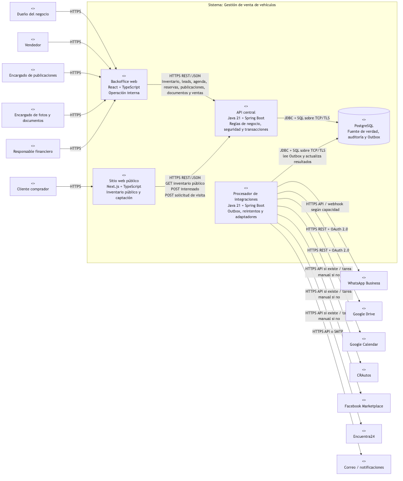
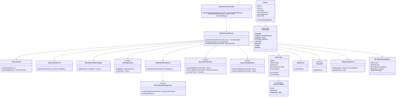
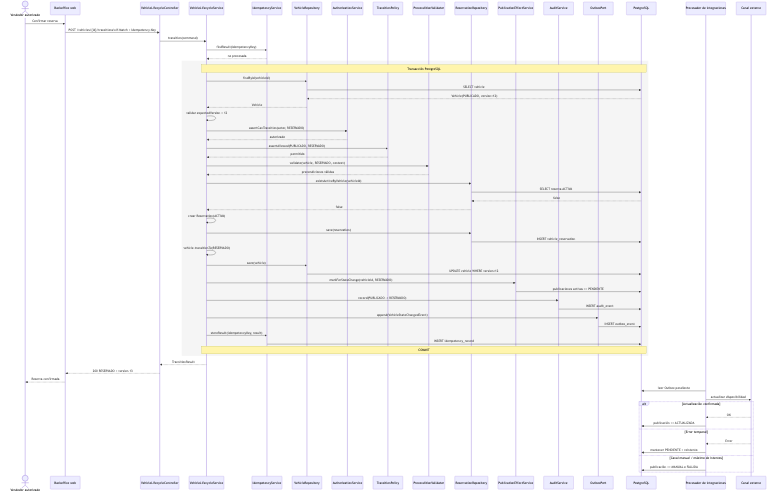
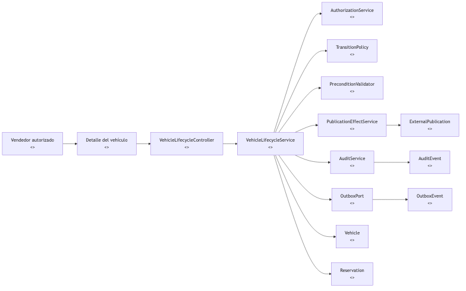

# Avance 2

## Gestión de venta de vehículos

> Documento de Diseño de Software — PSWE-04  
> Universidad Cenfotec · Maestría Profesional en Ingeniería del Software

| Campo | Detalle |
|---|---|
| **Sistema** | Gestión de venta de vehículos |
| **Hito** | Avance 2 |
| **Versión** | 0.3.1 — revisión de diseño |
| **Fecha** | 2026-07-23 |
| **Base del diseño** | Avance 1: alcance, ciclo de vida, stakeholders, drivers, escenarios de calidad y vista de contexto C4 |

---

# 1. Propósito y ajustes de diseño respecto al Avance 1

El Avance 1 definió el problema arquitectónico alrededor de una fuente de verdad interna, el ciclo de vida del vehículo, la consistencia con publicaciones externas, la trazabilidad y el uso de servicios como Google Drive y Google Calendar sin convertirlos en registros oficiales del negocio.

Este Avance 2 convierte esas decisiones en estructura de software. La propuesta se apoya en cuatro ideas:

1. el inventario, el precio y la disponibilidad oficial se mantienen dentro del sistema;
2. el ciclo de vida del vehículo se controla mediante reglas de dominio y no mediante un campo editable libremente;
3. los canales externos se desacoplan mediante adaptadores y procesamiento asíncrono;
4. los cambios sensibles generan auditoría y efectos de publicación de forma trazable.

## 1.1 Refinamiento del ciclo de vida definido en S07

En S07 se usaron `CON_CLIENTE_POTENCIAL_ACTIVO` y `CITA_AGENDADA` como hitos del proceso comercial. Para el diseño detallado se separan de los estados propios del vehículo.

La razón es práctica: un vehículo publicado puede tener varios clientes potenciales y varias citas al mismo tiempo. Si una cita se almacena como estado único del vehículo, el modelo no puede representar correctamente esa concurrencia de actividades.

Por eso, en este avance se distinguen cuatro conceptos:

### Estado del vehículo

```text
INGRESADO
PENDIENTE_DOCUMENTACION
PENDIENTE_FOTOS
LISTO_PARA_PUBLICAR
PUBLICADO
RESERVADO
VENDIDO
RETIRADO
```

### Estado de cliente potencial

```text
NUEVO
EN_SEGUIMIENTO
DESCARTADO
CONVERTIDO
```

### Estado de cita

```text
SOLICITADA
AGENDADA
CONFIRMADA
REALIZADA
CANCELADA
NO_ASISTIO
```

### Estado de reserva

```text
ACTIVA
CANCELADA
CONVERTIDA_VENTA
```

Este ajuste no cambia el alcance funcional de S07. Lo vuelve implementable sin mezclar la disponibilidad del vehículo con actividades que pueden existir en paralelo.

---

# 2. Vista de contenedores C4

## 2.1 Delimitación de la solución

El sitio web propio se modela como un **contenedor separado** del backoffice. Ambos consumen la misma API central, pero tienen permisos y casos de uso distintos.

El sitio público puede:

- consultar inventario publicado;
- ver información comercial autorizada;
- registrar un cliente potencial;
- enviar una solicitud de visita.

El sitio público no:

- escribe directamente en inventario;
- cambia estados del vehículo;
- confirma reservas;
- confirma una cita por sí mismo;
- modifica publicaciones externas.

Una solicitud de visita entra a la API y pasa al módulo de agenda. La cita queda registrada internamente y solo después se sincroniza con Google Calendar cuando corresponda.

El backoffice es utilizado por el personal del negocio para administrar inventario, clientes potenciales, citas, documentos, publicaciones, reservas, ventas, comisiones y tareas pendientes.

## 2.2 Diagrama de contenedores


*Figura 1. Vista C4 de contenedores de Gestión de venta de vehículos.*

## 2.3 Contenedores y responsabilidades

| Contenedor | Tecnología | Responsabilidad |
|---|---|---|
| **Backoffice web** | React + TypeScript | Interfaz privada para vendedores y personal administrativo. Consume la API central; no implementa reglas de transición por su cuenta. |
| **Sitio web público** | Next.js + TypeScript | Muestra únicamente vehículos autorizados para publicación, registra interesados y solicitudes de visita. No mantiene inventario propio. |
| **API central** | Java 21 + Spring Boot + Spring Security | Punto de entrada de las reglas de negocio. Administra inventario, ciclo de vida, clientes potenciales, citas, reservas, documentos, publicaciones, ventas, comisiones, autorización y auditoría. |
| **Procesador de integraciones** | Java 21 + Spring Boot | Procesa eventos Outbox, ejecuta adaptadores externos, aplica reintentos, maneja idempotencia y actualiza el estado de sincronización. |
| **PostgreSQL** | PostgreSQL | Fuente de verdad de los datos internos, auditoría, metadatos de documentos, publicaciones externas, reservas y eventos Outbox. |

## 2.4 Relaciones y protocolos

| Origen | Destino | Protocolo | Información / operación |
|---|---|---|---|
| Usuario interno | Backoffice | HTTPS | Operación privada del negocio. |
| Cliente comprador | Sitio público | HTTPS | Consulta de vehículos y envío de interés. |
| Backoffice | API central | HTTPS + REST/JSON | Operaciones autenticadas del negocio. |
| Sitio público | API central | HTTPS + REST/JSON | Inventario público, cliente potencial y solicitud de visita. |
| API central | PostgreSQL | JDBC + SQL sobre TCP/TLS | Persistencia transaccional. |
| Procesador de integraciones | PostgreSQL | JDBC + SQL sobre TCP/TLS | Lectura de Outbox, reintentos y actualización de sincronizaciones. |
| Procesador de integraciones | Google Drive | HTTPS REST + OAuth 2.0 | Archivos y enlaces. |
| Procesador de integraciones | Google Calendar | HTTPS REST + OAuth 2.0 | Sincronización de citas. |
| Procesador de integraciones | CRAutos | HTTPS/API cuando exista; tarea manual en caso contrario | Publicación y actualización de disponibilidad/precio. |
| Procesador de integraciones | Facebook Marketplace | HTTPS/API cuando exista; tarea manual en caso contrario | Publicación y actualización de disponibilidad/precio. |
| Procesador de integraciones | Encuentra24 | HTTPS/API cuando exista; tarea manual en caso contrario | Publicación y actualización de disponibilidad/precio. |
| Procesador de integraciones | WhatsApp Business | HTTPS API / webhook según capacidades disponibles | Captación o seguimiento de contactos. |
| Procesador de integraciones | Correo/notificaciones | HTTPS API o SMTP | Alertas y recordatorios. |

## 2.5 Relación del sitio propio con los módulos internos

| Función del sitio público | Módulo interno que la resuelve | Regla |
|---|---|---|
| Consultar vehículos | Inventario | Solo expone vehículos `PUBLICADO` y campos comerciales permitidos. |
| Consultar precio y disponibilidad | Inventario | Lee el valor oficial de PostgreSQL; no consulta marketplaces en tiempo real. |
| Registrar interés | Clientes potenciales | Crea un `Lead` con canal `SITIO_WEB`. |
| Solicitar visita | Clientes potenciales + Agenda | Crea una solicitud asociada al interesado; la cita confirmada se controla en Agenda. |
| Consultar fotos | Documentos/medios | La API entrega únicamente referencias autorizadas para exposición pública. |
| Mostrar si está reservado | Inventario/publicación interna | La política del sitio decide si muestra “Reservado” o si oculta el vehículo; el estado siempre se deriva de la fuente interna. |

## 2.6 Consistencia con la vista de contexto de S07

- El sistema interno sigue siendo la fuente oficial del precio, estado y disponibilidad.
- El sitio web propio forma parte de la solución y consume la misma API que el backoffice.
- Google Drive almacena archivos, pero las reglas sobre documentos se apoyan en metadatos internos.
- Google Calendar replica o apoya una cita; la cita comercial existe primero dentro del sistema.
- WhatsApp, CRAutos, Facebook Marketplace y Encuentra24 son canales externos y no controlan el estado del vehículo.
- Una falla externa no revierte una reserva, venta, retiro o cambio de precio ya confirmado internamente.

---

# 3. Estilo arquitectónico

## 3.1 Estilo seleccionado

Se selecciona un **monolito modular para la API central**, con límites inspirados en puertos y adaptadores, acompañado por un **procesador asíncrono de integraciones basado en Outbox**.

La API se despliega como una sola aplicación, pero internamente se divide en módulos con dependencias controladas:

```text
Inventario y ciclo de vida
Clientes potenciales
Agenda
Reservas
Publicaciones
Documentos
Ventas y comisiones
Auditoría
Integraciones
```

Las reglas del negocio permanecen dentro de la API. Las APIs de Google, WhatsApp o marketplaces se ocultan detrás de puertos. La transacción principal no espera la respuesta de esos proveedores.

## 3.2 Razón principal de la elección

El problema central requiere **consistencia fuerte dentro del sistema** y tolera **consistencia eventual con canales externos**.

Por ejemplo, al reservar un vehículo deben quedar coordinados en una sola transacción:

- estado del vehículo;
- reserva activa;
- auditoría;
- estado interno de publicaciones;
- evento pendiente de sincronización.

La actualización de CRAutos, Facebook Marketplace o Encuentra24 ocurre después. Si un canal falla, el sistema sigue sabiendo que el vehículo está reservado y qué publicación quedó pendiente.

## 3.3 Tácticas asociadas a los escenarios de calidad de S07

| Escenario de S07 | Medida definida | Táctica arquitectónica | Cómo se verifica |
|---|---|---|---|
| Consulta rápida de inventario | p95 < 3 s | Lectura desde PostgreSQL, índices por criterios de búsqueda y proyección de ficha sin consultar servicios externos en tiempo real | Prueba de carga sobre búsquedas y ficha de vehículo |
| Cambio de precio | Cambio interno < 2 s; 100% auditado | Transacción local en API + auditoría en la misma transacción | Prueba de integración que mida tiempo y compruebe auditoría |
| Estado reservado/vendido/retirado | Bloqueo interno < 2 s | Máquina de estados + restricción de reserva activa + transacción local | Pruebas de concurrencia y transición |
| Tareas de publicación | creadas < 1 min | Outbox transaccional + worker de integración | Prueba con canal simulado fuera de servicio |
| Falla de integración | error visible < 1 min | Reintentos, estado por publicación y registro de último error | Prueba de resiliencia con adaptador que devuelve error |
| Registro de cliente potencial | < 1 min y máximo 5 campos obligatorios | Endpoint específico de alta rápida, sin depender de APIs externas | Prueba de usabilidad y tiempo de tarea |
| Acceso a documentos | 100% valida rol | Autorización en API y auditoría de accesos sensibles | Prueba automatizada por rol |

## 3.4 Comparación con alternativas

| Criterio | Monolito modular + Outbox | Microservicios desde el inicio | Monolito CRUD tradicional |
|---|---|---|---|
| Consistencia interna | **Alta**: una transacción local puede coordinar vehículo, reserva, auditoría y Outbox | Media: requiere coordinación distribuida o sagas | Alta técnicamente, pero reglas pueden dispersarse |
| Complejidad operativa | **Media-baja** | Alta: varios despliegues, tracing, contratos y autenticación entre servicios | Baja |
| Aislamiento frente a proveedores externos | **Alto** con puertos/adaptadores | Alto | Bajo si controladores/servicios llaman APIs directamente |
| Facilidad para mantener reglas de estado | **Alta** con módulo de dominio | Alta, pero con costo de coordinación entre servicios | Baja si el estado queda como CRUD |
| Escalamiento independiente | Medio | **Alto** | Bajo |
| Adecuación al tamaño inicial del sistema | **Alta** | Baja-media | Media |
| Riesgo de sobrearquitectura | Medio-bajo | **Alto** | Bajo, pero con riesgo de deuda de diseño |

## 3.5 Alternativa rechazada: microservicios desde el inicio

### Ventajas

- despliegue independiente por dominio;
- escalamiento por servicio;
- aislamiento de fallas de procesos internos;
- equipos separados podrían evolucionar servicios de forma autónoma.

### Razones para rechazarla

Una venta o reserva cruza varias reglas que deben quedar consistentes. Si inventario, reservas, publicaciones, auditoría y ventas fueran servicios separados, el equipo tendría que introducir desde el inicio sagas, compensaciones, mensajería entre servicios, observabilidad distribuida y contratos versionados.

Ese costo no está justificado por el tamaño esperado del sistema ni por el equipo actual.

### Trade-off aceptado

Se renuncia a despliegues independientes por módulo a cambio de transacciones internas simples y reglas de dominio más fáciles de verificar. Los límites internos se conservan para permitir una separación futura si el volumen o el equipo lo justifican.

## 3.6 Alternativa rechazada: monolito CRUD por capas

### Ventajas

- implementación inicial rápida;
- menor cantidad de abstracciones;
- aprendizaje sencillo para operaciones básicas.

### Razones para rechazarla

Un CRUD tradicional facilita que distintos controladores o servicios escriban directamente el estado del vehículo. Eso contradice el driver principal de S07: el estado debe controlar acciones, permisos, auditoría y efectos sobre publicaciones.

### Trade-off aceptado

La propuesta modular requiere más clases y contratos internos, pero reduce el riesgo de reglas duplicadas o inconsistentes.

## 3.7 Costo aceptado por la consistencia eventual

El diseño no promete que un marketplace quede actualizado en el mismo instante que PostgreSQL.

Después de una reserva puede existir durante algunos minutos esta situación:

```text
Sistema interno: RESERVADO
Facebook Marketplace: todavía disponible
Estado interno de publicación: PENDIENTE
```

Ese desfase se acepta porque el sistema conserva la verdad comercial, bloquea nuevas reservas y muestra el pendiente al responsable. Es preferible a revertir la reserva porque un tercero no respondió.

---
# 4. ADRs

## ADR-001 — PostgreSQL como fuente de verdad interna

| Campo | Valor |
|---|---|
| **Estado** | Aceptado |
| **Fecha** | 2026-07-23 |
| **Drivers relacionados** | Repositorio centralizado, trazabilidad, respuesta rápida |
| **Escenarios S07** | 1, 2, 3, 4 y 6 |

### Contexto

Precio, disponibilidad y estado pueden aparecer en varios canales. Los servicios externos pueden quedar temporalmente desactualizados o no estar disponibles.

### Decisión

PostgreSQL mantiene la versión oficial de vehículos, precios, estados, clientes potenciales, citas, reservas, publicaciones, metadatos de documentos, ventas, comisiones, auditoría y eventos Outbox.

Todos los cambios se realizan por la API central.

### Alternativas consideradas

1. usar cada sistema externo como fuente de verdad de su área;
2. conservar inventario en hojas de cálculo;
3. mantener una base separada por módulo desde la primera versión.

### Consecuencias positivas

- existe un único lugar para determinar la situación real del vehículo;
- las consultas no dependen de servicios externos;
- se facilita la auditoría;
- sitio público y backoffice consumen los mismos datos.

### Consecuencias negativas

- PostgreSQL se vuelve crítico para la operación;
- se necesitan respaldos, monitoreo y recuperación;
- hay que sincronizar cambios hacia canales externos.

---

## ADR-002 — Separar el ciclo de vida del vehículo de clientes potenciales y citas

| Campo | Valor |
|---|---|
| **Estado** | Aceptado |
| **Fecha** | 2026-07-23 |
| **Drivers relacionados** | Ciclo de vida, consistencia de estado, trazabilidad |
| **Escenarios S07** | 3 y 5 |

### Contexto

S07 describió `CON_CLIENTE_POTENCIAL_ACTIVO` y `CITA_AGENDADA` como hitos del proceso. En diseño detallado, un vehículo puede tener varios interesados y varias citas de manera concurrente.

### Decisión

El estado del vehículo representa solamente su condición comercial:

```text
INGRESADO -> PENDIENTE_DOCUMENTACION -> PENDIENTE_FOTOS -> LISTO_PARA_PUBLICAR -> PUBLICADO -> RESERVADO -> VENDIDO
```

`RETIRADO` funciona como salida permitida desde estados definidos.

Los clientes potenciales, citas y reservas tienen ciclos de vida propios y se relacionan con el vehículo por identificador.

### Alternativas consideradas

1. mantener todas las actividades en un único enum de `Vehicle.state`;
2. calcular el estado del vehículo únicamente a partir de citas, leads y reservas;
3. usar un motor BPM para modelar todo el proceso.

### Consecuencias positivas

- permite varios interesados y varias citas simultáneas;
- el estado del vehículo expresa disponibilidad real;
- reduce transiciones artificiales como `CITA_AGENDADA -> PUBLICADO`;
- simplifica reglas de publicación y reserva.

### Consecuencias negativas

- aumenta la cantidad de entidades y estados;
- algunas pantallas deben combinar información de vehículo, leads y citas;
- los reportes de “etapa comercial” requieren una proyección, no solo leer `Vehicle.state`.

---

## ADR-003 — El Gestor del ciclo de vida controla toda transición de vehículo

| Campo | Valor |
|---|---|
| **Estado** | Aceptado |
| **Fecha** | 2026-07-23 |
| **Drivers relacionados** | Ciclo de vida, seguridad, auditoría |
| **Escenarios S07** | 2, 3 y 6 |

### Contexto

El estado del vehículo controla qué operaciones son válidas. Un `UPDATE state='VENDIDO'` directo permitiría saltarse permisos, precondiciones, auditoría y efectos sobre publicaciones.

### Decisión

Todo cambio de estado pasa por `VehicleLifecycleService`, que valida:

- transición permitida;
- autorización del actor;
- versión concurrente del vehículo;
- precondiciones del dominio;
- cambios relacionados;
- auditoría;
- evento Outbox cuando existan efectos externos.

No se expone un endpoint CRUD para modificar `state` directamente.

### Alternativas consideradas

1. validar únicamente en la interfaz;
2. distribuir las reglas entre controladores y servicios;
3. usar un motor de workflow desde la primera versión.

### Consecuencias positivas

- existe un único punto para proteger las transiciones;
- las reglas pueden probarse unitariamente;
- una pantalla o integración no puede saltarse el ciclo de vida;
- el cambio se coordina con auditoría y publicaciones.

### Consecuencias negativas

- el componente concentra reglas importantes;
- cambiar el ciclo de vida exige actualizar pruebas y políticas;
- debe evitarse convertir el servicio en una clase con demasiadas responsabilidades.

---

## ADR-004 — Adaptadores separados para cada sistema externo

| Campo | Valor |
|---|---|
| **Estado** | Aceptado |
| **Fecha** | 2026-07-23 |
| **Drivers relacionados** | Integraciones con distinto nivel de madurez, crecimiento de canales |
| **Escenarios S07** | 4 |

### Contexto

Google Drive, Google Calendar, WhatsApp Business y marketplaces tienen capacidades y contratos diferentes. Algunos canales pueden no ofrecer una API adecuada.

### Decisión

El núcleo define puertos como:

```text
DocumentStoragePort
CalendarPort
PublicationChannelPort
NotificationPort
```

Cada proveedor implementa su adaptador. Un canal manual implementa la misma intención de negocio creando una tarea en vez de ejecutar una API.

### Alternativas consideradas

1. llamadas directas a proveedores desde módulos internos;
2. un único servicio con condicionales por proveedor;
3. manejar canales manuales fuera del sistema.

### Consecuencias positivas

- cambios de proveedor quedan aislados;
- reglas internas pueden probarse con dobles de prueba;
- agregar un canal no cambia el ciclo de vida del vehículo;
- canales automáticos y manuales usan un modelo común de publicación.

### Consecuencias negativas

- aumenta el número de interfaces y clases;
- cada adaptador necesita manejo propio de autenticación y errores;
- se requiere monitoreo por canal.

---

## ADR-005 — Publicaciones con estado propio y Outbox transaccional

| Campo | Valor |
|---|---|
| **Estado** | Aceptado |
| **Fecha** | 2026-07-23 |
| **Drivers relacionados** | Consistencia con publicaciones externas, resiliencia |
| **Escenarios S07** | 2, 3 y 4 |

### Contexto

Una reserva, venta, retiro o cambio de precio debe quedar confirmado aunque un marketplace no responda.

### Decisión

Cada publicación externa tiene estado propio:

```text
ACTUALIZADA
PENDIENTE
FALLIDA
MANUAL
CERRADA
```

La API escribe el cambio de negocio y el evento Outbox en la misma transacción. El procesador de integraciones ejecuta después la actualización externa.

### Alternativas consideradas

1. esperar la API externa dentro de la solicitud del usuario;
2. confirmar el dominio y publicar un mensaje después sin garantía transaccional;
3. introducir un broker de mensajería adicional desde el inicio.

### Consecuencias positivas

- el negocio no depende del tiempo de respuesta de terceros;
- el evento no se pierde entre `COMMIT` y publicación;
- se soportan reintentos e idempotencia;
- el pendiente queda visible.

### Consecuencias negativas

- existe consistencia eventual;
- se necesita un worker y monitoreo;
- aparecen estados operativos adicionales.

---

## ADR-006 — Archivos en Google Drive y metadatos en PostgreSQL

| Campo | Valor |
|---|---|
| **Estado** | Aceptado |
| **Fecha** | 2026-07-23 |
| **Drivers relacionados** | Seguridad, privacidad, repositorio centralizado |
| **Escenarios S07** | 6 |

### Contexto

Google Drive es adecuado para almacenar archivos, pero un archivo o enlace aislado no permite aplicar reglas de negocio ni saber su estado dentro del proceso.

### Decisión

El archivo físico se conserva en Drive. PostgreSQL guarda:

- identificador interno;
- vehículo asociado;
- tipo de documento;
- referencia de Drive;
- estado de revisión;
- clasificación de sensibilidad;
- responsable y fechas;
- información de auditoría necesaria.

Las reglas de completitud documental consultan metadatos internos.

### Alternativas consideradas

1. guardar binarios en PostgreSQL;
2. usar solo carpetas de Drive;
3. implementar almacenamiento propio desde el inicio.

### Consecuencias positivas

- Drive no se convierte en motor de reglas;
- se puede saber si la documentación está completa sin consultar Drive en cada operación;
- se mantiene trazabilidad;
- la base transaccional no almacena binarios grandes.

### Consecuencias negativas

- hay que detectar enlaces rotos;
- permisos de Drive y aplicación deben mantenerse alineados;
- se requieren verificaciones periódicas para archivos relevantes.

---

## ADR-007 — Auditoría de solo inserción para cambios sensibles

| Campo | Valor |
|---|---|
| **Estado** | Aceptado |
| **Fecha** | 2026-07-23 |
| **Drivers relacionados** | Trazabilidad comercial, seguridad |
| **Escenarios S07** | 2, 3 y 6 |

### Contexto

Cambios de precio, estado, reserva, documentos, citas y publicaciones deben conservar responsable, fecha y motivo cuando aplique.

### Decisión

Se utiliza una bitácora funcional de solo inserción. Cada registro conserva como mínimo:

- entidad e identificador;
- acción;
- actor;
- fecha/hora;
- valor anterior y nuevo cuando corresponda;
- motivo;
- origen;
- `correlationId`.

La bitácora no reemplaza los logs técnicos.

### Alternativas consideradas

1. confiar únicamente en logs de aplicación;
2. usar solo `updated_at` y `updated_by`;
3. adoptar Event Sourcing completo.

### Consecuencias positivas

- permite reconstruir cambios sensibles;
- facilita investigar diferencias de precio o estado;
- soporta trazabilidad sin exigir Event Sourcing.

### Consecuencias negativas

- aumenta el volumen de datos;
- hay que evitar guardar secretos o datos personales innecesarios;
- se debe controlar quién puede consultar la bitácora.

---

# 5. Primer componente detallado: Gestor del ciclo de vida del vehículo

## 5.1 Responsabilidad

El **Gestor del ciclo de vida del vehículo** pertenece al módulo de Inventario de la API central.

Su responsabilidad es decidir y ejecutar cambios que modifican la condición comercial del vehículo. No administra el ciclo completo de clientes potenciales ni de citas; esos procesos pertenecen a sus respectivos módulos.

El componente controla:

- estado actual del vehículo;
- transición solicitada;
- permisos;
- precondiciones;
- concurrencia;
- cambios relacionados a reserva o cierre;
- auditoría;
- efectos internos sobre publicaciones;
- evento Outbox para efectos externos.

## 5.2 Invariantes principales

1. Un vehículo `VENDIDO` o `RETIRADO` no acepta nuevas citas ni reservas.
2. Un vehículo solo puede tener una reserva `ACTIVA`.
3. Un vehículo `RESERVADO` no puede recibir una segunda reserva activa.
4. Un cambio de estado no puede omitir auditoría.
5. Una transición que afecte publicaciones registra el efecto pendiente en la misma transacción.
6. Ninguna API externa decide el estado del vehículo.
7. El estado no se modifica mediante un endpoint CRUD genérico.

## 5.3 Matriz de transiciones del vehículo

| Origen | Destino | Actor autorizado | Precondiciones | Efectos principales |
|---|---|---|---|---|
| `INGRESADO` | `PENDIENTE_DOCUMENTACION` | Vendedor / encargado de documentos | Consignante asociado | Registra faltantes y auditoría |
| `PENDIENTE_DOCUMENTACION` | `PENDIENTE_FOTOS` | Encargado de documentos | Documentación mínima completa | Habilita etapa fotográfica |
| `PENDIENTE_FOTOS` | `LISTO_PARA_PUBLICAR` | Encargado de fotos / vendedor autorizado | Galería mínima + ficha comercial | Habilita preparación de publicación |
| `LISTO_PARA_PUBLICAR` | `PUBLICADO` | Encargado de publicaciones / dueño | Precio aprobado + descripción | Sitio propio visible + publicaciones por canal |
| `PUBLICADO` | `RESERVADO` | Vendedor autorizado / dueño | Comprador + condición de reserva + sin reserva activa | Crea reserva, bloquea otra reserva y marca publicaciones pendientes |
| `RESERVADO` | `PUBLICADO` | Vendedor autorizado / dueño | Cancelación con motivo | Cancela reserva y restablece disponibilidad |
| `RESERVADO` | `VENDIDO` | Dueño / responsable financiero autorizado | Cierre y comisión registrados | Convierte reserva, bloquea operación y cierra publicaciones |
| `PUBLICADO` | `VENDIDO` | Dueño | Aprobación explícita de venta sin reserva + cierre y comisión | Venta directa excepcional, auditada |
| `INGRESADO`, `PENDIENTE_DOCUMENTACION`, `PENDIENTE_FOTOS`, `LISTO_PARA_PUBLICAR`, `PUBLICADO`, `RESERVADO` | `RETIRADO` | Dueño / vendedor autorizado según política | Motivo obligatorio | Bloquea operación y retira publicaciones |

## 5.4 Efecto del estado del vehículo sobre publicaciones

| Estado del vehículo | Sitio web propio | Publicaciones externas | Acción interna |
|---|---|---|---|
| `INGRESADO` | Oculto | No crear | Ninguna |
| `PENDIENTE_DOCUMENTACION` | Oculto | No crear | Bloqueo de publicación |
| `PENDIENTE_FOTOS` | Oculto | No crear | Bloqueo de publicación |
| `LISTO_PARA_PUBLICAR` | Oculto | Preparar | Crear registros/tareas según canales seleccionados |
| `PUBLICADO` | Visible | Activas | Mantener `ACTUALIZADA` o señalar pendientes |
| `RESERVADO` | Mostrar “Reservado” u ocultar según política | Actualizar disponibilidad | Marcar cada publicación `PENDIENTE` hasta confirmar cambio |
| `VENDIDO` | No disponible | Cerrar/retirar | Generar acciones de cierre por canal |
| `RETIRADO` | Oculto | Retirar/pausar | Generar acciones de retiro por canal |

## 5.5 Diagrama de clases de diseño



*Figura 2. Diagrama de clases del Gestor del ciclo de vida del vehículo.*

## 5.6 Flujo principal: reservar un vehículo publicado

Se detalla `PUBLICADO -> RESERVADO` porque combina permisos, concurrencia, reserva, auditoría y efectos sobre publicaciones.

### Precondiciones

- el vehículo existe;
- el estado actual es `PUBLICADO`;
- el actor tiene permiso de reserva;
- existe un comprador identificado;
- se registró la condición de reserva;
- no existe otra reserva activa;
- la versión enviada por el cliente coincide con la versión actual del vehículo.

### Resultado

- se crea una `Reservation` con estado `ACTIVA`;
- `Vehicle.state` cambia a `RESERVADO`;
- se incrementa `Vehicle.version`;
- cada publicación activa queda `PENDIENTE` de actualizar disponibilidad;
- se inserta auditoría;
- se inserta `VehicleStateChangedEvent` en Outbox;
- se confirma toda la operación en una sola transacción;
- la actualización externa ocurre después del `COMMIT`.

## 5.7 Diagrama de secuencia



*Figura 3. Secuencia principal para reservar un vehículo.*

## 5.8 Control de concurrencia de reservas

La lógica de aplicación verifica que no exista una reserva activa. Además, PostgreSQL aplica una segunda defensa mediante una restricción de unicidad para reservas activas por vehículo.

Conceptualmente:

```sql
CREATE UNIQUE INDEX uq_active_reservation_per_vehicle
ON vehicle_reservation(vehicle_id)
WHERE status = 'ACTIVA';
```

Así, aunque dos solicitudes concurrentes superen casi al mismo tiempo una consulta previa, la base de datos impide confirmar dos reservas activas.

También se utiliza `Vehicle.version` para control optimista. Una transición actualiza el vehículo únicamente si la versión coincide con la leída por el cliente.

## 5.9 Análisis de robustez



*Figura 4. Análisis de robustez de la transición `PUBLICADO -> RESERVADO`.*

### Frontera

`Detalle del vehículo` y `VehicleLifecycleController` reciben la intención del usuario, validan formato y convierten HTTP en un comando. No deciden si una transición es válida.

### Control

`VehicleLifecycleService` coordina el caso de uso. Las reglas se distribuyen por responsabilidad:

- `AuthorizationService`: quién puede ejecutar la acción;
- `TransitionPolicy`: qué estados pueden conectarse;
- `PreconditionValidator`: qué datos deben existir;
- `PublicationEffectService`: qué publicaciones quedan pendientes;
- `AuditService`: qué evidencia funcional se registra;
- `OutboxPort`: qué efecto externo se debe procesar después.

### Entidades

`Vehicle`, `Reservation`, `ExternalPublication`, `AuditEvent` y `OutboxEvent` representan información persistente del dominio. La representación de un vehículo en Facebook, CRAutos o Encuentra24 nunca reemplaza a `Vehicle`.

## 5.10 Riesgos y controles del diseño

| Riesgo | Control |
|---|---|
| La interfaz intenta escribir un estado libremente | No existe endpoint CRUD para `state`; toda transición pasa por `VehicleLifecycleService`. |
| Dos vendedores reservan el mismo vehículo | Validación de negocio + versión optimista + índice único de reserva activa. |
| Una solicitud se reenvía por timeout | `Idempotency-Key` devuelve el resultado ya procesado. |
| Un usuario trabaja con una versión vieja | `If-Match` detecta la versión obsoleta. |
| Un marketplace falla después de reservar | Outbox conserva el efecto pendiente; la reserva interna no se revierte. |
| Se pierde la identidad de quien cambió el estado | Auditoría se inserta en la misma transacción. |
| Existen varios clientes potenciales o citas | Se manejan como entidades separadas y no cambian por sí solas `Vehicle.state`. |

---

# 6. Contratos de interfaz del componente

## 6.1 Consultar transiciones disponibles

```http
GET /api/vehicles/{vehicleId}/available-transitions
Authorization: Bearer <token>
```

### Respuesta `200 OK`

```json
{
  "vehicleId": "2a650ee4-9e8d-43cc-9b5a-916d37a19b48",
  "currentState": "PUBLICADO",
  "version": 12,
  "availableTransitions": [
    {
      "targetState": "RESERVADO",
      "requiredFields": ["buyerId", "reservationCondition"],
      "requiresReason": false
    },
    {
      "targetState": "VENDIDO",
      "requiredFields": ["buyerId", "saleAmount", "commission", "directSaleApproval"],
      "requiresReason": true
    },
    {
      "targetState": "RETIRADO",
      "requiredFields": ["reason"],
      "requiresReason": true
    }
  ]
}
```

La respuesta considera tanto el estado como los permisos del actor.

## 6.2 Ejecutar transición a reservado

```http
POST /api/vehicles/{vehicleId}/transitions
Authorization: Bearer <token>
Content-Type: application/json
If-Match: "12"
Idempotency-Key: 52e18c34-1a21-4633-9728-b8d196071fac
```

### Solicitud

```json
{
  "targetState": "RESERVADO",
  "reason": "Cliente confirma reserva",
  "context": {
    "buyerId": "d4d2c237-1295-4ad7-96f2-1dc8ffebcc38",
    "reservationCondition": "Depósito confirmado"
  }
}
```

### Respuesta `200 OK`

```json
{
  "vehicleId": "2a650ee4-9e8d-43cc-9b5a-916d37a19b48",
  "previousState": "PUBLICADO",
  "currentState": "RESERVADO",
  "version": 13,
  "changedAt": "2026-07-23T20:10:00-06:00",
  "reservation": {
    "status": "ACTIVA",
    "buyerId": "d4d2c237-1295-4ad7-96f2-1dc8ffebcc38"
  },
  "externalEffects": [
    {
      "type": "UPDATE_PUBLICATION_AVAILABILITY",
      "status": "PENDING"
    }
  ]
}
```

## 6.3 Errores del contrato

| HTTP | Código funcional | Caso |
|---|---|---|
| `400` | `INVALID_REQUEST` | Faltan datos obligatorios. |
| `401` | `UNAUTHENTICATED` | Token ausente o inválido. |
| `403` | `TRANSITION_NOT_AUTHORIZED` | El actor no tiene permiso. |
| `404` | `VEHICLE_NOT_FOUND` | Vehículo inexistente o no visible. |
| `409` | `INVALID_STATE_TRANSITION` | No existe la transición solicitada desde el estado actual. |
| `409` | `VEHICLE_ALREADY_RESERVED` | Ya existe una reserva activa. |
| `409` | `PRECONDITION_NOT_MET` | Falta documentación, comprador, aprobación u otra condición. |
| `412` | `STALE_VEHICLE_VERSION` | `If-Match` no coincide con la versión actual. |
| `422` | `BUSINESS_RULE_VIOLATION` | La solicitud es válida en formato, pero viola una regla de negocio. |

### Ejemplo `412 Precondition Failed`

```json
{
  "code": "STALE_VEHICLE_VERSION",
  "message": "El vehículo cambió desde la última consulta.",
  "currentVersion": 13,
  "correlationId": "90ed103b-71fa-48cb-85ae-0ba68bc23430"
}
```

## 6.4 Diferencia entre idempotencia y concurrencia

`Idempotency-Key` y `If-Match` resuelven problemas distintos.

- **Idempotency-Key:** evita ejecutar dos veces la misma intención cuando el cliente reenvía una solicitud por timeout o error de red.
- **If-Match:** evita que una solicitud basada en la versión 12 sobrescriba un cambio que ya produjo la versión 13.

Ambos se mantienen porque una reserva necesita protección frente a reintentos y frente a modificaciones concurrentes.

## 6.5 Contratos internos hacia otros módulos

### Puerto de efectos de publicación

```java
public interface PublicationEffectPort {
    void markForVehicleStateChange(
        UUID vehicleId,
        VehicleState previousState,
        VehicleState newState
    );
}
```

### Puerto Outbox

```java
public interface OutboxPort {
    void append(DomainEvent event);
}
```

### Puerto de reservas

```java
public interface ReservationRepository {
    boolean existsActiveByVehicle(UUID vehicleId);
    Optional<Reservation> findActiveByVehicle(UUID vehicleId);
    Reservation save(Reservation reservation);
}
```

Estos contratos evitan que el Gestor conozca detalles de PostgreSQL o de los proveedores externos.

## 6.6 Contrato del evento Outbox

```json
{
  "eventId": "af33afe4-189b-4801-90cf-3f457ffedb15",
  "eventType": "VehicleStateChanged",
  "aggregateId": "2a650ee4-9e8d-43cc-9b5a-916d37a19b48",
  "occurredAt": "2026-07-23T20:10:00-06:00",
  "payload": {
    "previousState": "PUBLICADO",
    "newState": "RESERVADO",
    "changedBy": "user-123",
    "publicationAction": "UPDATE_AVAILABILITY"
  }
}
```

### Reglas

- `eventId` es único.
- El evento se inserta en la misma transacción que el cambio de estado.
- El consumidor no cambia el estado del vehículo.
- Un fallo no elimina el evento.
- Los reintentos conservan número de intento y último error.
- El adaptador debe ser idempotente cuando el proveedor permita utilizar una clave externa de idempotencia.

---

# 7. Persistencia mínima relacionada

## 7.1 `vehicle`

| Campo | Propósito |
|---|---|
| `id` | Identificador interno |
| `vin` / `plate` | Identificación del vehículo |
| `asking_price` | Precio oficial |
| `state` | Estado comercial |
| `version` | Control de concurrencia optimista |
| `updated_at` | Última modificación |

## 7.2 `vehicle_reservation`

| Campo | Propósito |
|---|---|
| `id` | Identificador de reserva |
| `vehicle_id` | Vehículo asociado |
| `buyer_id` | Comprador |
| `condition` | Condición de reserva |
| `status` | ACTIVA, CANCELADA o CONVERTIDA_VENTA |
| `created_by` / `created_at` | Trazabilidad |
| `cancelled_by` / `cancelled_at` | Trazabilidad de cancelación cuando aplique |

### Restricción de integridad

Debe existir como máximo una fila `ACTIVA` por `vehicle_id`.

## 7.3 `lead`

| Campo | Propósito |
|---|---|
| `id` | Identificador |
| `vehicle_id` | Vehículo de interés |
| `buyer_id` | Persona interesada cuando exista |
| `origin_channel` | WhatsApp, sitio web, CRAutos, Facebook, Encuentra24, otro |
| `status` | NUEVO, EN_SEGUIMIENTO, DESCARTADO, CONVERTIDO |
| `next_action_at` | Próxima acción comercial |

## 7.4 `appointment`

| Campo | Propósito |
|---|---|
| `id` | Identificador |
| `vehicle_id` | Vehículo |
| `lead_id` | Cliente potencial relacionado |
| `status` | SOLICITADA, AGENDADA, CONFIRMADA, REALIZADA, CANCELADA, NO_ASISTIO |
| `scheduled_at` | Fecha/hora |
| `calendar_external_id` | Referencia de Google Calendar cuando exista |

## 7.5 `external_publication`

| Campo | Propósito |
|---|---|
| `id` | Identificador interno |
| `vehicle_id` | Vehículo |
| `channel` | Canal |
| `external_url` | Enlace cuando exista |
| `sync_status` | ACTUALIZADA, PENDIENTE, FALLIDA, MANUAL o CERRADA |
| `last_error` | Último error |
| `updated_at` | Última modificación |

## 7.6 `document_metadata`

| Campo | Propósito |
|---|---|
| `id` | Identificador interno |
| `vehicle_id` | Vehículo |
| `document_type` | Tipo de documento |
| `drive_reference` | Identificador o URL de Drive |
| `status` | PENDIENTE, CARGADO, VERIFICADO, RECHAZADO |
| `sensitivity` | Clasificación de acceso |
| `created_by` / `created_at` | Trazabilidad |

## 7.7 `audit_event`

| Campo | Propósito |
|---|---|
| `id` | Identificador |
| `entity_type` / `entity_id` | Entidad afectada |
| `action` | Acción sensible |
| `old_value` / `new_value` | Valores controlados cuando aplique |
| `actor_id` | Responsable |
| `reason` | Motivo |
| `occurred_at` | Fecha/hora |
| `correlation_id` | Relación con la solicitud |

## 7.8 `outbox_event`

| Campo | Propósito |
|---|---|
| `event_id` | Identificador idempotente |
| `event_type` | Tipo |
| `aggregate_id` | Entidad de origen |
| `payload` | Datos del evento |
| `status` | PENDING, PROCESSING, PROCESSED o FAILED |
| `attempts` | Intentos |
| `next_attempt_at` | Próximo reintento |
| `created_at` / `processed_at` | Trazabilidad |

---

# 8. Validaciones de diseño previstas

| Prueba | Resultado esperado | Escenario relacionado |
|---|---|---|
| Consultar ficha bajo carga normal | p95 < 3 s | Rendimiento |
| Cambiar precio | valor interno < 2 s + auditoría completa | Integridad/consistencia |
| Reservar vehículo publicado | estado interno y reserva confirmados < 2 s | Consistencia de estado |
| Lanzar dos reservas concurrentes | exactamente una reserva `ACTIVA` | Consistencia de estado |
| Repetir la misma solicitud con igual `Idempotency-Key` | no se crea segunda reserva | Resiliencia |
| Enviar transición con versión vieja | respuesta `412` y sin sobrescribir datos | Consistencia |
| Simular marketplace caído | vehículo sigue reservado y publicación queda pendiente/fallida | Resiliencia |
| Vender vehículo | nuevas citas y reservas quedan bloqueadas | Consistencia de estado |
| Intentar consultar documento sensible sin permiso | acceso rechazado | Seguridad |
| Consultar auditoría de un cambio de precio | actor, fecha, valor anterior y nuevo disponibles | Trazabilidad |
| Crear dos leads para el mismo vehículo | ambos existen sin alterar `Vehicle.state` | Usabilidad/modelado |
| Crear dos citas para interesados distintos | ambas pueden coexistir según reglas de agenda | Modelado del dominio |

---