# Gestión de Venta de Vehículos
> Documento de Diseño de Software — PSWE-04  
> Universidad Cenfotec · Maestría Profesional en Ingeniería del Software

---

## Tabla de contenidos

1. [Descripción del sistema y alcance](#1-descripción-del-sistema-y-alcance)
2. [Stakeholders](#2-stakeholders)
3. [Drivers arquitectónicos](#3-drivers-arquitectónicos)
4. [Requerimientos de calidad — Escenarios](#4-requerimientos-de-calidad--escenarios)
5. [Restricciones](#5-restricciones)
6. [Principios de diseño adoptados](#6-principios-de-diseño-adoptados)
7. [Vistas arquitectónicas](#7-vistas-arquitectónicas)
8. [Estilo arquitectónico](#8-estilo-arquitectónico)
9. [Registro de decisiones — ADRs](#9-registro-de-decisiones--adrs)
10. [Diseño detallado de componentes](#10-diseño-detallado-de-componentes)
11. [Patrones de diseño aplicados](#11-patrones-de-diseño-aplicados)
12. [Principios y técnicas habilitadoras — evidencia](#12-principios-y-técnicas-habilitadoras--evidencia)
13. [Análisis de calidad del diseño](#13-análisis-de-calidad-del-diseño)
14. [Secciones específicas por tipo de sistema](#14-secciones-específicas-por-tipo-de-sistema)
15. [Tendencias y evolución del diseño](#15-tendencias-y-evolución-del-diseño)
16. [Glosario](#16-glosario)
17. [Referencias](#17-referencias)

---

# BLOQUE 1 — CONTEXTO Y PROBLEMA
*Hitos: Propuesta (S03) y Avance 1 (S07)*

---
## 1. Descripción del sistema y alcance

### 1.1 Descripción general

Gestión de Venta de Vehículos apoya la operación de un negocio que recibe vehículos de terceros para venderlos por consignación. El sistema registra el vehículo, el consignante, sus datos comerciales, el precio, las fotos, los documentos, los compradores interesados, las citas, las reservas y el cierre de la venta o el retiro del vehículo.

El problema que resuelve es la dispersión de información entre WhatsApp, hojas de cálculo, carpetas de archivos, calendarios y publicaciones externas. Esa dispersión produce precios contradictorios, seguimiento incompleto y poca claridad sobre la disponibilidad real. El valor del sistema consiste en mantener una fuente de verdad interna y hacer visible cualquier diferencia con los canales externos.

La solución no pretende reemplazar todos los canales. El sitio público, WhatsApp, Google Drive, Google Calendar y los marketplaces siguen cumpliendo funciones específicas, pero ninguna conversación, carpeta o publicación externa sustituye el registro operativo interno.

### 1.2 Contexto del negocio o dominio

La venta por consignación separa al **consignante**, que entrega el vehículo para su comercialización, del **comprador**, que consulta, visita, reserva o compra. El negocio debe mantener el vínculo con ambos, controlar quién puede cambiar el precio o la disponibilidad y conservar evidencia de las decisiones sensibles.

El vehículo atraviesa un ciclo comercial: ingreso, revisión documental y fotográfica, preparación de publicación, publicación, reserva, venta o retiro. Los clientes potenciales y las citas no forman parte del estado único del vehículo porque pueden existir varios en paralelo. La reserva sí afecta la disponibilidad y debe impedir una segunda reserva activa.

Los canales externos tienen capacidades diferentes. Algunos pueden admitir integración, otros requieren una operación manual y ninguno debe decidir el estado interno. Google Drive conserva archivos; Google Calendar recibe copias de citas; los marketplaces muestran publicaciones; WhatsApp funciona como canal de contacto. El sistema conserva metadatos, estados, permisos, auditoría y trabajo pendiente.

Los avances no documentan una evaluación jurídica completa ni una normativa específica obligatoria. Antes de una puesta en producción debe validarse el tratamiento legal aplicable a datos personales, documentos del vehículo, retención y acceso. Esta entrega define controles técnicos de privacidad, pero no sustituye esa revisión.

### 1.3 Alcance del sistema

**Dentro del alcance — el sistema HACE:**

- Registra vehículos en consignación, consignantes, datos comerciales, precio, disponibilidad y versión.
- Controla las transiciones del vehículo mediante estados, permisos, precondiciones y auditoría.
- Mantiene ciclos separados para clientes potenciales, citas y reservas.
- Permite registrar interesados desde sitio público, WhatsApp, redes sociales o marketplaces.
- Agenda, confirma, reprograma, cancela y registra el resultado de visitas.
- Conserva metadatos, clasificación y estado de revisión de fotos y documentos almacenados en Google Drive.
- Administra publicaciones por canal, incluyendo estados automáticos y tareas manuales verificables.
- Registra ventas, precio final, comisión y responsable.
- Genera auditoría funcional para cambios sensibles.
- Procesa efectos externos mediante Outbox, adaptadores, reintentos, dead-letter y recuperación.
- Aplica autenticación, autorización por rol y recurso, control de concurrencia e idempotencia.
- Expone inventario publicado mediante el sitio propio sin crear una fuente de datos independiente.

**Fuera del alcance — el sistema NO HACE:**

- No procesa pagos bancarios ni funciona como pasarela de pago.
- No ejecuta el traspaso legal completo del vehículo.
- No valida automáticamente información contra el Registro Nacional.
- No garantiza publicación automática en todos los marketplaces.
- No reemplaza un sistema contable.
- No realiza tasación oficial automática.
- No incorpora chatbot ni decisiones basadas en IA generativa.
- No convierte Google Drive, Calendar, WhatsApp o un marketplace en fuente de verdad.
- No sustituye una evaluación legal de privacidad, retención o cumplimiento normativo.

### 1.4 Usuarios y casos de uso principales

| Tipo de usuario | Casos de uso principales |
|---|---|
| Dueño del negocio | CU-01 consultar operación; CU-03 aprobar transición sensible; CU-08 revisar venta y comisión; CU-09 atender escalaciones. |
| Vendedor | CU-02 registrar o consultar vehículo; CU-04 registrar cliente potencial; CU-05 gestionar cita; CU-03 reservar o solicitar retiro autorizado. |
| Encargado de publicaciones | CU-06 crear, actualizar, verificar o retirar publicaciones; CU-09 atender tareas manuales y fallos funcionales. |
| Encargado de fotos y documentos | CU-07 cargar, clasificar, revisar y reconciliar documentos; atender alertas de permisos. |
| Responsable financiero | CU-08 cerrar venta, registrar precio final y comisión; consultar auditoría de cierre. |
| Administrador técnico | CU-09 administrar usuarios, credenciales, worker, dead-letter, replays y alertas. |
| Cliente vendedor o consignante | Consultar el avance comercial por medio del personal; autorizar cambios cuando corresponda; solicitar retiro. |
| Cliente comprador | CU-01 consultar inventario público; CU-04 registrar interés; CU-05 solicitar una visita. |

| ID | Caso de uso arquitectónicamente relevante |
|---|---|
| CU-01 | Consultar ficha, precio, estado y disponibilidad del vehículo. |
| CU-02 | Registrar y completar la ficha de un vehículo en consignación. |
| CU-03 | Cambiar el estado del vehículo, reservarlo, venderlo o retirarlo. |
| CU-04 | Registrar y dar seguimiento a un cliente potencial. |
| CU-05 | Solicitar, agendar, confirmar, reprogramar o cancelar una cita. |
| CU-06 | Crear y mantener publicaciones automáticas o manuales. |
| CU-07 | Gestionar documentos y fotos con control de acceso. |
| CU-08 | Registrar cierre de venta y comisión. |
| CU-09 | Operar integraciones, alertas, dead-letter, tareas manuales y recuperación. |

---

## 2. Stakeholders

| Stakeholder | Rol | Intereses principales | Preocupaciones o restricciones |
|---|---|---|---|
| Dueño del negocio | Responsable de la operación | Visibilidad de inventario, ventas, citas, comisiones y pendientes. | Información contradictoria, ventas sobre vehículos no disponibles y tareas externas sin atender. |
| Vendedor | Usuario operativo | Consultar datos confiables y registrar seguimiento con pocos pasos. | Lentitud, estados ambiguos y duplicidad de reservas. |
| Cliente vendedor o consignante | Propietario o representante que entrega el vehículo | Conocer publicación, interesados, cambios de precio y resultado. | Uso indebido de documentos y falta de trazabilidad. |
| Cliente comprador | Interesado en adquirir un vehículo | Ver precio, fotos y disponibilidad; solicitar visita. | Información desactualizada o citas para vehículos no disponibles. |
| Encargado de publicaciones | Responsable de canales | Saber qué debe publicar, corregir o retirar y conservar evidencia. | Marketplaces sin API confiable, credenciales vencidas y tareas vencidas. |
| Encargado de fotos y documentos | Responsable documental | Identificar faltantes y controlar revisión y acceso. | Enlaces públicos, permisos heredados, archivos maliciosos o metadatos desalineados. |
| Responsable financiero | Responsable del cierre | Registrar precio final, comisión y responsable. | Cierre sin autorización, datos incompletos o falta de auditoría. |
| Administrador técnico | Operación y soporte | Mantener usuarios, integraciones, métricas, alertas y recuperación. | Fallos silenciosos, secretos expuestos y replays duplicados. |
| Equipo de desarrollo | Evolución del software | Módulos comprensibles, pruebas aisladas y contratos estables. | Acoplamiento con proveedores y reglas duplicadas. |
| Operación del negocio | Continuidad operativa | Resolver fallos automáticos y manuales con responsables y SLA. | Trabajo pendiente oculto o sin dueño. |
| Proveedores externos | Drive, Calendar, WhatsApp, marketplaces y correo | Recibir solicitudes compatibles con sus capacidades. | Cuotas, cambios de contrato, indisponibilidad y autenticación. |
| Docente y equipo evaluador | Evaluación académica | Trazabilidad, consistencia, evidencia editable y justificación de decisiones. | Diagramas no editables, resultados no medidos presentados como hechos e inconsistencias entre vistas. |

---

## 3. Drivers arquitectónicos

### 3.1 Requerimientos funcionales clave

| ID | Requerimiento | Stakeholder | Por qué es un driver |
|---|---|---|---|
| RF-01 | Mantener inventario, precio, estado y disponibilidad en una fuente interna. | Dueño, vendedor, comprador | Obliga a centralizar las escrituras y evitar consultas en tiempo real a proveedores. |
| RF-02 | Controlar el ciclo de vida con transiciones válidas, permisos y precondiciones. | Dueño, vendedor | Impide resolver el dominio como un CRUD de estados libres. |
| RF-03 | Permitir varios clientes potenciales y citas sin cambiar por sí solos el estado del vehículo. | Vendedor, comprador | Exige separar agregados y ciclos de vida. |
| RF-04 | Actualizar publicaciones mediante integraciones automáticas o tareas manuales. | Encargado de publicaciones | Requiere puertos, adaptadores, estados por canal y consistencia eventual. |
| RF-05 | Confirmar una reserva o cambio interno aunque un proveedor falle. | Dueño, vendedor | Obliga a separar la transacción interna de los efectos externos. |
| RF-06 | Gestionar documentos en Drive sin delegar autorización ni reglas de negocio. | Consignante, encargado documental | Exige metadatos internos, acceso mediado, auditoría y reconciliación. |
| RF-07 | Registrar quién cambió precio, estado, documentos, cita o publicación. | Dueño, responsable financiero | Requiere auditoría funcional de solo inserción. |
| RF-08 | Recuperar integraciones fallidas sin repetir acciones ya exitosas. | Administrador técnico, operación | Requiere idempotencia, acciones por destino, dead-letter y replay controlado. |

### 3.2 Atributos de calidad prioritarios

| ID | Atributo | Importancia | Stakeholder | Justificación |
|---|---|---|---|---|
| QA-01 | Consistencia e integridad | Alta | Dueño, vendedor, comprador | Un estado o precio incorrecto puede producir una reserva o comunicación comercial inválida. |
| QA-02 | Resiliencia y operabilidad | Alta | Operación, administrador técnico | Los servicios externos pueden fallar y el trabajo pendiente debe permanecer visible y recuperable. |
| QA-03 | Seguridad y privacidad | Alta | Consignante, encargado documental | Se manejan documentos, teléfonos y datos comerciales sensibles. |
| QA-04 | Rendimiento | Alta | Vendedor, comprador | La ficha debe estar disponible durante la atención sin consultar proveedores externos. |
| QA-05 | Usabilidad | Media-alta | Vendedor, comprador | El registro de interesados y solicitudes debe ser rápido para evitar notas paralelas. |

### 3.3 Restricciones que actúan como drivers

| ID | Restricción | Tipo | Impacto en el diseño |
|---|---|---|---|
| REST-01 | No todos los marketplaces ofrecen una API confiable. | Técnica / externa | Se necesita una estrategia manual con SLA, evidencia y reconciliación. |
| REST-02 | Google Drive almacena los binarios, pero no controla el dominio. | Técnica | PostgreSQL conserva metadatos y la API media el acceso. |
| REST-03 | Google Calendar es un apoyo, no la agenda oficial. | Negocio / técnica | La cita se confirma primero en PostgreSQL y se sincroniza después. |
| REST-04 | El sistema no procesa pagos, traspasos legales ni contabilidad completa. | Alcance / negocio | Evita incorporar responsabilidades financieras o jurídicas ajenas al problema. |
| REST-05 | El sistema interno debe mantener la verdad oficial aunque un canal esté caído. | Negocio | Favorece consistencia local y consistencia eventual externa. |
| REST-06 | La línea tecnológica aprobada usa React, Next.js, Java 21, Spring Boot y PostgreSQL. | Técnica | Define contenedores, contratos y habilidades de implementación. |
| REST-07 | Los resultados de rendimiento o métricas de código no pueden declararse cumplidos sin pruebas ejecutadas. | Académica / evidencia | El documento separa diseño, criterio verificable y resultado medido. |

---

# BLOQUE 2 — REQUERIMIENTOS DE CALIDAD
*Hito: Avance 1 (S07)*

---

## 4. Requerimientos de calidad — Escenarios

### Escenario QS-01 — Rendimiento de consulta de inventario

| Elemento | Descripción |
|---|---|
| **Fuente del estímulo** | Vendedor o comprador desde el sitio público. |
| **Estímulo** | Consulta una ficha de vehículo durante la atención comercial. |
| **Entorno** | Horario comercial y carga normal. |
| **Artefacto** | API de consulta, proyección de inventario y PostgreSQL. |
| **Respuesta** | Retorna datos comerciales, precio, estado, disponibilidad, fotos autorizadas y estado resumido de publicaciones sin consultar proveedores externos. |
| **Medida de respuesta** | El 95 % de las consultas responde en menos de 3 segundos. |

*Tensión con:* QS-06, porque autorización, auditoría y controles adicionales consumen recursos; se evita aplicar acceso documental pesado a la consulta comercial.

### Escenario QS-02 — Cambio de precio y consistencia de publicaciones

| Elemento | Descripción |
|---|---|
| **Fuente del estímulo** | Dueño del negocio o vendedor autorizado. |
| **Estímulo** | Cambia el precio de un vehículo publicado. |
| **Entorno** | Existen uno o varios canales externos, automáticos o manuales. |
| **Artefacto** | Inventario, auditoría, publicaciones, Outbox y procesador. |
| **Respuesta** | Confirma el precio interno, conserva el valor anterior y crea una acción por publicación. |
| **Medida de respuesta** | Cambio interno en menos de 2 segundos; 100 % auditado; acciones visibles en menos de 1 minuto; intento automático antes de 20 minutos cuando el proveedor esté disponible. |

*Tensión con:* QS-04, porque priorizar la disponibilidad de la operación interna acepta un periodo de consistencia eventual con terceros.

### Escenario QS-03 — Reserva, venta o retiro consistente

| Elemento | Descripción |
|---|---|
| **Fuente del estímulo** | Vendedor o dueño autorizado. |
| **Estímulo** | Cambia un vehículo a reservado, vendido o retirado. |
| **Entorno** | Puede haber solicitudes concurrentes, clientes potenciales, citas y publicaciones activas. |
| **Artefacto** | Gestor del ciclo de vida, reservas, agenda, auditoría, publicaciones y PostgreSQL. |
| **Respuesta** | Valida transición, versión, permisos y precondiciones; impide nuevas operaciones incompatibles; genera efectos externos. |
| **Medida de respuesta** | Bloqueo interno en menos de 2 segundos; como máximo una reserva activa; ninguna transición sensible sin actor y motivo cuando aplique. |

*Tensión con:* QS-05, porque más validaciones y control de concurrencia agregan pasos, pero protegen la disponibilidad real.

### Escenario QS-04 — Falla de integración externa

| Elemento | Descripción |
|---|---|
| **Fuente del estímulo** | Drive, Calendar, WhatsApp, marketplace, correo o la red. |
| **Estímulo** | La integración no responde, rechaza la solicitud o confirma un resultado incierto. |
| **Entorno** | Operación normal con un proveedor parcial o totalmente indisponible. |
| **Artefacto** | Outbox, acción de integración, adaptador, dead-letter y tablero operativo. |
| **Respuesta** | Mantiene el cambio interno, clasifica el error, programa reintento o tarea manual, alerta y permite recuperación auditada. |
| **Medida de respuesta** | Error visible en menos de 1 minuto; toda acción conserva canal, entidad, intento, error sanitizado y responsable; alertas críticas a los umbrales definidos. |

*Tensión con:* QS-02, porque la recuperación asíncrona no garantiza actualización inmediata de todos los canales.

### Escenario QS-05 — Registro rápido de cliente potencial

| Elemento | Descripción |
|---|---|
| **Fuente del estímulo** | Vendedor o comprador desde el sitio público. |
| **Estímulo** | Registra un interés por un vehículo y una siguiente acción o solicitud de visita. |
| **Entorno** | El vendedor atiende varias conversaciones o el comprador usa un dispositivo móvil. |
| **Artefacto** | Sitio público, backoffice, LeadService y API. |
| **Respuesta** | Crea el cliente potencial con los datos mínimos y permite continuar el seguimiento. |
| **Medida de respuesta** | Registro básico en menos de 1 minuto y con no más de cinco campos obligatorios. |

*Tensión con:* QS-06, porque reducir campos mejora la usabilidad pero exige evitar recolectar datos innecesarios y validar acceso posterior.

### Escenario QS-06 — Acceso a documentos sensibles

| Elemento | Descripción |
|---|---|
| **Fuente del estímulo** | Vendedor, encargado documental, responsable financiero o administrador con excepción aprobada. |
| **Estímulo** | Intenta cargar, consultar o descargar un documento asociado a un vehículo. |
| **Entorno** | El contenido reside en Google Drive y puede ser confidencial o restringido. |
| **Artefacto** | API central, política de autorización, metadatos, inspección, auditoría y adaptador de Drive. |
| **Respuesta** | Valida rol, recurso, acción, finalidad, estado de revisión y permisos; media la transferencia y registra el resultado. |
| **Medida de respuesta** | El 100 % de accesos valida autorización; cero enlaces públicos para documentos internos, confidenciales o restringidos; todo acceso sensible queda auditado. |

*Tensión con:* QS-01 y QS-05, porque la protección añade validaciones; se limita el acceso documental a endpoints específicos.

---

## 5. Restricciones

| ID | Restricción | Tipo | Origen | Impacto en el diseño |
|---|---|---|---|---|
| REST-01 | Marketplaces con automatización desigual. | Técnica | Proveedores externos | Strategy + Adapter y proceso manual. |
| REST-02 | Binarios en Google Drive. | Técnica | Decisión de diseño aprobada | Metadatos y reglas en PostgreSQL; acceso mediado. |
| REST-03 | Agenda interna antes que Calendar. | Negocio | Operación comercial | Outbox para sincronización posterior. |
| REST-04 | Sin pagos ni traspaso legal. | Negocio / alcance | Definición del proyecto | Ventas registra cierre y comisión, no liquida dinero ni actos legales. |
| REST-05 | Consistencia fuerte dentro de una base transaccional. | Técnica / negocio | Drivers de estado y reserva | Monolito modular y PostgreSQL. |
| REST-06 | Consistencia eventual con terceros. | Técnica | Disponibilidad externa | Estados por acción, reintentos y tareas. |
| REST-07 | Protección de documentos y datos personales. | Seguridad | Stakeholders y escenario QS-06 | Autorización contextual, clasificación, auditoría e inspección. |
| REST-08 | No existe aún una implementación con resultados medidos. | Evidencia | Estado del proyecto | Los valores se presentan como metas y planes de prueba. |

---
---

## 6. Principios de diseño adoptados

| Principio | Justificación para este sistema |
|---|---|
| Fuente única de verdad | Evita decidir disponibilidad o precio a partir de mensajes, carpetas o publicaciones desactualizadas. |
| Responsabilidad única | El ciclo de vida, la agenda, las publicaciones, los documentos y la auditoría cambian por razones distintas. |
| Inversión de dependencias | Las reglas internas no deben importar clientes de Google ni SDK de marketplaces. |
| Abierto/cerrado | Debe poder agregarse un canal sin modificar el núcleo del dominio. |
| Defensa en profundidad | Permisos de aplicación, metadatos, auditoría, inspección y reconciliación protegen documentos y operaciones sensibles. |
| Mínimo privilegio | Cada rol recibe solo las acciones y documentos necesarios; el administrador técnico no tiene acceso general al contenido. |
| Idempotencia | Reintentos HTTP, worker y replays no deben duplicar reservas ni efectos externos. |
| Falla visible y recuperable | Una integración fallida conserva estado, error, responsable y procedimiento de recuperación. |
| KISS y YAGNI | Se adopta monolito modular en vez de microservicios y no se introduce un broker adicional sin necesidad demostrada. |
| Trazabilidad por diseño | Toda decisión crítica se conecta con escenario, ADR, contenedor, componente, contrato, métrica y prueba. |
---

# BLOQUE 3 — VISTAS ARQUITECTÓNICAS
*Hitos: Avance 1 (S07), Avance 2 (S11) y Entrega final (S14)*

---

## 7. Vistas arquitectónicas

La notación principal es C4 para contexto, contenedores, componentes y despliegue. Los flujos usan secuencia UML en Mermaid y la concurrencia se representa mediante un diagrama de actividad simplificado, porque esos modelos expresan mejor el orden de mensajes y las condiciones de carrera.
### 7.1 Vista de contexto

En este nivel se representa **un solo sistema de software**: Gestión de venta de vehículos. El sitio público y el backoffice no aparecen como elementos separados porque son contenedores internos y se muestran en la vista 7.2.

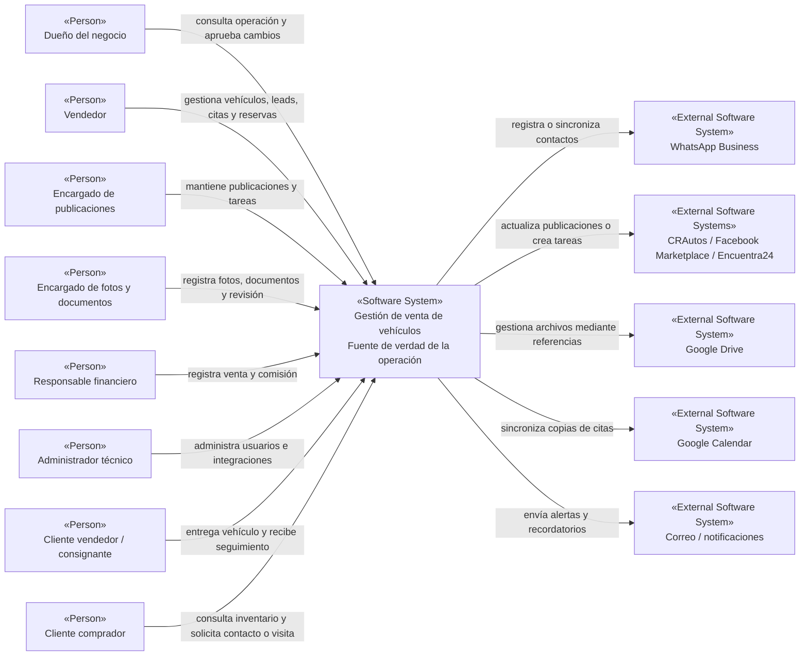
```mermaid
flowchart LR
    owner["«Person»\nDueño del negocio"]
    seller["«Person»\nVendedor"]
    pubmanager["«Person»\nEncargado de publicaciones"]
    docmanager["«Person»\nEncargado de fotos y documentos"]
    finance["«Person»\nResponsable financiero"]
    admin["«Person»\nAdministrador técnico"]
    consignor["«Person»\nCliente vendedor / consignante"]
    buyer["«Person»\nCliente comprador"]

    system["«Software System»\nGestión de venta de vehículos\nFuente de verdad de la operación"]

    whatsapp["«External Software System»\nWhatsApp Business"]
    marketplaces["«External Software Systems»\nCRAutos / Facebook Marketplace / Encuentra24"]
    drive["«External Software System»\nGoogle Drive"]
    calendar["«External Software System»\nGoogle Calendar"]
    notify["«External Software System»\nCorreo / notificaciones"]

    owner -->|"consulta operación y aprueba cambios"| system
    seller -->|"gestiona vehículos, leads, citas y reservas"| system
    pubmanager -->|"mantiene publicaciones y tareas"| system
    docmanager -->|"registra fotos, documentos y revisión"| system
    finance -->|"registra venta y comisión"| system
    admin -->|"administra usuarios e integraciones"| system
    consignor -->|"entrega vehículo y recibe seguimiento"| system
    buyer -->|"consulta inventario y solicita contacto o visita"| system

    system -->|"registra o sincroniza contactos"| whatsapp
    system -->|"actualiza publicaciones o crea tareas"| marketplaces
    system -->|"gestiona archivos mediante referencias"| drive
    system -->|"sincroniza copias de citas"| calendar
    system -->|"envía alertas y recordatorios"| notify
```

#### Límites del sistema

- Gestión de venta de vehículos conserva la fuente oficial de inventario, precio, estado, disponibilidad, clientes potenciales, citas, reservas, publicaciones, documentos, ventas y comisiones.
- El comprador interactúa con la solución mediante el sitio público, pero ese contenedor se detalla únicamente en la vista de contenedores.
- Los usuarios internos interactúan mediante el backoffice, también detallado en la vista siguiente.
- Google Drive almacena archivos; PostgreSQL conserva metadatos, clasificación y reglas de completitud.
- Google Calendar replica una cita interna; no sustituye la agenda comercial.
- Los marketplaces pueden operar por API o mediante tareas manuales.
- WhatsApp Business es un canal de contacto; el seguimiento formal queda dentro del sistema.

#### 7.1.1 Descripción de elementos

| Elemento | Tipo | Descripción de la relación |
|---|---|---|
| Gestión de venta de vehículos | Sistema principal | Centraliza el inventario, los estados, los precios, el seguimiento comercial, los documentos, las citas, las reservas, las ventas y el estado de las integraciones. |
| Dueño del negocio | Persona / Rol | Consulta la operación, aprueba cambios sensibles y atiende escalaciones. |
| Vendedor | Persona / Rol | Registra y consulta vehículos, clientes potenciales, citas y reservas. |
| Encargado de publicaciones | Persona / Rol | Ejecuta o verifica actualizaciones en canales automáticos y manuales. |
| Encargado de fotos y documentos | Persona / Rol | Registra archivos, revisa completitud y atiende incidencias documentales. |
| Responsable financiero | Persona / Rol | Registra el cierre de la venta y las comisiones. |
| Administrador técnico | Persona / Rol | Administra usuarios, credenciales, integraciones, alertas y recuperaciones. |
| Cliente vendedor o consignante | Persona externa | Entrega el vehículo y recibe seguimiento del proceso comercial. |
| Cliente comprador | Persona externa | Consulta el inventario y solicita información o una visita. |
| Google Drive | Sistema externo | Conserva los archivos; la aplicación mantiene metadatos, clasificación, permisos y auditoría. |
| Google Calendar | Sistema externo | Recibe una copia de las citas confirmadas sin convertirse en la agenda oficial. |
| WhatsApp Business | Sistema externo | Funciona como canal de contacto y posible origen de clientes potenciales. |
| CRAutos, Facebook Marketplace y Encuentra24 | Sistemas externos | Publican vehículos mediante integración o tareas manuales, según la capacidad del canal. |
| Correo / notificaciones | Sistema externo | Entrega alertas, recordatorios y escalaciones. |
### 7.2 Vista de estructura interna

#### 7.2.1 Justificación de notación

Se usa C4 nivel 2 porque la solución tiene cinco unidades desplegables o de almacenamiento con fronteras propias: Backoffice web, Sitio web público, API central, Procesador de integraciones y PostgreSQL. Dentro de la API y del procesador se usa C4 nivel 3 para mostrar componentes. Esta combinación es más honesta que representar todo como clases o como microservicios independientes.
#### 7.2.2 Diagrama de contenedores

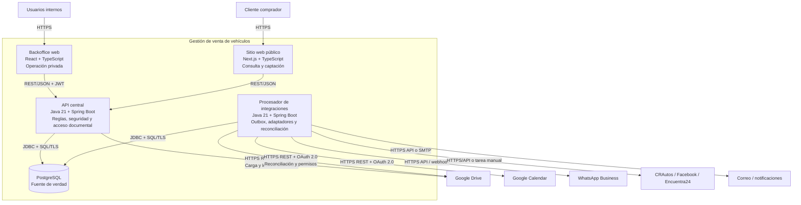
```mermaid
flowchart TB
    internal["Usuarios internos"]
    buyer["Cliente comprador"]

    subgraph solution["Gestión de venta de vehículos"]
        backoffice["Backoffice web\nReact + TypeScript\nOperación privada"]
        publicsite["Sitio web público\nNext.js + TypeScript\nConsulta y captación"]
        api["API central\nJava 21 + Spring Boot\nReglas, seguridad y acceso documental"]
        worker["Procesador de integraciones\nJava 21 + Spring Boot\nOutbox, adaptadores y reconciliación"]
        db[("PostgreSQL\nFuente de verdad")]
    end

    drive["Google Drive"]
    calendar["Google Calendar"]
    whatsapp["WhatsApp Business"]
    marketplaces["CRAutos / Facebook / Encuentra24"]
    notify["Correo / notificaciones"]

    internal -->|"HTTPS"| backoffice
    buyer -->|"HTTPS"| publicsite
    backoffice -->|"REST/JSON + JWT"| api
    publicsite -->|"REST/JSON"| api
    api -->|"JDBC + SQL/TLS"| db
    worker -->|"JDBC + SQL/TLS"| db

    api -->|"HTTPS REST + OAuth 2.0\nCarga y lectura autorizada"| drive
    worker -->|"HTTPS REST + OAuth 2.0\nReconciliación y permisos"| drive
    worker -->|"HTTPS REST + OAuth 2.0"| calendar
    worker -->|"HTTPS API / webhook"| whatsapp
    worker -->|"HTTPS/API o tarea manual"| marketplaces
    worker -->|"HTTPS API o SMTP"| notify
```

#### 7.2.3 Descripción de elementos

##### Contenedores

| Contenedor | Tecnología | Responsabilidad |
|---|---|---|
| **Backoffice web** | React + TypeScript | Interfaz privada para inventario, leads, citas, documentos, reservas, ventas, comisiones, publicaciones y tareas. |
| **Sitio web público** | Next.js + TypeScript | Consulta de vehículos publicados, registro de interés y solicitud de visita. |
| **API central** | Java 21 + Spring Boot + Spring Security + Spring Data JPA | Aplica reglas de dominio, autorización, transacciones, auditoría, contratos REST y acceso síncrono mediado a documentos. |
| **Procesador de integraciones** | Java 21 + Spring Boot | Lee eventos Outbox, ejecuta adaptadores, aplica reintentos, reconcilia permisos de Drive y actualiza estados operativos. |
| **PostgreSQL** | PostgreSQL | Fuente de verdad, control de concurrencia, auditoría, metadatos documentales, estados de publicación y eventos Outbox. |

##### Relaciones y protocolos

| Origen | Destino | Protocolo | Uso |
|---|---|---|---|
| Backoffice | API central | HTTPS + REST/JSON + JWT | Operaciones autenticadas. |
| Sitio público | API central | HTTPS + REST/JSON | Inventario público, leads y solicitudes de visita. |
| API central | PostgreSQL | JDBC + SQL/TLS | Transacciones del dominio. |
| Procesador | PostgreSQL | JDBC + SQL/TLS | Reclamo de eventos, acciones y actualización de sincronizaciones. |
| API central | Google Drive | HTTPS REST + OAuth 2.0 | Carga y entrega de contenido después de autorizar en la aplicación. |
| Procesador | Google Drive | HTTPS REST + OAuth 2.0 | Reconciliación, corrección de permisos y tareas diferidas. |
| Procesador | Google Calendar | HTTPS REST + OAuth 2.0 | Copia y actualización de citas. |
| Procesador | WhatsApp Business | HTTPS API / webhook | Captación o seguimiento, según capacidades disponibles. |
| Procesador | Marketplaces | HTTPS/API o tarea manual | Publicación, precio y disponibilidad. |
| Procesador | Correo/notificaciones | HTTPS API o SMTP | Alertas y recordatorios. |

La API central accede a Drive únicamente para operaciones documentales autorizadas que necesitan respuesta síncrona. El procesador se ocupa de reconciliación, permisos y trabajos diferidos. Esta separación evita que la vista C4 contradiga el flujo detallado de documentos.
#### 7.2.4 Vista de componentes: inventario y ciclo de vida

**Contenedor:** API central.  
**Tecnología:** Java 21, Spring Boot, Spring Security y Spring Data JPA.  
**Responsabilidad del subsistema:** conservar la ficha oficial y ejecutar cambios de condición comercial sin permitir escrituras directas sobre `Vehicle.state`.

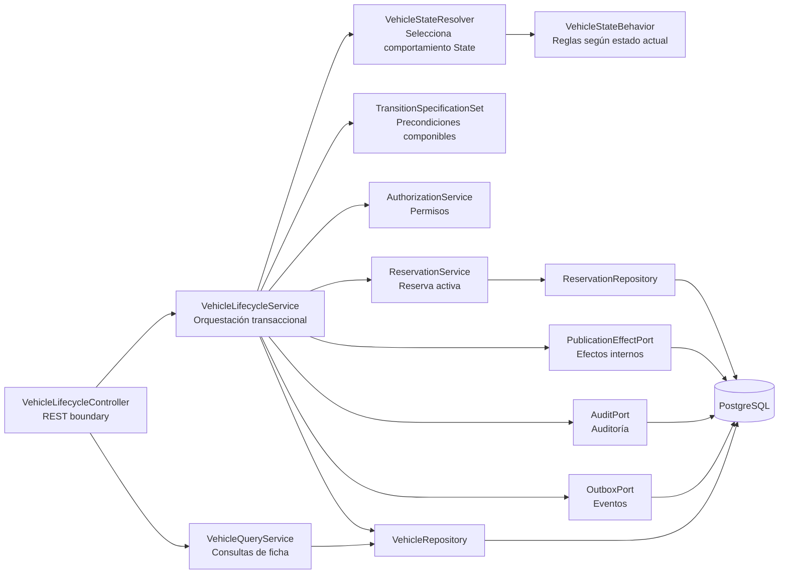
```mermaid
flowchart LR
    controller["VehicleLifecycleController\nREST boundary"]
    query["VehicleQueryService\nConsultas de ficha"]
    lifecycle["VehicleLifecycleService\nOrquestación transaccional"]
    resolver["VehicleStateResolver\nSelecciona comportamiento State"]
    state["VehicleStateBehavior\nReglas según estado actual"]
    specs["TransitionSpecificationSet\nPrecondiciones componibles"]
    auth["AuthorizationService\nPermisos"]
    reservation["ReservationService\nReserva activa"]
    effects["PublicationEffectPort\nEfectos internos"]
    audit["AuditPort\nAuditoría"]
    outbox["OutboxPort\nEventos"]
    vehicleRepo["VehicleRepository"]
    reservationRepo["ReservationRepository"]
    db[("PostgreSQL")]

    controller --> lifecycle
    controller --> query
    lifecycle --> resolver
    resolver --> state
    lifecycle --> specs
    lifecycle --> auth
    lifecycle --> reservation
    lifecycle --> effects
    lifecycle --> audit
    lifecycle --> outbox
    lifecycle --> vehicleRepo
    reservation --> reservationRepo
    query --> vehicleRepo
    vehicleRepo --> db
    reservationRepo --> db
    effects --> db
    audit --> db
    outbox --> db
```

##### Responsabilidades

| Componente | Responsabilidad |
|---|---|
| `VehicleLifecycleController` | Convierte HTTP en comandos, valida encabezados y traduce errores; no decide reglas de transición. |
| `VehicleLifecycleService` | Mantiene el orden del caso de uso y delimita la transacción local. |
| `VehicleStateResolver` | Obtiene el comportamiento correspondiente al estado persistido del vehículo. |
| `VehicleStateBehavior` | Decide destinos permitidos, permiso requerido y efectos propios del estado actual. |
| `TransitionSpecificationSet` | Compone precondiciones como documentos, fotos, precio, comprador, aprobación y motivo. |
| `ReservationService` | Crea, cancela o convierte la única reserva activa permitida. |
| `PublicationEffectPort` | Marca publicaciones afectadas sin ejecutar llamadas externas. |
| `AuditPort` | Inserta evidencia funcional del cambio. |
| `OutboxPort` | Inserta la intención externa que se procesará después del `COMMIT`. |
| `VehicleQueryService` | Construye la ficha sin consultar servicios externos en tiempo real. |

**Consistencia C4:** ningún componente del backoffice, sitio público o procesador de integraciones escribe directamente en `VehicleRepository`. Toda transición entra por la API central y pasa por `VehicleLifecycleService`.
#### 7.2.5 Vista de componentes: procesador de integraciones

**Contenedor ampliado:** Procesador de integraciones.  
**Tecnología:** Java 21, Spring Boot, PostgreSQL y clientes HTTP/OAuth por proveedor.  
**Responsabilidad del contenedor:** ejecutar efectos externos sin permitir que la transacción del negocio dependa de un proveedor.

La API central aparece como contenedor de origen porque registra las acciones y el evento Outbox en PostgreSQL. Los elementos internos detallados pertenecen únicamente al Procesador de integraciones, manteniendo el nivel C4.

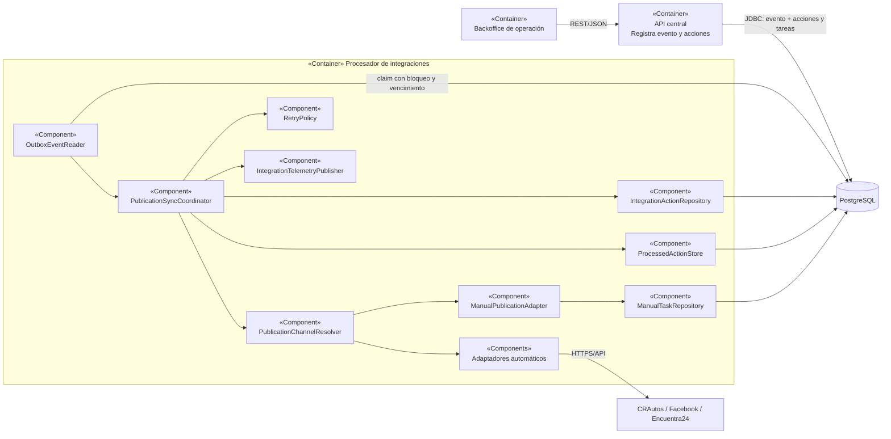
```mermaid
flowchart LR
    api["«Container»\nAPI central\nRegistra evento y acciones"]
    db[("PostgreSQL")]

    subgraph worker["«Container» Procesador de integraciones"]
        reader["«Component»\nOutboxEventReader"]
        coordinator["«Component»\nPublicationSyncCoordinator"]
        actionRepo["«Component»\nIntegrationActionRepository"]
        resolver["«Component»\nPublicationChannelResolver"]
        retry["«Component»\nRetryPolicy"]
        idempotency["«Component»\nProcessedActionStore"]
        autoAdapters["«Components»\nAdaptadores automáticos"]
        manualAdapter["«Component»\nManualPublicationAdapter"]
        taskRepo["«Component»\nManualTaskRepository"]
        telemetry["«Component»\nIntegrationTelemetryPublisher"]

        reader --> coordinator
        coordinator --> actionRepo
        coordinator --> resolver
        coordinator --> retry
        coordinator --> idempotency
        coordinator --> telemetry
        resolver --> autoAdapters
        resolver --> manualAdapter
        manualAdapter --> taskRepo
    end

    providers["CRAutos / Facebook / Encuentra24"]
    operator["«Container»\nBackoffice de operación"]

    operator -->|"REST/JSON"| api
    api -->|"JDBC: evento + acciones y tareas"| db
    reader -->|"claim con bloqueo y vencimiento"| db
    actionRepo --> db
    idempotency --> db
    taskRepo --> db
    autoAdapters -->|"HTTPS/API"| providers
```

##### Responsabilidades

| Componente | Responsabilidad |
|---|---|
| `OutboxEventReader` | Reclama eventos elegibles con bloqueo y vencimiento para evitar consumo simultáneo y recuperar workers caídos. |
| `PublicationSyncCoordinator` | Coordina cada acción de publicación, conserva éxitos parciales y calcula el estado agregado del evento. |
| `IntegrationActionRepository` | Conserva el estado operativo de cada acción: pendiente, reintento, espera manual, éxito, dead-letter o cancelación. |
| `PublicationChannelResolver` | Selecciona el adaptador según canal y capacidad declarada. |
| `RetryPolicy` | Clasifica el error y calcula el siguiente intento sin aplicar reintentos ilimitados. |
| `ProcessedActionStore` | Evita repetir una acción ya confirmada para la pareja `eventId + targetId`. |
| Adaptadores automáticos | Traducen la intención interna al contrato real del proveedor. |
| `ManualPublicationAdapter` | Crea una tarea idempotente cuando no existe una API confiable. |
| `ManualTaskRepository` | Conserva asignación, SLA, evidencia, verificación y resultado de la tarea. |
| `IntegrationTelemetryPublisher` | Publica métricas y alertas sin guardar secretos ni datos personales. |

**Consistencia C4:** el procesador no posee un puerto de escritura sobre `Vehicle`. Solo modifica eventos, acciones de integración, publicaciones externas, tareas manuales y datos operativos.
#### 7.2.6 Vista de componentes: clientes potenciales y agenda

**Contenedor:** API central; la sincronización con Calendar se ejecuta en el Procesador de integraciones.  
**Tecnología:** Java 21, Spring Boot y PostgreSQL.  
**Responsabilidad del subsistema:** registrar el interés y convertir una solicitud de visita en una cita interna con responsable y horario válidos.

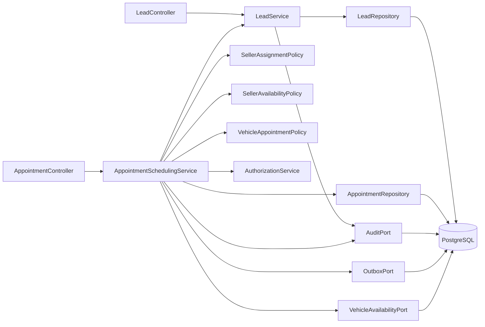
```mermaid
flowchart LR
    leadController["LeadController"]
    appointmentController["AppointmentController"]
    leadService["LeadService"]
    appointmentService["AppointmentSchedulingService"]
    assignment["SellerAssignmentPolicy"]
    availability["SellerAvailabilityPolicy"]
    vehicleRules["VehicleAppointmentPolicy"]
    auth["AuthorizationService"]
    leadRepo["LeadRepository"]
    appointmentRepo["AppointmentRepository"]
    vehiclePort["VehicleAvailabilityPort"]
    audit["AuditPort"]
    outbox["OutboxPort"]
    db[("PostgreSQL")]

    leadController --> leadService
    appointmentController --> appointmentService
    leadService --> leadRepo
    leadService --> audit
    appointmentService --> assignment
    appointmentService --> availability
    appointmentService --> vehicleRules
    appointmentService --> auth
    appointmentService --> leadService
    appointmentService --> appointmentRepo
    appointmentService --> vehiclePort
    appointmentService --> audit
    appointmentService --> outbox

    leadRepo --> db
    appointmentRepo --> db
    audit --> db
    outbox --> db
    vehiclePort --> db
```

##### Responsabilidades

| Componente | Responsabilidad |
|---|---|
| `LeadService` | Registra o reutiliza un interesado con máximo cinco datos obligatorios y canal de origen. |
| `AppointmentSchedulingService` | Crea solicitudes, asigna responsable y horario, confirma, reprograma o cancela citas. |
| `SellerAssignmentPolicy` | Selecciona o valida el responsable interno antes de agendar. |
| `SellerAvailabilityPolicy` | Detecta conflictos del vendedor y restricciones del horario comercial. |
| `VehicleAppointmentPolicy` | Impide nuevas citas para vehículos `VENDIDO` o `RETIRADO`. |
| `VehicleAvailabilityPort` | Consulta el estado oficial del vehículo sin modificarlo. |
| `OutboxPort` | Solicita la sincronización posterior con Google Calendar y notificaciones. |

**Consistencia C4:** el sitio público crea una solicitud `SOLICITADA`; no asigna vendedores, no confirma citas y no llama a Google Calendar.
#### 7.2.7 Consistencia entre niveles C4

| Elemento del contexto | Contenedor responsable | Componentes principales | Regla de consistencia |
|---|---|---|---|
| Inventario y estado oficial | API central + PostgreSQL | `VehicleLifecycleService`, `VehicleQueryService` | Los canales externos nunca escriben el estado directamente. |
| Interacción del comprador | Sitio web público | `LeadService`, `AppointmentSchedulingService`, `VehicleQueryService` | El contenedor público pertenece al sistema; solo muestra vehículos autorizados y crea solicitudes, no reservas. |
| Publicaciones externas | Procesador de integraciones | `PublicationSyncCoordinator`, adaptadores | El registro interno se actualiza aunque el proveedor falle. |
| WhatsApp Business | Procesador + API central | Adaptador de contacto y `LeadService` | El canal origina o complementa un lead; no reemplaza su historial. |
| Google Calendar | Procesador de integraciones | Adaptador de calendario | La cita existe primero en PostgreSQL. |
| Google Drive | API central + procesador | `SecureDocumentService`, `DocumentStoragePort`, `DrivePermissionReconciler` | La API media carga/lectura autorizada; el procesador reconcilia permisos; PostgreSQL conserva metadatos y auditoría. |
| Usuarios internos | Backoffice | Controladores REST y servicios de aplicación | Las reglas se validan en la API, no en la interfaz. |

---
### 7.3 Vista de comportamiento

Los tres flujos siguientes cubren los casos que más presión ejercen sobre consistencia, resiliencia y concurrencia. Los diagramas detallados, clases y contratos se encuentran en la sección 10.

#### Flujo 1 — Reservar un vehículo publicado

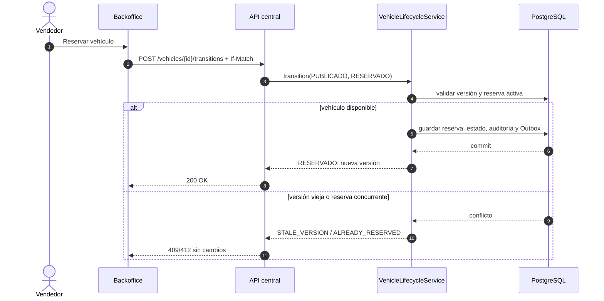
```mermaid
sequenceDiagram
    autonumber
    actor V as Vendedor
    participant UI as Backoffice
    participant API as API central
    participant L as VehicleLifecycleService
    participant DB as PostgreSQL

    V->>UI: Reservar vehículo
    UI->>API: POST /vehicles/{id}/transitions + If-Match
    API->>L: transition(PUBLICADO, RESERVADO)
    L->>DB: validar versión y reserva activa
    alt vehículo disponible
        L->>DB: guardar reserva, estado, auditoría y Outbox
        DB-->>L: commit
        L-->>API: RESERVADO, nueva versión
        API-->>UI: 200 OK
    else versión vieja o reserva concurrente
        DB-->>L: conflicto
        L-->>API: STALE_VERSION / ALREADY_RESERVED
        API-->>UI: 409/412 sin cambios
    end
```

**Descripción:** el cambio se confirma en una sola transacción. La versión optimista y el índice único de reserva activa impiden que dos solicitudes concurrentes confirmen la misma disponibilidad.

**Escenarios de calidad que valida:** QS-03 y QS-04.

#### Flujo 2 — Cambiar precio y sincronizar publicaciones

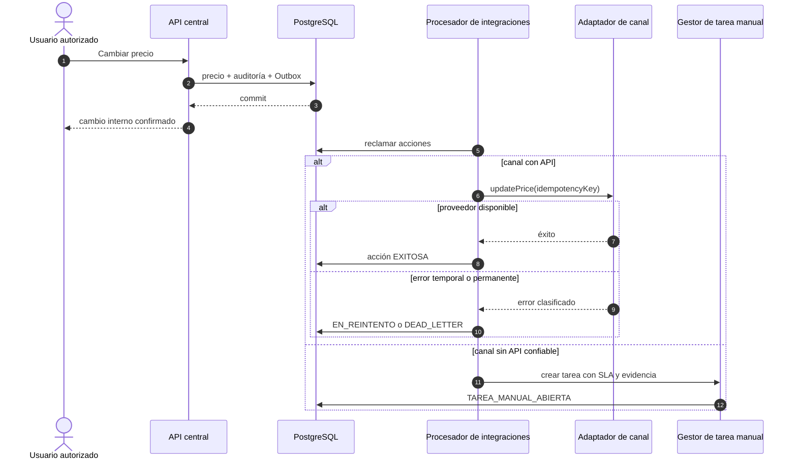
```mermaid
sequenceDiagram
    autonumber
    actor U as Usuario autorizado
    participant API as API central
    participant DB as PostgreSQL
    participant W as Procesador de integraciones
    participant A as Adaptador de canal
    participant T as Gestor de tarea manual

    U->>API: Cambiar precio
    API->>DB: precio + auditoría + Outbox
    DB-->>API: commit
    API-->>U: cambio interno confirmado
    W->>DB: reclamar acciones
    alt canal con API
        W->>A: updatePrice(idempotencyKey)
        alt proveedor disponible
            A-->>W: éxito
            W->>DB: acción EXITOSA
        else error temporal o permanente
            A-->>W: error clasificado
            W->>DB: EN_REINTENTO o DEAD_LETTER
        end
    else canal sin API confiable
        W->>T: crear tarea con SLA y evidencia
        T->>DB: TAREA_MANUAL_ABIERTA
    end
```

**Descripción:** el precio interno y el evento Outbox se confirman juntos. Cada destino recibe una acción independiente; un canal manual permanece pendiente hasta que exista evidencia y verificación.

**Escenarios de calidad que valida:** QS-02 y QS-04.

#### Flujo 3 — Solicitar y agendar una visita

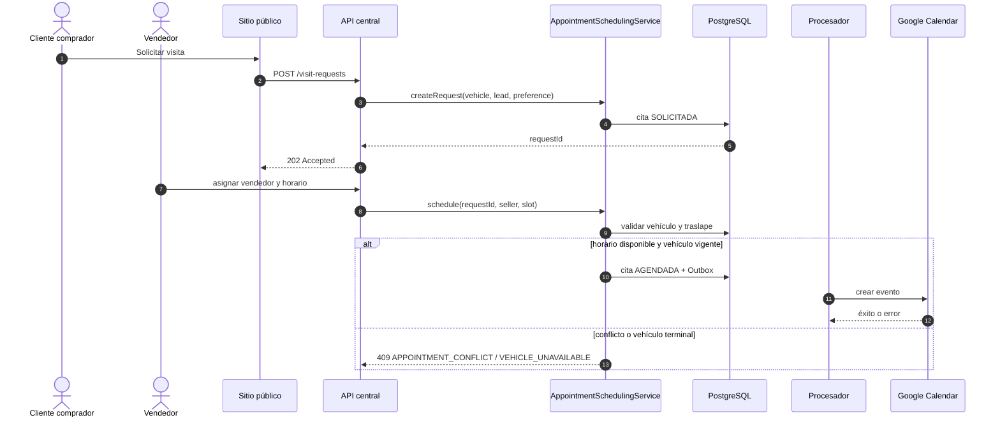
```mermaid
sequenceDiagram
    autonumber
    actor C as Cliente comprador
    actor V as Vendedor
    participant S as Sitio público
    participant API as API central
    participant A as AppointmentSchedulingService
    participant DB as PostgreSQL
    participant W as Procesador
    participant GC as Google Calendar

    C->>S: Solicitar visita
    S->>API: POST /visit-requests
    API->>A: createRequest(vehicle, lead, preference)
    A->>DB: cita SOLICITADA
    DB-->>API: requestId
    API-->>S: 202 Accepted
    V->>API: asignar vendedor y horario
    API->>A: schedule(requestId, seller, slot)
    A->>DB: validar vehículo y traslape
    alt horario disponible y vehículo vigente
        A->>DB: cita AGENDADA + Outbox
        W->>GC: crear evento
        GC-->>W: éxito o error
    else conflicto o vehículo terminal
        A-->>API: 409 APPOINTMENT_CONFLICT / VEHICLE_UNAVAILABLE
    end
```

**Descripción:** la solicitud pública no confirma por sí sola una cita. Un usuario interno asigna responsable y horario; la agenda valida el estado del vehículo y evita traslapes antes de sincronizar con Calendar.

**Escenarios de calidad que valida:** QS-03 y QS-05.
### 7.4 Vista de despliegue

La siguiente vista representa un **despliegue de referencia** coherente con los contenedores definidos. No fija un proveedor cloud; la selección de servicio administrado, región y tamaño de nodos debe ratificarse antes de implementación. La separación entre web, aplicación y datos permite aplicar TLS, respaldos, despliegue independiente del worker y límites de red.

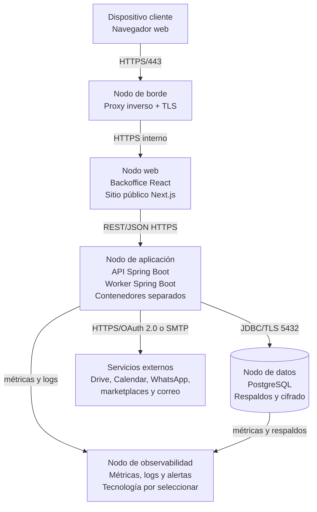
```mermaid
flowchart TB
    browser["Dispositivo cliente\nNavegador web"]
    edge["Nodo de borde\nProxy inverso + TLS"]
    web["Nodo web\nBackoffice React\nSitio público Next.js"]
    app["Nodo de aplicación\nAPI Spring Boot\nWorker Spring Boot\nContenedores separados"]
    data[("Nodo de datos\nPostgreSQL\nRespaldos y cifrado")]
    obs["Nodo de observabilidad\nMétricas, logs y alertas\nTecnología por seleccionar"]
    ext["Servicios externos\nDrive, Calendar, WhatsApp,\nmarketplaces y correo"]

    browser -->|"HTTPS/443"| edge
    edge -->|"HTTPS interno"| web
    web -->|"REST/JSON HTTPS"| app
    app -->|"JDBC/TLS 5432"| data
    app -->|"HTTPS/OAuth 2.0 o SMTP"| ext
    app -->|"métricas y logs"| obs
    data -->|"métricas y respaldos"| obs
```

| Nodo | Descripción | Artefactos desplegados | Conectividad |
|---|---|---|---|
| Dispositivo cliente | Navegador de usuario interno o comprador. | Aplicación web descargada o renderizada. | HTTPS/443 al borde. |
| Nodo de borde | Terminación TLS, encabezados de seguridad y proxy inverso. | Proxy inverso. | HTTPS hacia nodos web; sin acceso directo a PostgreSQL. |
| Nodo web | Sirve Backoffice y Sitio público. | React + TypeScript; Next.js + TypeScript. | HTTPS/REST hacia API. |
| Nodo de aplicación | Ejecuta lógica síncrona y trabajo asíncrono en procesos separados. | API Spring Boot; Procesador Spring Boot. | JDBC/TLS a PostgreSQL; HTTPS/OAuth 2.0 o SMTP a externos. |
| Nodo de datos | Fuente de verdad y persistencia de auditoría/Outbox. | PostgreSQL, respaldos y restauración verificada. | Puerto 5432 restringido al nodo de aplicación. |
| Nodo de observabilidad | Recibe métricas, logs y alertas. | Tecnología por seleccionar durante implementación. | Solo telemetría; acceso operativo autenticado. |

**Criterios de despliegue:**

- API y worker se despliegan como procesos separados aunque compartan código Java.
- PostgreSQL no se expone a Internet.
- Los secretos no se incluyen en imágenes ni repositorio; se inyectan mediante el mecanismo seguro del entorno.
- El worker puede detenerse sin impedir transacciones internas; el backlog y su edad deben generar alertas.
- Respaldos y restauración deben probarse antes de producción.
### 7.5 Vista de concurrencia

**¿Aplica esta sección?** Sí. El sistema recibe solicitudes simultáneas de reserva y cita, y ejecuta varios workers sobre acciones Outbox. Existen condiciones de carrera sobre reservas activas, versiones de vehículo, horarios de vendedores y reclamo de acciones.

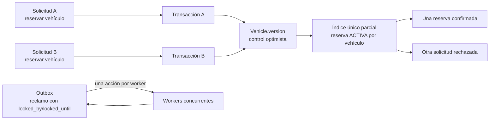
```mermaid
flowchart LR
    req1["Solicitud A\nreservar vehículo"]
    req2["Solicitud B\nreservar vehículo"]
    api1["Transacción A"]
    api2["Transacción B"]
    version["Vehicle.version\ncontrol optimista"]
    unique["Índice único parcial\nreserva ACTIVA por vehículo"]
    outbox["Outbox\nreclamo con locked_by/locked_until"]
    result1["Una reserva confirmada"]
    result2["Otra solicitud rechazada"]
    workers["Workers concurrentes"]

    req1 --> api1
    req2 --> api2
    api1 --> version
    api2 --> version
    version --> unique
    unique --> result1
    unique --> result2
    workers --> outbox
    outbox -->|"una acción por worker"| workers
```

| Recurso compartido | Mecanismo de sincronización | Riesgo | Mitigación |
|---|---|---|---|
| `Vehicle.version` | Control optimista con `If-Match` | Sobrescribir una transición reciente. | Actualización condicionada por versión y respuesta `412`. |
| Reserva activa por vehículo | Índice único parcial en PostgreSQL | Dos reservas confirmadas. | Restricción de base de datos y manejo de conflicto. |
| Agenda de un vendedor | Restricción de traslape y validación transaccional | Dos citas en el mismo intervalo. | Exclusión de intervalo o restricción equivalente en la base. |
| Acción de integración | Reclamo con `locked_by` y `locked_until` | Dos workers ejecutan el mismo efecto. | Arrendamiento temporal, estado `EN_PROCESO` e idempotency key. |
| Replay de dead-letter | Permiso, motivo e idempotencia | Repetir una acción exitosa. | Replay por `actionId`, reconciliación previa y conservación de éxitos. |
| Tarea manual | Clave única por acción y canal | Duplicidad de trabajo. | Una tarea activa por intención y cancelación de tareas incompatibles. |
---

# BLOQUE 4 — DECISIONES ARQUITECTÓNICAS
*Hito: Avance 2 (S11)*

---

## 8. Estilo arquitectónico

### 8.1 Estilo(s) adoptado(s)

| Estilo | Aplicación en el sistema | Justificación |
|---|---|---|
| Monolito modular | La API central se despliega como una aplicación y se divide en inventario, leads, agenda, reservas, publicaciones, documentos, ventas, auditoría e integraciones. | Permite transacciones locales para reserva, estado, auditoría y Outbox sin introducir coordinación distribuida prematura. |
| Puertos y adaptadores | El dominio consume interfaces para persistencia, Calendar, Drive, publicaciones y notificaciones. | Aísla contratos externos y permite canales automáticos y manuales. |
| Procesamiento dirigido por eventos | Los cambios internos generan eventos Outbox y acciones por destino. | Evita bloquear la operación por la latencia o indisponibilidad de terceros. |
| Capas de aplicación y dominio | Controladores traducen HTTP; servicios coordinan casos de uso; entidades y políticas conservan reglas. | Evita que la interfaz o un adaptador decidan transiciones del negocio. |

### 8.2 Alternativas consideradas y rechazadas

| Alternativa | Por qué se consideró | Por qué se rechazó |
|---|---|---|
| Microservicios desde el inicio | Despliegue y escalamiento independiente por dominio. | Una reserva cruza inventario, reserva, auditoría, publicación y Outbox; exigiría sagas, mensajería, tracing y contratos distribuidos sin una necesidad de escala demostrada. |
| Monolito CRUD por capas | Menor cantidad inicial de clases y desarrollo rápido. | Permitiría escribir estados desde distintos servicios y dispersaría permisos, precondiciones y efectos externos. |
| Llamadas síncronas a proveedores | Aparente actualización inmediata del canal. | Una falla o latencia externa bloquearía la transacción y podría dejar resultados inciertos. |
| Event Sourcing completo | Historial exhaustivo y reconstrucción temporal. | Agrega complejidad de proyecciones, evolución de eventos y operación no justificada para el alcance. |
| Broker de mensajería desde la primera versión | Desacoplamiento y throughput. | PostgreSQL Outbox cubre la necesidad inicial con menos infraestructura; un broker queda como punto de evolución. |
| Motor BPM/workflow | Modelado gráfico del proceso. | El ciclo actual es acotado y puede expresarse con State, políticas y pruebas sin una plataforma adicional. |

### 8.3 Análisis de trade-offs del estilo elegido

| Trade-off | Qué se gana | Qué se sacrifica | Escenario afectado |
|---|---|---|---|
| Transacción local vs. escalamiento independiente | Consistencia simple y menor complejidad operativa. | No se escala cada módulo de la API por separado. | QS-03. |
| Outbox vs. actualización externa inmediata | Resiliencia y no pérdida de la intención. | Consistencia eventual y estados operativos adicionales. | QS-02, QS-04. |
| Adaptadores por canal vs. una integración genérica | Aislamiento de cambios y manejo específico de errores. | Más interfaces y clases. | QS-04. |
| Seguridad documental mediada vs. enlace directo | Autorización, auditoría y revocación central. | Mayor latencia y dependencia de la API para descargar. | QS-06. |
| Estado + especificaciones vs. condicionales simples | Reglas localizadas y extensibles. | Mayor número de objetos y necesidad de disciplina de diseño. | QS-03. |
## 9. Registro de decisiones — ADRs

Los ADRs aceptados se conservan en archivos individuales dentro de `/decisiones`. No se reescriben para ocultar decisiones anteriores; una modificación significativa crea una nueva decisión o declara que otra fue superada.

| ADR | Decisión | Estado | Archivo |
|---|---|---|---|
| ADR-001 | PostgreSQL como fuente de verdad interna | Aceptado | [`ADR-001-postgresql-fuente-de-verdad.md`](../decisiones/ADR-001-postgresql-fuente-de-verdad.md) |
| ADR-002 | Separar ciclos de vida de vehículo, lead, cita y reserva | Aceptado | [`ADR-002-separar-ciclos-de-vida.md`](../decisiones/ADR-002-separar-ciclos-de-vida.md) |
| ADR-003 | Gestor central para transiciones de vehículo | Aceptado | [`ADR-003-gestor-ciclo-de-vida.md`](../decisiones/ADR-003-gestor-ciclo-de-vida.md) |
| ADR-004 | Adaptadores separados por sistema externo | Aceptado | [`ADR-004-adaptadores-externos.md`](../decisiones/ADR-004-adaptadores-externos.md) |
| ADR-005 | Estado de publicación y Outbox transaccional | Aceptado | [`ADR-005-outbox-transaccional.md`](../decisiones/ADR-005-outbox-transaccional.md) |
| ADR-006 | Archivos en Drive y metadatos en PostgreSQL | Aceptado | [`ADR-006-drive-y-metadatos.md`](../decisiones/ADR-006-drive-y-metadatos.md) |
| ADR-007 | Auditoría funcional append-only | Aceptado | [`ADR-007-auditoria-append-only.md`](../decisiones/ADR-007-auditoria-append-only.md) |
| ADR-008 | Observabilidad, dead-letter y recuperación del Outbox | Aceptado | [`ADR-008-observabilidad-outbox.md`](../decisiones/ADR-008-observabilidad-outbox.md) |
| ADR-009 | Operación controlada de canales manuales | Aceptado | [`ADR-009-canales-manuales.md`](../decisiones/ADR-009-canales-manuales.md) |
| ADR-010 | Seguridad y privacidad de documentos en Drive | Aceptado | [`ADR-010-seguridad-documentos-drive.md`](../decisiones/ADR-010-seguridad-documentos-drive.md) |

### ADR-001 — PostgreSQL como fuente de verdad interna

| Campo | Valor |
|---|---|
| **Estado** | Aceptado |
| **Fecha** | 2026-07-23 |
| **Autores** | Alejandro, William, Rodolfo |
| **Drivers relacionados** | Repositorio centralizado, trazabilidad, respuesta rápida |
| **Escenarios S07** | 1, 2, 3, 4 y 6 |

#### Contexto

Precio, disponibilidad y estado pueden aparecer en varios canales. Los servicios externos pueden quedar temporalmente desactualizados o no estar disponibles.

#### Decisión

PostgreSQL mantiene la versión oficial de vehículos, precios, estados, clientes potenciales, citas, reservas, publicaciones, metadatos de documentos, ventas, comisiones, auditoría y eventos Outbox.

Todos los cambios se realizan por la API central.

#### Alternativas consideradas

1. usar cada sistema externo como fuente de verdad de su área;
2. conservar inventario en hojas de cálculo;
3. mantener una base separada por módulo desde la primera versión.

#### Consecuencias positivas

- existe un único lugar para determinar la situación real del vehículo;
- las consultas no dependen de servicios externos;
- se facilita la auditoría;
- sitio público y backoffice consumen los mismos datos.

#### Consecuencias negativas

- PostgreSQL se vuelve crítico para la operación;
- se necesitan respaldos, monitoreo y recuperación;
- hay que sincronizar cambios hacia canales externos.

---

**Revisión requerida si:** la disponibilidad, el volumen o el crecimiento del equipo exigen partición, réplicas o separación de datos por servicio.

**Archivo individual:** [`ADR-001-postgresql-fuente-de-verdad.md`](../decisiones/ADR-001-postgresql-fuente-de-verdad.md)


---

### ADR-002 — Separar el ciclo de vida del vehículo de clientes potenciales y citas

| Campo | Valor |
|---|---|
| **Estado** | Aceptado |
| **Fecha** | 2026-07-23 |
| **Autores** | Alejandro, William, Rodolfo |
| **Drivers relacionados** | Ciclo de vida, consistencia de estado, trazabilidad |
| **Escenarios S07** | 3 y 5 |

#### Contexto

S07 describió `CON_CLIENTE_POTENCIAL_ACTIVO` y `CITA_AGENDADA` como hitos del proceso. En diseño detallado, un vehículo puede tener varios interesados y varias citas de manera concurrente.

#### Decisión

El estado del vehículo representa solamente su condición comercial:

```text
INGRESADO -> PENDIENTE_DOCUMENTACION -> PENDIENTE_FOTOS -> LISTO_PARA_PUBLICAR -> PUBLICADO -> RESERVADO -> VENDIDO
```

`RETIRADO` funciona como salida permitida desde estados definidos.

Los clientes potenciales, citas y reservas tienen ciclos de vida propios y se relacionan con el vehículo por identificador.

#### Alternativas consideradas

1. mantener todas las actividades en un único enum de `Vehicle.state`;
2. calcular el estado del vehículo únicamente a partir de citas, leads y reservas;
3. usar un motor BPM para modelar todo el proceso.

#### Consecuencias positivas

- permite varios interesados y varias citas simultáneas;
- el estado del vehículo expresa disponibilidad real;
- reduce transiciones artificiales como `CITA_AGENDADA -> PUBLICADO`;
- simplifica reglas de publicación y reserva.

#### Consecuencias negativas

- aumenta la cantidad de entidades y estados;
- algunas pantallas deben combinar información de vehículo, leads y citas;
- los reportes de “etapa comercial” requieren una proyección, no solo leer `Vehicle.state`.

---

**Revisión requerida si:** el negocio adopta un proceso configurable que requiera un motor de workflow o reglas dinámicas por tipo de vehículo.

**Archivo individual:** [`ADR-002-separar-ciclos-de-vida.md`](../decisiones/ADR-002-separar-ciclos-de-vida.md)


---

### ADR-003 — El Gestor del ciclo de vida controla toda transición de vehículo

| Campo | Valor |
|---|---|
| **Estado** | Aceptado |
| **Fecha** | 2026-07-23 |
| **Autores** | Alejandro, William, Rodolfo |
| **Drivers relacionados** | Ciclo de vida, seguridad, auditoría |
| **Escenarios S07** | 2, 3 y 6 |

#### Contexto

El estado del vehículo controla qué operaciones son válidas. Un `UPDATE state='VENDIDO'` directo permitiría saltarse permisos, precondiciones, auditoría y efectos sobre publicaciones.

#### Decisión

Todo cambio de estado pasa por `VehicleLifecycleService`, que valida:

- transición permitida;
- autorización del actor;
- versión concurrente del vehículo;
- precondiciones del dominio;
- cambios relacionados;
- auditoría;
- evento Outbox cuando existan efectos externos.

No se expone un endpoint CRUD para modificar `state` directamente.

#### Alternativas consideradas

1. validar únicamente en la interfaz;
2. distribuir las reglas entre controladores y servicios;
3. usar un motor de workflow desde la primera versión.

#### Consecuencias positivas

- existe un único punto para proteger las transiciones;
- las reglas pueden probarse unitariamente;
- una pantalla o integración no puede saltarse el ciclo de vida;
- el cambio se coordina con auditoría y publicaciones.

#### Consecuencias negativas

- el componente concentra reglas importantes;
- cambiar el ciclo de vida exige actualizar pruebas y políticas;
- debe evitarse convertir el servicio en una clase con demasiadas responsabilidades.

---

**Revisión requerida si:** las políticas de transición dejan de ser estables, varían por unidad de negocio o el componente concentra responsabilidades fuera del ciclo de vida.

**Archivo individual:** [`ADR-003-gestor-ciclo-de-vida.md`](../decisiones/ADR-003-gestor-ciclo-de-vida.md)


---

### ADR-004 — Adaptadores separados para cada sistema externo

| Campo | Valor |
|---|---|
| **Estado** | Aceptado |
| **Fecha** | 2026-07-23 |
| **Autores** | Alejandro, William, Rodolfo |
| **Drivers relacionados** | Integraciones con distinto nivel de madurez, crecimiento de canales |
| **Escenarios S07** | 4 |

#### Contexto

Google Drive, Google Calendar, WhatsApp Business y marketplaces tienen capacidades y contratos diferentes. Algunos canales pueden no ofrecer una API adecuada.

#### Decisión

El núcleo define puertos como:

```text
DocumentStoragePort
CalendarPort
PublicationChannelPort
NotificationPort
```

Cada proveedor implementa su adaptador. Un canal manual implementa la misma intención de negocio creando una tarea en vez de ejecutar una API.

#### Alternativas consideradas

1. llamadas directas a proveedores desde módulos internos;
2. un único servicio con condicionales por proveedor;
3. manejar canales manuales fuera del sistema.

#### Consecuencias positivas

- cambios de proveedor quedan aislados;
- reglas internas pueden probarse con dobles de prueba;
- agregar un canal no cambia el ciclo de vida del vehículo;
- canales automáticos y manuales usan un modelo común de publicación.

#### Consecuencias negativas

- aumenta el número de interfaces y clases;
- cada adaptador necesita manejo propio de autenticación y errores;
- se requiere monitoreo por canal.

---

**Revisión requerida si:** se incorpora una plataforma corporativa de integración o los proveedores convergen en un contrato común verificable.

**Archivo individual:** [`ADR-004-adaptadores-externos.md`](../decisiones/ADR-004-adaptadores-externos.md)


---

### ADR-005 — Publicaciones con estado propio y Outbox transaccional

| Campo | Valor |
|---|---|
| **Estado** | Aceptado |
| **Fecha** | 2026-07-23 |
| **Autores** | Alejandro, William, Rodolfo |
| **Drivers relacionados** | Consistencia con publicaciones externas, resiliencia |
| **Escenarios S07** | 2, 3 y 4 |

#### Contexto

Una reserva, venta, retiro o cambio de precio debe quedar confirmado aunque un marketplace no responda.

#### Decisión

Cada publicación externa tiene estado propio:

```text
ACTUALIZADA
PENDIENTE
EN_REINTENTO
MANUAL
FALLIDA_PERMANENTE
CERRADA
```

La API escribe el cambio de negocio y el evento Outbox en la misma transacción. El procesador de integraciones ejecuta después la actualización externa.

#### Alternativas consideradas

1. esperar la API externa dentro de la solicitud del usuario;
2. confirmar el dominio y publicar un mensaje después sin garantía transaccional;
3. introducir un broker de mensajería adicional desde el inicio.

#### Consecuencias positivas

- el negocio no depende del tiempo de respuesta de terceros;
- el evento no se pierde entre `COMMIT` y publicación;
- se soportan reintentos e idempotencia;
- el pendiente queda visible.

#### Consecuencias negativas

- existe consistencia eventual;
- se necesita un worker y monitoreo;
- aparecen estados operativos adicionales.

---

#### Enmienda de entrega final

La operación se completa con estados de evento, dead-letter, alertas y recuperación definidos en ADR-008.

**Revisión requerida si:** el volumen o la latencia requerida supera el sondeo sobre PostgreSQL y justifica un broker de mensajería.

**Archivo individual:** [`ADR-005-outbox-transaccional.md`](../decisiones/ADR-005-outbox-transaccional.md)


---

### ADR-006 — Archivos en Google Drive y metadatos en PostgreSQL

| Campo | Valor |
|---|---|
| **Estado** | Aceptado |
| **Fecha** | 2026-07-23 |
| **Autores** | Alejandro, William, Rodolfo |
| **Drivers relacionados** | Seguridad, privacidad, repositorio centralizado |
| **Escenarios S07** | 6 |

#### Contexto

Google Drive es adecuado para almacenar archivos, pero un archivo o enlace aislado no permite aplicar reglas de negocio ni saber su estado dentro del proceso.

#### Decisión

El archivo físico se conserva en Drive. PostgreSQL guarda:

- identificador interno;
- vehículo asociado;
- tipo de documento;
- referencia de Drive;
- estado de revisión;
- clasificación de sensibilidad;
- responsable y fechas;
- información de auditoría necesaria.

Las reglas de completitud documental consultan metadatos internos.

#### Alternativas consideradas

1. guardar binarios en PostgreSQL;
2. usar solo carpetas de Drive;
3. implementar almacenamiento propio desde el inicio.

#### Consecuencias positivas

- Drive no se convierte en motor de reglas;
- se puede saber si la documentación está completa sin consultar Drive en cada operación;
- se mantiene trazabilidad;
- la base transaccional no almacena binarios grandes.

#### Consecuencias negativas

- hay que detectar enlaces rotos;
- permisos de Drive y aplicación deben mantenerse alineados;
- se requieren verificaciones periódicas para archivos relevantes.

---

#### Enmienda de entrega final

El acceso a documentos sensibles se media por la API; no se permiten enlaces públicos permanentes. Clasificación, autorización, reconciliación y respuesta ante permisos excesivos se detallan en ADR-010.

**Revisión requerida si:** Drive deja de cumplir los requisitos de seguridad, volumen, retención o recuperación y se requiere almacenamiento dedicado.

**Archivo individual:** [`ADR-006-drive-y-metadatos.md`](../decisiones/ADR-006-drive-y-metadatos.md)


---

### ADR-007 — Auditoría de solo inserción para cambios sensibles

| Campo | Valor |
|---|---|
| **Estado** | Aceptado |
| **Fecha** | 2026-07-23 |
| **Autores** | Alejandro, William, Rodolfo |
| **Drivers relacionados** | Trazabilidad comercial, seguridad |
| **Escenarios S07** | 2, 3 y 6 |

#### Contexto

Cambios de precio, estado, reserva, documentos, citas y publicaciones deben conservar responsable, fecha y motivo cuando aplique.

#### Decisión

Se utiliza una bitácora funcional de solo inserción. Cada registro conserva como mínimo:

- entidad e identificador;
- acción;
- actor;
- fecha/hora;
- valor anterior y nuevo cuando corresponda;
- motivo;
- origen;
- `correlationId`.

La bitácora no reemplaza los logs técnicos.

#### Alternativas consideradas

1. confiar únicamente en logs de aplicación;
2. usar solo `updated_at` y `updated_by`;
3. adoptar Event Sourcing completo.

#### Consecuencias positivas

- permite reconstruir cambios sensibles;
- facilita investigar diferencias de precio o estado;
- soporta trazabilidad sin exigir Event Sourcing.

#### Consecuencias negativas

- aumenta el volumen de datos;
- hay que evitar guardar secretos o datos personales innecesarios;
- se debe controlar quién puede consultar la bitácora.

---

**Revisión requerida si:** una auditoría externa exige almacenamiento WORM, firma criptográfica o reconstrucción completa mediante Event Sourcing.

**Archivo individual:** [`ADR-007-auditoria-append-only.md`](../decisiones/ADR-007-auditoria-append-only.md)


---

### ADR-008 — Observabilidad, dead-letter y recuperación del Outbox

| Campo | Valor |
|---|---|
| **Estado** | Aceptado |
| **Fecha** | 2026-08-06 |
| **Autores** | Alejandro, William, Rodolfo |
| **Versión** | 1.1 |
| **Drivers** | Resiliencia, operabilidad, trazabilidad |
| **Escenarios S07** | 2 y 4 |

#### Contexto

El Outbox evita perder intenciones externas, pero una fila pendiente sin alertas, responsable ni procedimiento de recuperación puede permanecer sin atención. También existe riesgo de declarar una operación terminada cuando solo se creó una tarea manual, o de convertir un evento completo en fallo aunque otros canales ya hayan terminado correctamente.

#### Decisión

Se separan tres ciclos:

- evento Outbox: `PENDING`, `PROCESSING`, `RETRY_SCHEDULED`, `WAITING_MANUAL`, `PROCESSED`, `DEAD_LETTER`, `CANCELLED`;
- acción de integración: `PENDIENTE`, `EN_PROCESO`, `EN_REINTENTO`, `TAREA_MANUAL_ABIERTA`, `EXITOSA`, `DEAD_LETTER`, `CANCELADA`;
- estado de la entidad externa, como publicación o cita.

Dead-letter se controla por acción. El estado del evento se calcula a partir de sus acciones: una tarea manual abierta produce `WAITING_MANUAL`; una acción no resuelta en dead-letter produce `DEAD_LETTER`; el evento llega a `PROCESSED` solo cuando todas las acciones están `EXITOSA` o `CANCELADA`.

Los errores temporales usan espera creciente. Toda recuperación requiere permiso, motivo, auditoría, verificación del estado externo e idempotencia. El replay se dirige a acciones concretas y no repite acciones exitosas.

Se exponen métricas de edad, volumen, tasa de éxito, tareas manuales vencidas, dead-letter y replays. El administrador técnico responde por credenciales o worker; el responsable funcional atiende contenido, agenda o tareas manuales.

#### Alternativas consideradas

1. reintentar indefinidamente;
2. revisar la tabla Outbox solo cuando alguien reporte un problema;
3. marcar el evento procesado al crear una tarea manual;
4. mover todo el evento a dead-letter por el fallo de un único canal;
5. borrar eventos fallidos y recrearlos manualmente.

#### Consecuencias positivas

- fallos visibles y asignables;
- estados coherentes entre trabajo automático y manual;
- conservación de éxitos parciales;
- recuperación reproducible y auditada;
- menor riesgo de duplicar operaciones.

#### Consecuencias negativas

- más estados, métricas y reglas de agregación;
- se necesita mantener un runbook y responsables;
- dead-letter y tareas manuales requieren disciplina de cierre.

**Revisión requerida si:** cambian los SLO, aumenta significativamente el volumen de acciones o la operación requiere automatizar más decisiones de recuperación.

**Archivo individual:** [`ADR-008-observabilidad-outbox.md`](../decisiones/ADR-008-observabilidad-outbox.md)


---

### ADR-009 — Operación controlada de canales manuales

| Campo | Valor |
|---|---|
| **Estado** | Aceptado |
| **Fecha** | 2026-08-06 |
| **Autores** | Alejandro, William, Rodolfo |
| **Versión** | 1.1 |
| **Drivers** | Consistencia con publicaciones, trazabilidad, canales heterogéneos |
| **Escenarios S07** | 2, 3 y 4 |

#### Contexto

CRAutos, Facebook Marketplace o Encuentra24 pueden no ofrecer una API confiable para todas las operaciones. Una anotación informal no permite saber quién debe actualizar, cuándo vence, qué valor debe quedar visible ni cómo se confirma el resultado.

#### Decisión

`ManualPublicationAdapter` crea una tarea idempotente con vehículo, publicación, acción, valor esperado, responsable, SLA, evidencia y verificador. Mientras la tarea está abierta, la acción de integración queda `TAREA_MANUAL_ABIERTA` y el evento Outbox `WAITING_MANUAL`; crear la tarea no equivale a completar la sincronización.

La verificación de evidencia cambia la acción a `EXITOSA`, actualiza la publicación y recalcula el evento. La tarea permanece visible al vencer. Las acciones críticas de precio o disponibilidad requieren verificación por una persona distinta. Una reconciliación periódica compara tareas y publicaciones con la fuente interna.

#### Alternativas consideradas

1. manejar el trabajo por WhatsApp o correo;
2. marcar la acción como completada al crear la tarea;
3. excluir canales sin API del alcance;
4. automatizar con navegación no soportada o frágil.

#### Consecuencias positivas

- la consistencia eventual incluye trabajo humano trazable;
- se pueden medir vencimientos y tiempos de ejecución;
- se evita prometer automatización inexistente;
- los cambios posteriores cancelan tareas incompatibles.

#### Consecuencias negativas

- depende de disciplina operativa;
- requiere tablero, asignación y verificación;
- el marketplace todavía puede moderar o retrasar el cambio fuera del control del negocio.

**Revisión requerida si:** el canal obtiene una API estable o el SLA manual deja de ser sostenible para el volumen operativo.

**Archivo individual:** [`ADR-009-canales-manuales.md`](../decisiones/ADR-009-canales-manuales.md)


---

### ADR-010 — Seguridad y privacidad de documentos almacenados en Google Drive

| Campo | Valor |
|---|---|
| **Estado** | Aceptado |
| **Fecha** | 2026-08-06 |
| **Autores** | Alejandro, William, Rodolfo |
| **Versión** | 1.1 |
| **Drivers** | Seguridad, privacidad, trazabilidad |
| **Escenarios S07** | 6 |

#### Contexto

Los documentos del vehículo y del consignante contienen información sensible. Guardarlos en Drive reduce la carga de binarios en PostgreSQL, pero un enlace público, permiso heredado, archivo malicioso o acceso técnico amplio puede saltarse las reglas de la aplicación.

#### Decisión

Drive conserva el contenido y PostgreSQL los metadatos. La API central media la carga y lectura síncrona después de autorizar por rol, recurso, acción y finalidad. El Procesador de integraciones ejecuta reconciliación de existencia y permisos.

No se permiten enlaces públicos permanentes para información interna, confidencial o restringida. Todo archivo debe superar validación de tipo, tamaño y contenido antes de quedar disponible. Si la inspección no está disponible, el archivo permanece `PENDIENTE_REVISION`.

Los accesos distinguen autorización concedida, transferencia completada y transferencia fallida. El administrador técnico no recibe acceso general al contenido; una excepción requiere documento específico, aprobación, motivo, vencimiento y auditoría. Reducir la clasificación de un documento restringido requiere dos roles distintos.

#### Alternativas consideradas

1. compartir enlaces de Drive directamente;
2. usar únicamente permisos de carpetas como autorización;
3. guardar todos los binarios en PostgreSQL;
4. permitir acceso completo al administrador técnico;
5. aceptar cargas sin inspección cuando el validador no esté disponible.

#### Consecuencias positivas

- control uniforme desde la API;
- menor riesgo de enlaces reutilizables;
- detección de desalineación entre permisos internos y Drive;
- archivos no verificados no quedan disponibles;
- evidencia precisa del acceso y la entrega.

#### Consecuencias negativas

- la descarga depende de la API y del adaptador;
- se necesita reconciliación, inspección y respuesta a incidentes;
- clasificación, finalidades y retención deben mantenerse por tipo documental.

**Revisión requerida si:** cambia el proveedor de almacenamiento o una evaluación legal o de seguridad exige controles adicionales de cifrado, retención o residencia.

**Archivo individual:** [`ADR-010-seguridad-documentos-drive.md`](../decisiones/ADR-010-seguridad-documentos-drive.md)

---

# BLOQUE 5 — DISEÑO DETALLADO
*Hito: Entrega final (S14)*

---

## 10. Diseño detallado de componentes

Se seleccionan tres componentes críticos: Gestor del ciclo de vida, Coordinador de sincronización de publicaciones y Servicio de agenda. Cada uno incluye trazabilidad, clases, contratos, robustez y secuencias principal y alternativa. El Gestor seguro de documentos se conserva como diseño complementario porque responde al escenario de seguridad QS-06.
### 10.1. Componente 1: Gestor del ciclo de vida del vehículo

#### 10.1.1. Responsabilidad y trazabilidad

El componente controla cualquier transición que cambie la condición comercial del vehículo. El estado se persiste como enum por simplicidad de almacenamiento, pero su comportamiento se resuelve mediante objetos State; así el diseño y el patrón aplicado describen la misma solución.

| Requerimiento | Evidencia en el componente |
|---|---|
| `REQ-INV-01` | `VehicleRepository` es el único puerto de escritura del agregado `Vehicle`. |
| `REQ-LCV-01` | `VehicleStateBehavior`, `AuthorizationService` y `TransitionSpecificationSet`. |
| `REQ-LCV-02` | `ReservationService` más índice único parcial de reserva activa. |
| `REQ-LCV-03` | Los estados terminales no ofrecen transiciones de reserva y son consultados por agenda. |
| `REQ-AUD-01` | `AuditPort` se ejecuta dentro de la misma transacción. |
| `REQ-PUB-01` | `PublicationEffectPort` registra una acción por publicación afectada. |
| `REQ-PUB-02` | `OutboxPort` separa el `COMMIT` interno de la actualización externa. |
| `S07-Q2`, `S07-Q3` | La solicitud solo usa PostgreSQL; no espera proveedores. |

#### 10.1.2. Invariantes y contrato funcional

**Precondiciones comunes**

1. El vehículo existe y la versión `If-Match` coincide.
2. La clave idempotente pertenece al actor, vehículo y tipo de transición.
3. El actor posee el permiso indicado por el State actual.
4. Las especificaciones de la transición se cumplen.

**Postcondiciones de una transición exitosa**

1. El vehículo queda en el nuevo estado y aumenta su versión.
2. Los cambios relacionados —reserva, venta o retiro— quedan en la misma transacción.
3. Se registra auditoría con estado anterior, nuevo, actor, motivo y `correlationId`.
4. Cada publicación afectada recibe una acción de sincronización.
5. Se inserta un evento Outbox; no se llama a proveedores durante la solicitud HTTP.

**Invariantes**

- `VENDIDO` y `RETIRADO` no aceptan nuevas citas ni reservas.
- Existe como máximo una reserva `ACTIVA` por vehículo.
- Ninguna API externa decide o escribe `Vehicle.state`.
- Una transición fallida no deja auditoría, reserva o Outbox parcialmente confirmados.

#### 10.1.3. Clases de diseño

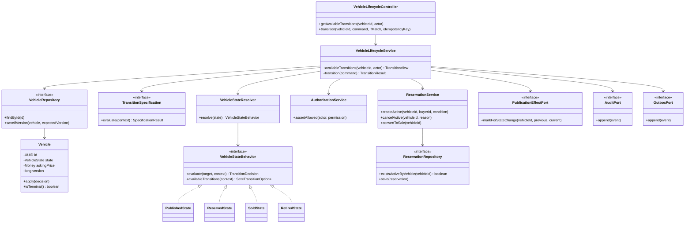
```mermaid
classDiagram
    class VehicleLifecycleController {
      +getAvailableTransitions(vehicleId, actor)
      +transition(vehicleId, command, ifMatch, idempotencyKey)
    }

    class VehicleLifecycleService {
      +availableTransitions(vehicleId, actor) TransitionView
      +transition(command) TransitionResult
    }

    class Vehicle {
      -UUID id
      -VehicleState state
      -Money askingPrice
      -long version
      +apply(decision)
      +isTerminal() boolean
    }

    class VehicleStateResolver {
      +resolve(state) VehicleStateBehavior
    }

    class VehicleStateBehavior {
      <<interface>>
      +evaluate(target, context) TransitionDecision
      +availableTransitions(context) Set~TransitionOption~
    }

    class PublishedState
    class ReservedState
    class SoldState
    class RetiredState

    class TransitionSpecification {
      <<interface>>
      +evaluate(context) SpecificationResult
    }

    class ReservationService {
      +createActive(vehicleId, buyerId, condition)
      +cancelActive(vehicleId, reason)
      +convertToSale(vehicleId)
    }

    class AuthorizationService {
      +assertAllowed(actor, permission)
    }

    class VehicleRepository {
      <<interface>>
      +findById(id)
      +saveIfVersion(vehicle, expectedVersion)
    }

    class ReservationRepository {
      <<interface>>
      +existsActiveByVehicle(vehicleId) boolean
      +save(reservation)
    }

    class PublicationEffectPort {
      <<interface>>
      +markForStateChange(vehicleId, previous, current)
    }

    class AuditPort {
      <<interface>>
      +append(event)
    }

    class OutboxPort {
      <<interface>>
      +append(event)
    }

    VehicleLifecycleController --> VehicleLifecycleService
    VehicleLifecycleService --> VehicleRepository
    VehicleLifecycleService --> VehicleStateResolver
    VehicleStateResolver --> VehicleStateBehavior
    VehicleStateBehavior <|.. PublishedState
    VehicleStateBehavior <|.. ReservedState
    VehicleStateBehavior <|.. SoldState
    VehicleStateBehavior <|.. RetiredState
    VehicleLifecycleService --> TransitionSpecification
    VehicleLifecycleService --> AuthorizationService
    VehicleLifecycleService --> ReservationService
    VehicleLifecycleService --> PublicationEffectPort
    VehicleLifecycleService --> AuditPort
    VehicleLifecycleService --> OutboxPort
    ReservationService --> ReservationRepository
    VehicleRepository --> Vehicle
```

Los estados de preparación (`INGRESADO`, `PENDIENTE_DOCUMENTACION`, `PENDIENTE_FOTOS` y `LISTO_PARA_PUBLICAR`) también implementan `VehicleStateBehavior`; el diagrama muestra los estados con mayor riesgo comercial para conservar legibilidad.

#### 10.1.4. Secuencia principal: reservar un vehículo publicado

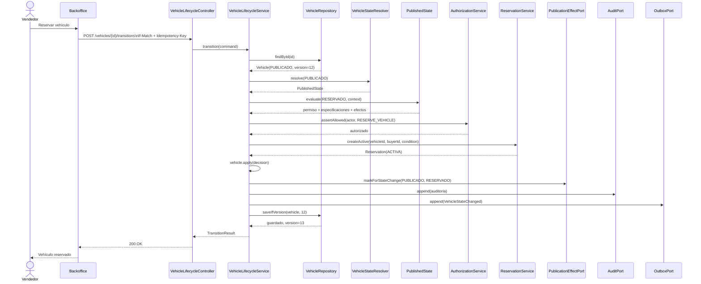
```mermaid
sequenceDiagram
    actor V as Vendedor
    participant UI as Backoffice
    participant C as VehicleLifecycleController
    participant S as VehicleLifecycleService
    participant VR as VehicleRepository
    participant SR as VehicleStateResolver
    participant ST as PublishedState
    participant A as AuthorizationService
    participant R as ReservationService
    participant PE as PublicationEffectPort
    participant AU as AuditPort
    participant O as OutboxPort

    V->>UI: Reservar vehículo
    UI->>C: POST /vehicles/{id}/transitions\nIf-Match + Idempotency-Key
    C->>S: transition(command)
    S->>VR: findById(id)
    VR-->>S: Vehicle(PUBLICADO, version=12)
    S->>SR: resolve(PUBLICADO)
    SR-->>S: PublishedState
    S->>ST: evaluate(RESERVADO, context)
    ST-->>S: permiso + especificaciones + efectos
    S->>A: assertAllowed(actor, RESERVE_VEHICLE)
    A-->>S: autorizado
    S->>R: createActive(vehicleId, buyerId, condition)
    R-->>S: Reservation(ACTIVA)
    S->>S: vehicle.apply(decision)
    S->>PE: markForStateChange(PUBLICADO, RESERVADO)
    S->>AU: append(auditoría)
    S->>O: append(VehicleStateChanged)
    S->>VR: saveIfVersion(vehicle, 12)
    VR-->>S: guardado, version=13
    S-->>C: TransitionResult
    C-->>UI: 200 OK
    UI-->>V: Vehículo reservado
```

#### 10.1.5. Secuencia alternativa: reserva concurrente

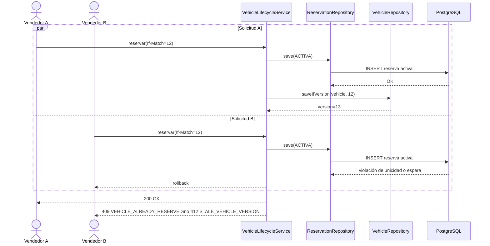
```mermaid
sequenceDiagram
    actor V1 as Vendedor A
    actor V2 as Vendedor B
    participant S as VehicleLifecycleService
    participant RR as ReservationRepository
    participant VR as VehicleRepository
    participant DB as PostgreSQL

    par Solicitud A
        V1->>S: reservar(If-Match=12)
        S->>RR: save(ACTIVA)
        RR->>DB: INSERT reserva activa
        DB-->>RR: OK
        S->>VR: saveIfVersion(vehicle, 12)
        VR-->>S: version=13
    and Solicitud B
        V2->>S: reservar(If-Match=12)
        S->>RR: save(ACTIVA)
        RR->>DB: INSERT reserva activa
        DB-->>RR: violación de unicidad o espera
        S-->>V2: rollback
    end

    S-->>V1: 200 OK
    S-->>V2: 409 VEHICLE_ALREADY_RESERVED\no 412 STALE_VEHICLE_VERSION
```

La respuesta depende del punto de conflicto, pero nunca quedan dos reservas activas ni una transición parcial.

#### 10.1.6. Análisis de robustez

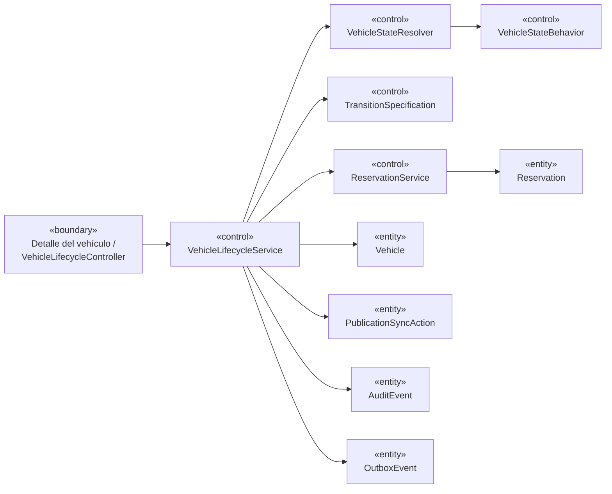
```mermaid
flowchart LR
    boundary["«boundary»\nDetalle del vehículo /\nVehicleLifecycleController"]
    control["«control»\nVehicleLifecycleService"]
    resolver["«control»\nVehicleStateResolver"]
    state["«control»\nVehicleStateBehavior"]
    spec["«control»\nTransitionSpecification"]
    reservation["«control»\nReservationService"]
    vehicle["«entity»\nVehicle"]
    reserveEntity["«entity»\nReservation"]
    publication["«entity»\nPublicationSyncAction"]
    audit["«entity»\nAuditEvent"]
    outbox["«entity»\nOutboxEvent"]

    boundary --> control
    control --> resolver
    resolver --> state
    control --> spec
    control --> reservation
    control --> vehicle
    reservation --> reserveEntity
    control --> publication
    control --> audit
    control --> outbox
```

| Falla | Detección | Respuesta | Estado persistido |
|---|---|---|---|
| Actor sin permiso | `AuthorizationService` | `403` | Sin cambios. |
| Transición inexistente | State actual | `409 INVALID_STATE_TRANSITION` | Sin cambios. |
| Precondición incumplida | Specification | `409 PRECONDITION_NOT_MET` con detalle | Sin cambios. |
| Versión obsoleta | `saveIfVersion` | `412` | Sin sobrescritura. |
| Segunda reserva | Índice único parcial | `409` y rollback | Conserva la primera reserva. |
| Error al insertar auditoría u Outbox | Transacción local | `500` y rollback | No queda transición parcial. |

#### 10.1.7. Contratos REST

##### Consultar transiciones disponibles

```http
GET /api/vehicles/{vehicleId}/available-transitions
Authorization: Bearer <token>
```

```json
{
  "vehicleId": "2a650ee4-9e8d-43cc-9b5a-916d37a19b48",
  "currentState": "PUBLICADO",
  "version": 12,
  "availableTransitions": [
    {
      "targetState": "RESERVADO",
      "requiredFields": ["buyerId", "reservationCondition"]
    },
    {
      "targetState": "RETIRADO",
      "requiredFields": ["reason"]
    }
  ]
}
```

##### Ejecutar transición

```http
POST /api/vehicles/{vehicleId}/transitions
Authorization: Bearer <token>
If-Match: "12"
Idempotency-Key: 52e18c34-1a21-4633-9728-b8d196071fac
Content-Type: application/json
```

```json
{
  "targetState": "RESERVADO",
  "reason": "Cliente confirma reserva",
  "context": {
    "buyerId": "d4d2c237-1295-4ad7-96f2-1dc8ffebcc38",
    "reservationCondition": "Depósito confirmado"
  }
}
```

```json
{
  "vehicleId": "2a650ee4-9e8d-43cc-9b5a-916d37a19b48",
  "previousState": "PUBLICADO",
  "currentState": "RESERVADO",
  "version": 13,
  "reservationStatus": "ACTIVA",
  "publicationEffects": 3,
  "externalSyncStatus": "PENDING"
}
```

##### Errores funcionales

| HTTP | Código | Condición |
|---|---|---|
| `400` | `INVALID_REQUEST` | Datos o encabezados requeridos ausentes. |
| `403` | `TRANSITION_NOT_AUTHORIZED` | El actor no tiene permiso. |
| `404` | `VEHICLE_NOT_FOUND` | El vehículo no existe o no es visible. |
| `409` | `INVALID_STATE_TRANSITION` | El State actual no ofrece el destino. |
| `409` | `VEHICLE_ALREADY_RESERVED` | Ya hay una reserva activa. |
| `409` | `PRECONDITION_NOT_MET` | Falta un dato o requisito. |
| `412` | `STALE_VEHICLE_VERSION` | La versión cambió. |
| `422` | `BUSINESS_RULE_VIOLATION` | La forma es válida, pero viola una regla. |

#### 10.1.8. Contratos internos

```java
public interface VehicleStateBehavior {
    TransitionDecision evaluate(
        VehicleState target,
        TransitionContext context
    );
}

public interface PublicationEffectPort {
    int markForVehicleStateChange(
        UUID vehicleId,
        VehicleState previousState,
        VehicleState newState
    );
}

public interface OutboxPort {
    void append(DomainEvent event);
}
```

### 10.2. Componente 2: Coordinador de sincronización de publicaciones

#### 10.2.1. Responsabilidad y trazabilidad

El componente procesa efectos externos sin bloquear la operación principal. Un evento puede afectar varias publicaciones; por eso se registra una `PublicationSyncAction` independiente para cada canal.

| Requerimiento | Evidencia en el componente |
|---|---|
| `REQ-PUB-01` | Expande eventos de precio, reserva, venta y retiro en acciones por publicación. |
| `REQ-PUB-02` | Un error cambia el estado operativo de la acción, no el estado del vehículo. |
| `REQ-PUB-03` | `ManualPublicationAdapter` crea tareas idempotentes. |
| `REQ-INT-01` | `ProcessedActionStore`, `RetryPolicy` y clave `eventId + publicationId`. |
| `S07-Q2` | La acción se crea en la transacción interna y el worker la toma antes de un minuto. |
| `S07-Q4` | Último error, intentos y próxima ejecución quedan visibles por canal. |

#### 10.2.2. Invariantes y estados operativos

Se distinguen tres conceptos que antes aparecían mezclados:

```text
Evento Outbox:
PENDING -> PROCESSING -> PROCESSED
                    -> RETRY_SCHEDULED
                    -> WAITING_MANUAL
                    -> DEAD_LETTER
                    -> CANCELLED

Acción de integración:
PENDIENTE -> EN_PROCESO -> EXITOSA
                       -> EN_REINTENTO -> EN_PROCESO
                       -> TAREA_MANUAL_ABIERTA -> EXITOSA / CANCELADA
                       -> DEAD_LETTER
                       -> CANCELADA

Publicación externa:
PENDIENTE -> ACTUALIZADA / MANUAL_PENDIENTE / FALLIDA / CERRADA
```

1. El consumidor no cambia `Vehicle.state`.
2. Una acción `EXITOSA` para `eventId + targetId` no se ejecuta de nuevo.
3. Un fallo temporal usa `EN_REINTENTO`; un error no recuperable o el agotamiento de intentos usa `DEAD_LETTER`.
4. Crear una tarea manual no completa la obligación: la acción queda `TAREA_MANUAL_ABIERTA` y el evento `WAITING_MANUAL`.
5. La verificación de la tarea cambia la acción a `EXITOSA` y actualiza la publicación a `ACTUALIZADA` o `CERRADA`, según la intención.
6. El evento queda `PROCESSED` solo cuando todas sus acciones están en `EXITOSA` o `CANCELADA`.
7. Si al menos una acción está en `DEAD_LETTER`, el evento refleja `DEAD_LETTER`; los éxitos de otros canales se conservan.
8. Un replay opera sobre acciones concretas y no repite las que ya terminaron correctamente.

#### 10.2.3. Clases de diseño

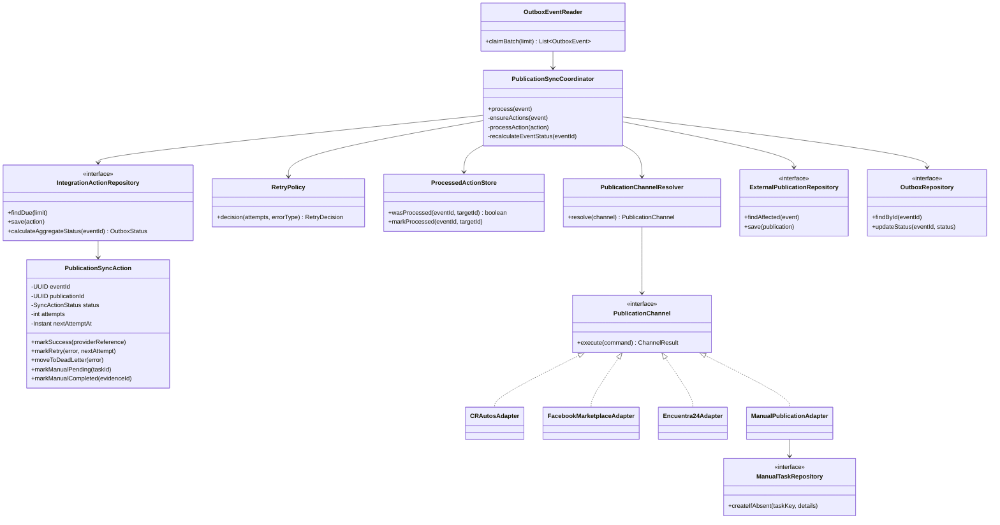
```mermaid
classDiagram
    class OutboxEventReader {
      +claimBatch(limit) List~OutboxEvent~
    }

    class PublicationSyncCoordinator {
      +process(event)
      -ensureActions(event)
      -processAction(action)
      -recalculateEventStatus(eventId)
    }

    class PublicationSyncAction {
      -UUID eventId
      -UUID publicationId
      -SyncActionStatus status
      -int attempts
      -Instant nextAttemptAt
      +markSuccess(providerReference)
      +markRetry(error, nextAttempt)
      +moveToDeadLetter(error)
      +markManualPending(taskId)
      +markManualCompleted(evidenceId)
    }

    class PublicationChannelResolver {
      +resolve(channel) PublicationChannel
    }

    class PublicationChannel {
      <<interface>>
      +execute(command) ChannelResult
    }

    class RetryPolicy {
      +decision(attempts, errorType) RetryDecision
    }

    class ProcessedActionStore {
      +wasProcessed(eventId, targetId) boolean
      +markProcessed(eventId, targetId)
    }

    class IntegrationActionRepository {
      <<interface>>
      +findDue(limit)
      +save(action)
      +calculateAggregateStatus(eventId) OutboxStatus
    }

    class ExternalPublicationRepository {
      <<interface>>
      +findAffected(event)
      +save(publication)
    }

    class OutboxRepository {
      <<interface>>
      +findById(eventId)
      +updateStatus(eventId, status)
    }

    class ManualTaskRepository {
      <<interface>>
      +createIfAbsent(taskKey, details)
    }

    class CRAutosAdapter
    class FacebookMarketplaceAdapter
    class Encuentra24Adapter
    class ManualPublicationAdapter

    OutboxEventReader --> PublicationSyncCoordinator
    PublicationSyncCoordinator --> IntegrationActionRepository
    PublicationSyncCoordinator --> PublicationChannelResolver
    PublicationSyncCoordinator --> RetryPolicy
    PublicationSyncCoordinator --> ProcessedActionStore
    PublicationSyncCoordinator --> ExternalPublicationRepository
    PublicationSyncCoordinator --> OutboxRepository
    PublicationChannelResolver --> PublicationChannel
    PublicationChannel <|.. CRAutosAdapter
    PublicationChannel <|.. FacebookMarketplaceAdapter
    PublicationChannel <|.. Encuentra24Adapter
    PublicationChannel <|.. ManualPublicationAdapter
    ManualPublicationAdapter --> ManualTaskRepository
    IntegrationActionRepository --> PublicationSyncAction
```

#### 10.2.4. Secuencia principal: cambio de precio con un canal automático y uno manual

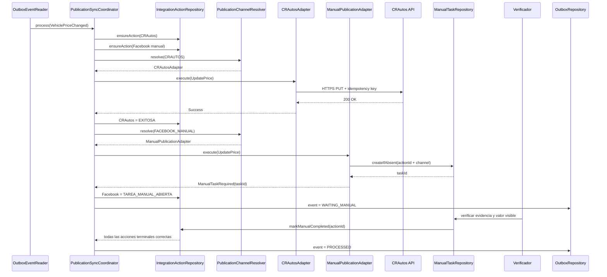
```mermaid
sequenceDiagram
    participant R as OutboxEventReader
    participant C as PublicationSyncCoordinator
    participant AR as IntegrationActionRepository
    participant RES as PublicationChannelResolver
    participant CA as CRAutosAdapter
    participant MA as ManualPublicationAdapter
    participant X as CRAutos API
    participant T as ManualTaskRepository
    participant V as Verificador
    participant O as OutboxRepository

    R->>C: process(VehiclePriceChanged)
    C->>AR: ensureAction(CRAutos)
    C->>AR: ensureAction(Facebook manual)

    C->>RES: resolve(CRAUTOS)
    RES-->>C: CRAutosAdapter
    C->>CA: execute(UpdatePrice)
    CA->>X: HTTPS PUT + idempotency key
    X-->>CA: 200 OK
    CA-->>C: Success
    C->>AR: CRAutos = EXITOSA

    C->>RES: resolve(FACEBOOK_MANUAL)
    RES-->>C: ManualPublicationAdapter
    C->>MA: execute(UpdatePrice)
    MA->>T: createIfAbsent(actionId + channel)
    T-->>MA: taskId
    MA-->>C: ManualTaskRequired(taskId)
    C->>AR: Facebook = TAREA_MANUAL_ABIERTA
    C->>O: event = WAITING_MANUAL

    V->>T: verificar evidencia y valor visible
    T->>AR: markManualCompleted(actionId)
    AR-->>C: todas las acciones terminales correctas
    C->>O: event = PROCESSED
```

El evento no se marca procesado al crear la tarea. La obligación termina cuando la acción manual fue ejecutada y verificada, o cuando se cancela porque dejó de ser compatible con el estado actual.

#### 10.2.5. Secuencia alternativa: proveedor temporalmente fuera de servicio

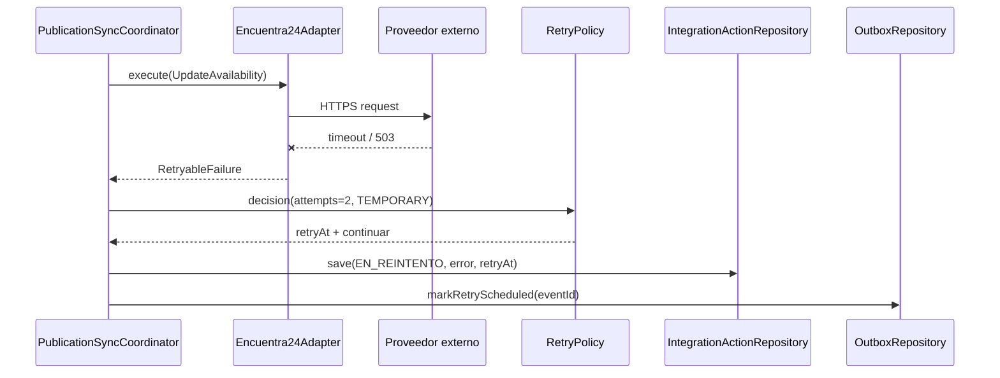
```mermaid
sequenceDiagram
    participant C as PublicationSyncCoordinator
    participant A as Encuentra24Adapter
    participant X as Proveedor externo
    participant RP as RetryPolicy
    participant AR as IntegrationActionRepository
    participant O as OutboxRepository

    C->>A: execute(UpdateAvailability)
    A->>X: HTTPS request
    X--xA: timeout / 503
    A-->>C: RetryableFailure
    C->>RP: decision(attempts=2, TEMPORARY)
    RP-->>C: retryAt + continuar
    C->>AR: save(EN_REINTENTO, error, retryAt)
    C->>O: markRetryScheduled(eventId)
```

Cuando `RetryPolicy` determina que no quedan intentos, la acción pasa a `DEAD_LETTER`, se genera una alerta y el evento refleja el mismo estado agregado. Los éxitos ya obtenidos en otros canales no se revierten.

#### 10.2.6. Análisis de robustez

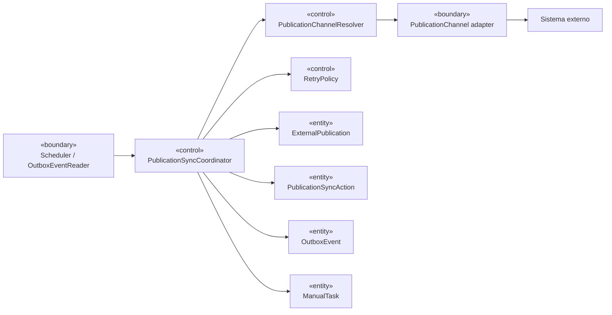
```mermaid
flowchart LR
    scheduler["«boundary»\nScheduler / OutboxEventReader"]
    coordinator["«control»\nPublicationSyncCoordinator"]
    resolver["«control»\nPublicationChannelResolver"]
    retry["«control»\nRetryPolicy"]
    adapter["«boundary»\nPublicationChannel adapter"]
    publication["«entity»\nExternalPublication"]
    action["«entity»\nPublicationSyncAction"]
    outbox["«entity»\nOutboxEvent"]
    task["«entity»\nManualTask"]
    provider["Sistema externo"]

    scheduler --> coordinator
    coordinator --> resolver
    coordinator --> retry
    resolver --> adapter
    adapter --> provider
    coordinator --> publication
    coordinator --> action
    coordinator --> outbox
    coordinator --> task
```

| Falla | Clasificación | Respuesta | Resultado visible |
|---|---|---|---|
| Timeout, `429` o `503` | Temporal | Reintento con espera creciente | `EN_REINTENTO`, error y próxima fecha. |
| Credencial vencida | Temporal operativa | Reintento limitado + alerta técnica | `EN_REINTENTO`; luego `DEAD_LETTER` si no se corrige. |
| Publicación inexistente en proveedor | Permanente | No reintentar automáticamente | Acción `DEAD_LETTER`, publicación `FALLIDA` y tarea de revisión. |
| Canal sin API | Manual | Crear tarea idempotente | Acción `TAREA_MANUAL_ABIERTA`, publicación `MANUAL_PENDIENTE` y evento `WAITING_MANUAL`. |
| Worker cae después del éxito externo | Resultado incierto | Repetir con clave idempotente o reconciliar | No se duplica cuando el proveedor soporta clave; de lo contrario se consulta/reconcilia. |

#### 10.2.7. Contrato del evento y de la acción

```json
{
  "eventId": "af33afe4-189b-4801-90cf-3f457ffedb15",
  "eventType": "VehiclePriceChanged",
  "aggregateId": "2a650ee4-9e8d-43cc-9b5a-916d37a19b48",
  "occurredAt": "2026-08-06T19:30:00-06:00",
  "payload": {
    "previousPrice": 12500000,
    "newPrice": 11900000,
    "currency": "CRC",
    "changedBy": "user-123"
  }
}
```

Una acción derivada usa esta clave lógica:

```text
syncActionKey = eventId + ":" + publicationId
```

Reglas:

- el evento y las acciones iniciales se insertan con el cambio interno;
- el coordinador puede completar o ampliar las acciones idempotentemente;
- cada acción se reintenta de forma independiente;
- el adaptador no recibe acceso al repositorio de vehículos;
- una tarea manual abierta mantiene el evento en `WAITING_MANUAL`;
- el evento se marca `PROCESSED` solo cuando todas sus acciones están `EXITOSA` o `CANCELADA`;
- una acción en `DEAD_LETTER` hace visible el fallo agregado sin revertir acciones exitosas.

#### 10.2.8. Contrato interno del adaptador

```java
public interface PublicationChannel {
    ChannelCapabilities capabilities();
    ChannelResult execute(PublicationCommand command);
}

public sealed interface ChannelResult {
    record Success(String externalReference) implements ChannelResult {}
    record ManualTaskRequired(String reason) implements ChannelResult {}
    record RetryableFailure(String code, String message) implements ChannelResult {}
    record PermanentFailure(String code, String message) implements ChannelResult {}
}
```

#### 10.2.9. Contrato de consulta operativa

```http
GET /api/publications?vehicleId={vehicleId}
Authorization: Bearer <token>
```

```json
{
  "vehicleId": "2a650ee4-9e8d-43cc-9b5a-916d37a19b48",
  "publications": [
    {
      "channel": "CRAUTOS",
      "publicationStatus": "ACTUALIZADA",
      "actionStatus": "EXITOSA",
      "lastSuccessfulSyncAt": "2026-08-06T19:31:15-06:00"
    },
    {
      "channel": "ENCUENTRA24",
      "publicationStatus": "PENDIENTE",
      "actionStatus": "EN_REINTENTO",
      "attempts": 2,
      "lastError": "Proveedor no disponible",
      "nextAttemptAt": "2026-08-06T19:36:00-06:00"
    }
  ]
}
```


#### 10.2.10. Observabilidad y operación del Outbox

El Outbox debe responder cinco preguntas operativas: qué trabajo está pendiente, desde cuándo, por qué falló, quién lo atiende y cómo se recupera sin duplicar el efecto. La política se aplica a publicaciones, Calendar, notificaciones y reconciliaciones; este componente la detalla para publicaciones.

##### Estados y regla de agregación

| Nivel | Estados | Regla |
|---|---|---|
| Evento Outbox | `PENDING`, `PROCESSING`, `RETRY_SCHEDULED`, `WAITING_MANUAL`, `PROCESSED`, `DEAD_LETTER`, `CANCELLED` | Resume la situación de todas las acciones derivadas. |
| Acción de integración | `PENDIENTE`, `EN_PROCESO`, `EN_REINTENTO`, `TAREA_MANUAL_ABIERTA`, `EXITOSA`, `DEAD_LETTER`, `CANCELADA` | Representa un destino concreto: publicación, cita, notificación o documento. |
| Publicación externa | `PENDIENTE`, `ACTUALIZADA`, `MANUAL_PENDIENTE`, `FALLIDA`, `CERRADA` | Informa la consistencia visible por canal. |

Prioridad para calcular el estado agregado:

1. `DEAD_LETTER` si existe una acción no resuelta en dead-letter;
2. `WAITING_MANUAL` si existe una tarea manual abierta y no hay dead-letter;
3. `RETRY_SCHEDULED` si existe una acción en reintento;
4. `PROCESSING` si existe una acción en proceso;
5. `PROCESSED` si todas las acciones están `EXITOSA` o `CANCELADA`.

Esta regla evita dos errores: declarar éxito cuando todavía hay una tarea manual abierta y convertir todo el evento en fallo sin conservar los canales que ya terminaron correctamente.

##### Política de reintentos

| Clasificación | Ejemplos | Tratamiento |
|---|---|---|
| Temporal | timeout, `429`, `502`, `503`, conexión interrumpida | Reintentos con espera creciente: 1, 5, 15 y 60 minutos. |
| Credenciales/configuración | `401`, `403`, token revocado | Acción a `DEAD_LETTER`, alerta técnica y replay después de corregir la causa. |
| Solicitud inválida | `400`, campo rechazado, publicación inexistente | Acción a `DEAD_LETTER`; respuesta sanitizada y tarea de revisión. |
| Duplicado confirmado | El proveedor indica que la acción ya fue aplicada | Se trata como `EXITOSA` y se registra la referencia externa. |
| Canal manual | No existe API confiable o la capacidad requerida no está disponible | Acción `TAREA_MANUAL_ABIERTA`; evento `WAITING_MANUAL`. |

El intento inicial es inmediato y los intentos de 1, 5 y 15 minutos mantienen el compromiso de intentar la sincronización dentro de los 20 minutos definidos en S07. El intento de 60 minutos es una recuperación adicional; si falla, la acción pasa a dead-letter.

##### Datos operativos mínimos

```text
outbox_event:
  event_id, event_type, aggregate_id, correlation_id,
  status, created_at, next_attempt_at,
  locked_by, locked_until, dead_lettered_at,
  completed_at, recovered_at

integration_action:
  action_id, event_id, target_type, target_id,
  channel, action_type, idempotency_key, status,
  attempts, next_attempt_at, last_http_status,
  last_error_class, last_error_code, last_error_summary,
  provider_reference, manual_task_id, updated_at
```

`target_type` permite usar la misma operación para `PUBLICATION`, `APPOINTMENT`, `NOTIFICATION` o `DOCUMENT_RECONCILIATION`. No se guardan tokens, encabezados de autorización, documentos ni respuestas completas con datos personales. El resumen de error se sanitiza antes de persistirse.

##### Métricas y alertas

| Métrica | Propósito | Umbral inicial |
|---|---|---|
| `outbox_events_total{status}` | Volumen por estado agregado. | Alerta si `DEAD_LETTER > 0`. |
| `outbox_oldest_action_age_seconds{status,channel}` | Edad de la acción más antigua. | Aviso a 5 min; crítico a 20 min para acciones automáticas. |
| `integration_action_success_ratio{channel}` | Acciones automáticas exitosas / terminadas. | Objetivo mensual ≥ 95%, analizado por canal. |
| `integration_action_duration_seconds_p95{channel}` | Tiempo hasta `EXITOSA`, `CANCELADA` o `DEAD_LETTER`. | p95 ≤ 20 min cuando el proveedor está disponible. |
| `manual_task_overdue_total{channel,priority}` | Tareas manuales vencidas. | Alerta cuando sea mayor que cero. |
| `worker_last_success_timestamp` | Detecta worker detenido. | Crítico si hay acciones elegibles y no procesa durante 10 min. |
| `replay_total{result}` | Controla recuperaciones y repetición de fallos. | Revisión si un mismo error reaparece después del replay. |

El tablero muestra por canal: acciones pendientes, edad máxima, reintentos, dead-letter, tareas manuales vencidas y últimas recuperaciones. Cada registro enlaza con `correlationId`, vehículo y destino, sin exponer datos sensibles.

##### Responsables y escalamiento

| Situación | Responsable primario | Escalamiento |
|---|---|---|
| Error temporal dentro del periodo de reintento | Procesador automático; supervisa administrador técnico. | Administrador técnico si supera 20 minutos. |
| Credenciales, cuota o configuración | Administrador técnico. | Dueño del negocio si afecta varios canales o supera 60 minutos. |
| Error de contenido o publicación inexistente | Encargado de publicaciones. | Dueño del negocio para vehículos reservados, vendidos o retirados. |
| Tarea manual | Encargado de publicaciones asignado. | Dueño del negocio al vencer el SLA. |
| Calendar o notificación en dead-letter | Administrador técnico y responsable de agenda. | Dueño del negocio si afecta citas del mismo día. |
| Posible exposición de documento | Administrador técnico y encargado de documentos. | Dueño del negocio de inmediato. |

##### Dead-letter y recuperación por acción

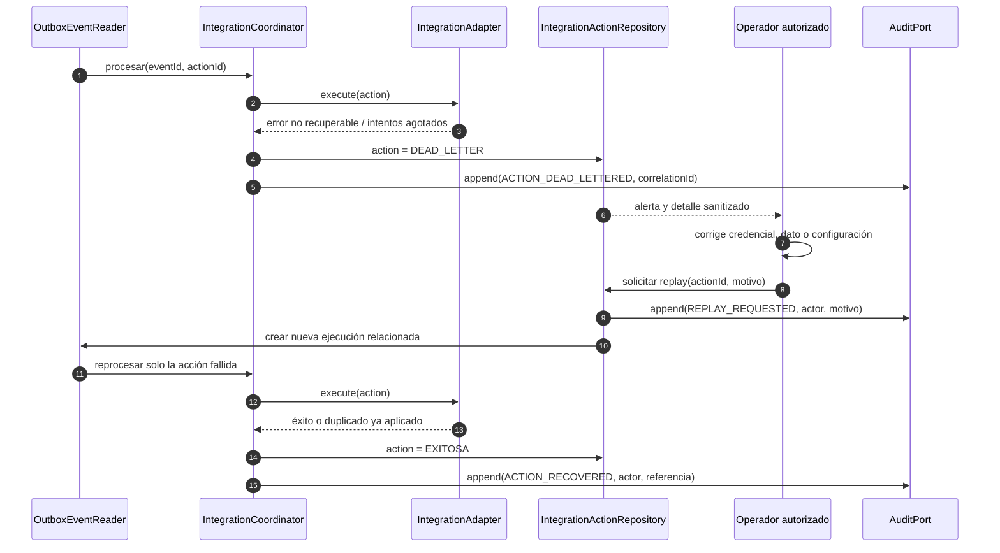
```mermaid
sequenceDiagram
    autonumber
    participant W as OutboxEventReader
    participant C as IntegrationCoordinator
    participant A as IntegrationAdapter
    participant R as IntegrationActionRepository
    participant O as Operador autorizado
    participant U as AuditPort

    W->>C: procesar(eventId, actionId)
    C->>A: execute(action)
    A-->>C: error no recuperable / intentos agotados
    C->>R: action = DEAD_LETTER
    C->>U: append(ACTION_DEAD_LETTERED, correlationId)
    R-->>O: alerta y detalle sanitizado
    O->>O: corrige credencial, dato o configuración
    O->>R: solicitar replay(actionId, motivo)
    R->>U: append(REPLAY_REQUESTED, actor, motivo)
    R->>W: crear nueva ejecución relacionada
    W->>C: reprocesar solo la acción fallida
    C->>A: execute(action)
    A-->>C: éxito o duplicado ya aplicado
    C->>R: action = EXITOSA
    C->>U: append(ACTION_RECOVERED, actor, referencia)
```

La recuperación usa una operación explícita:

```http
POST /api/operations/outbox/{eventId}/replay
Authorization: Bearer <token con OUTBOX_RECOVER>
Idempotency-Key: <uuid>
Content-Type: application/json
```

```json
{
  "actionIds": ["uuid-de-accion"],
  "reason": "Credencial del canal renovada y verificada"
}
```

Reglas:

1. el replay requiere al menos una acción `DEAD_LETTER`;
2. el payload original no se edita; se crea una ejecución relacionada con la acción original;
3. la clave funcional se conserva para detectar duplicados;
4. actor, motivo, fecha, evento, acción y resultado quedan auditados;
5. antes de repetir una operación de resultado incierto se consulta o reconcilia el estado externo;
6. una acción incompatible con el estado actual del vehículo se cambia a `CANCELADA`;
7. el estado agregado del evento se recalcula después de cada recuperación.

##### Runbook resumido

1. localizar la acción por alerta, `correlationId`, vehículo o destino;
2. revisar error, intentos, edad y estado interno actual;
3. comprobar si el proveedor aplicó la operación aunque no respondiera;
4. corregir credencial, capacidad, datos o configuración;
5. decidir entre replay, tarea manual o cancelación;
6. ejecutar la recuperación con motivo;
7. comprobar el resultado externo y el estado agregado del evento;
8. cerrar el incidente y registrar una acción preventiva si el error puede repetirse.

#### 10.2.11. Gestión de canales manuales

Un canal manual no se trata como una nota informal. Se modela como una operación controlada que conserva la misma intención que un adaptador automático, pero requiere intervención humana.

##### Ciclo de vida de la tarea

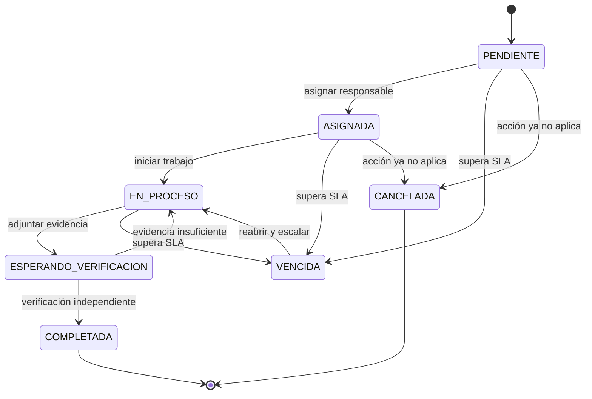
```mermaid
stateDiagram-v2
    [*] --> PENDIENTE
    PENDIENTE --> ASIGNADA: asignar responsable
    ASIGNADA --> EN_PROCESO: iniciar trabajo
    EN_PROCESO --> ESPERANDO_VERIFICACION: adjuntar evidencia
    ESPERANDO_VERIFICACION --> COMPLETADA: verificación independiente
    ESPERANDO_VERIFICACION --> EN_PROCESO: evidencia insuficiente
    PENDIENTE --> VENCIDA: supera SLA
    ASIGNADA --> VENCIDA: supera SLA
    EN_PROCESO --> VENCIDA: supera SLA
    VENCIDA --> EN_PROCESO: reabrir y escalar
    PENDIENTE --> CANCELADA: acción ya no aplica
    ASIGNADA --> CANCELADA: acción ya no aplica
    COMPLETADA --> [*]
    CANCELADA --> [*]
```

##### Datos obligatorios

| Campo | Uso |
|---|---|
| `taskId`, `actionId`, `correlationId` | Trazabilidad e idempotencia. |
| Vehículo, publicación y canal | Contexto exacto de la tarea. |
| Tipo de acción | Crear, cambiar precio, marcar reservado, retirar o cerrar. |
| Valor esperado | Precio o disponibilidad que debe quedar visible. |
| URL externa conocida | Acceso a la publicación que debe modificarse. |
| Instrucciones | Pasos específicos del canal sin incluir credenciales. |
| Responsable y rol | Persona que ejecuta la acción. |
| `dueAt` y prioridad | Control del SLA. |
| Evidencia | URL final, captura, referencia externa o nota justificada. |
| Verificador | Persona distinta cuando la acción afecta vendido, retirado o precio. |
| Resultado y motivo | Cierre, cancelación o imposibilidad. |

##### SLA interno inicial

| Acción | SLA de ejecución manual | Prioridad |
|---|---:|---|
| Vehículo reservado | 15 minutos | Alta |
| Vehículo vendido o retirado | 15 minutos | Crítica |
| Cambio de precio | 30 minutos | Alta |
| Nueva publicación | 4 horas hábiles | Normal |
| Corrección de descripción o fotos | 8 horas hábiles | Normal |

Estos tiempos no prometen que el marketplace publique o modere contenido dentro del mismo plazo. Miden el tiempo bajo control del negocio: tomar la tarea, ejecutar la acción disponible y registrar evidencia.

##### Reglas de control

- La clave `actionId + channel` impide crear dos tareas activas para la misma intención.
- Mientras la tarea esté abierta, la acción permanece `TAREA_MANUAL_ABIERTA` y el evento `WAITING_MANUAL`.
- Una tarea no se marca `COMPLETADA` sin evidencia y verificación cuando afecta disponibilidad o precio.
- Al verificar la tarea, el sistema cambia la acción a `EXITOSA`, actualiza la publicación y recalcula el evento.
- Si el canal no permite confirmar el resultado, se registra `NO_VERIFICABLE` con motivo y se mantiene visible en el tablero.
- Un cambio posterior invalida tareas anteriores incompatibles. Por ejemplo, una tarea para marcar reservado se cancela si el vehículo pasa a vendido y se crea una de retiro.
- Las tareas vencidas generan notificación y escalamiento; no desaparecen del tablero.
- Una reconciliación diaria revisa publicaciones activas y tareas abiertas contra el estado oficial.
- El sistema conserva historial; una tarea no se borra para ocultar un incumplimiento.

##### Contratos operativos

```http
GET /api/operations/manual-publications?status=VENCIDA&channel=FACEBOOK
POST /api/operations/manual-publications/{taskId}/assign
POST /api/operations/manual-publications/{taskId}/start
POST /api/operations/manual-publications/{taskId}/submit-evidence
POST /api/operations/manual-publications/{taskId}/verify
POST /api/operations/manual-publications/{taskId}/cancel
```

Ejemplo de evidencia:

```json
{
  "externalUrl": "https://canal.example/publicacion/123",
  "observedPrice": 9850000,
  "observedAvailability": "RESERVADO",
  "evidenceReference": "drive://evidencias/publicacion-123-captura",
  "notes": "Cambio visible y revisado en sesión sin autenticación"
}
```

El repositorio de evidencias usa una ubicación separada de los documentos personales del vehículo y aplica retención limitada. Las capturas no deben incluir conversaciones, identificaciones ni datos del comprador.

### 10.3. Componente 3: Servicio de agenda de citas

#### 10.3.1. Responsabilidad y trazabilidad

El componente administra la solicitud y la cita comercial. El sitio público registra una preferencia; solo un usuario interno puede asignar responsable y horario definitivo. Google Calendar conserva una copia de apoyo.

| Requerimiento | Evidencia en el componente |
|---|---|
| `REQ-LEAD-01` | La solicitud reutiliza o crea un lead mínimo mediante `LeadService`. |
| `REQ-APT-01` | `Appointment` se guarda antes del evento Outbox de Calendar. |
| `REQ-APT-02` | `VehicleAppointmentPolicy` consulta el estado oficial. |
| `REQ-LCV-03` | Vendido o retirado devuelve conflicto y no crea ni agenda la cita. |
| `REQ-AUD-01` | Solicitar, agendar, confirmar, reprogramar y cancelar genera auditoría. |
| `S07-Q3` | El bloqueo es local y no espera a Calendar. |
| `S07-Q5` | La solicitud pública usa cuatro campos obligatorios. |

#### 10.3.2. Invariantes y ciclo de cita

```text
SOLICITADA -> AGENDADA -> CONFIRMADA -> REALIZADA
SOLICITADA / AGENDADA / CONFIRMADA -> CANCELADA
AGENDADA / CONFIRMADA -> NO_ASISTIO
```

1. Toda cita pertenece a un vehículo y a un lead.
2. `SOLICITADA` puede existir sin vendedor; `AGENDADA` requiere vendedor y fecha definitiva.
3. La cita interna existe aunque Google Calendar esté caído.
4. No se crean ni agendan citas para `VENDIDO` o `RETIRADO`.
5. Reprogramar conserva la fecha anterior en auditoría.
6. La clave idempotente impide solicitudes públicas duplicadas.
7. Un conflicto de horario no sobrescribe otra cita.
8. PostgreSQL impide traslapes de intervalos para un mismo vendedor en estados `AGENDADA` o `CONFIRMADA`; la consulta previa solo mejora la respuesta al usuario.

#### 10.3.3. Clases de diseño

```mermaid
classDiagram
    class AppointmentController {
      +requestVisit(command, idempotencyKey)
      +schedule(appointmentId, command, ifMatch)
      +confirm(appointmentId, ifMatch)
      +reschedule(appointmentId, command, ifMatch)
      +cancel(appointmentId, reason, ifMatch)
    }

    class AppointmentSchedulingService {
      +requestVisit(command) AppointmentResult
      +schedule(command) AppointmentResult
      +confirm(command) AppointmentResult
      +reschedule(command) AppointmentResult
      +cancel(command) AppointmentResult
    }

    class Appointment {
      -UUID id
      -UUID vehicleId
      -UUID leadId
      -UUID sellerId
      -AppointmentStatus status
      -Instant preferredAt
      -Instant scheduledAt
      -long version
      +schedule(date, seller)
      +confirm()
      +reschedule(date)
      +cancel(reason)
    }

    class SellerAssignmentPolicy {
      +selectOrValidate(requestedSeller, vehicleId, date) UUID
    }

    class SellerAvailabilityPolicy {
      +evaluate(sellerId, start, duration) AvailabilityResult
    }

    class VehicleAppointmentPolicy {
      +assertRequestAllowed(vehicleState)
      +assertScheduleAllowed(vehicleState)
    }

    class LeadService {
      +findOrCreateMinimalLead(contact, vehicleId, origin)
    }

    class VehicleAvailabilityPort {
      <<interface>>
      +getState(vehicleId) VehicleState
    }

    class AppointmentRepository {
      <<interface>>
      +findById(id)
      +findConflicts(sellerId, start, duration)
      +saveScheduledIfNoOverlap(appointment, expectedVersion)
    }

    class AuditPort {
      <<interface>>
      +append(event)
    }

    class OutboxPort {
      <<interface>>
      +append(event)
    }

    AppointmentController --> AppointmentSchedulingService
    AppointmentSchedulingService --> AppointmentRepository
    AppointmentSchedulingService --> LeadService
    AppointmentSchedulingService --> SellerAssignmentPolicy
    AppointmentSchedulingService --> SellerAvailabilityPolicy
    AppointmentSchedulingService --> VehicleAppointmentPolicy
    AppointmentSchedulingService --> VehicleAvailabilityPort
    AppointmentSchedulingService --> AuditPort
    AppointmentSchedulingService --> OutboxPort
    AppointmentRepository --> Appointment
```

#### 10.3.4. Secuencia principal: solicitar y agendar una visita

```mermaid
sequenceDiagram
    actor B as Comprador
    actor V as Vendedor
    participant W as Sitio público
    participant BO as Backoffice
    participant C as AppointmentController
    participant S as AppointmentSchedulingService
    participant L as LeadService
    participant VP as VehicleAvailabilityPort
    participant AP as SellerAssignmentPolicy
    participant SP as SellerAvailabilityPolicy
    participant R as AppointmentRepository
    participant A as AuditPort
    participant O as OutboxPort

    B->>W: Solicita visita y propone horario
    W->>C: POST /public/visit-requests
    C->>S: requestVisit(command)
    S->>VP: getState(vehicleId)
    VP-->>S: PUBLICADO
    S->>L: findOrCreateMinimalLead(contact, vehicleId, SITIO_WEB)
    L-->>S: Lead
    S->>R: save(Appointment SOLICITADA)
    S->>A: append(VISIT_REQUESTED)
    S-->>C: 201 SOLICITADA
    C-->>W: solicitud registrada

    V->>BO: Asigna responsable y horario
    BO->>C: POST /appointments/{id}/schedule\nIf-Match
    C->>S: schedule(command)
    S->>VP: getState(vehicleId)
    VP-->>S: PUBLICADO
    S->>AP: selectOrValidate(seller, vehicle, date)
    AP-->>S: sellerId
    S->>SP: evaluate(sellerId, date, duration)
    SP-->>S: disponible
    S->>R: saveScheduledIfNoOverlap(Appointment AGENDADA)
    S->>A: append(APPOINTMENT_SCHEDULED)
    S->>O: append(AppointmentScheduled)
    S-->>C: 200 AGENDADA
    C-->>BO: cita agendada
```

La confirmación del comprador cambia `AGENDADA` a `CONFIRMADA`. Calendar se crea o actualiza después del `COMMIT`; su falla no revierte la cita.

#### 10.3.5. Secuencia alternativa: estado terminal o conflicto de horario

```mermaid
sequenceDiagram
    actor U as Usuario interno
    participant C as AppointmentController
    participant S as AppointmentSchedulingService
    participant V as VehicleAvailabilityPort
    participant P as SellerAvailabilityPolicy

    U->>C: Agendar solicitud
    C->>S: schedule(command)
    S->>V: getState(vehicleId)

    alt vehículo VENDIDO o RETIRADO
        V-->>S: VENDIDO
        S-->>C: VEHICLE_NOT_AVAILABLE
        C-->>U: 409 Conflict
    else vehículo disponible
        V-->>S: PUBLICADO
        S->>P: evaluate(sellerId, date, duration)
        P-->>S: conflicto + alternativas
        S-->>C: APPOINTMENT_TIME_CONFLICT
        C-->>U: 409 + horarios alternativos
    end
```

#### 10.3.6. Análisis de robustez

```mermaid
flowchart LR
    web["«boundary»\nSitio público / Backoffice"]
    controller["«boundary»\nAppointmentController"]
    service["«control»\nAppointmentSchedulingService"]
    assignment["«control»\nSellerAssignmentPolicy"]
    availability["«control»\nSellerAvailabilityPolicy"]
    vehiclePolicy["«control»\nVehicleAppointmentPolicy"]
    leadControl["«control»\nLeadService"]
    appointment["«entity»\nAppointment"]
    lead["«entity»\nLead"]
    vehicle["«entity»\nVehicle (consulta)"]
    audit["«entity»\nAuditEvent"]
    outbox["«entity»\nOutboxEvent"]

    web --> controller
    controller --> service
    service --> assignment
    service --> availability
    service --> vehiclePolicy
    service --> leadControl
    service --> appointment
    leadControl --> lead
    vehiclePolicy --> vehicle
    service --> audit
    service --> outbox
```

| Falla | Momento | Respuesta | Resultado |
|---|---|---|---|
| Solicitud duplicada | Alta pública | Reutilizar resultado de `Idempotency-Key` | No duplica lead ni cita. |
| Vehículo vendido antes de agendar | `schedule` | `409 VEHICLE_NOT_AVAILABLE` | La solicitud puede cancelarse con motivo. |
| Vendedor ocupado | Política de disponibilidad | `409` + alternativas | No sobrescribe citas existentes. |
| Dos solicitudes superan la consulta previa | Restricción de exclusión en PostgreSQL | `409 APPOINTMENT_TIME_CONFLICT` y rollback | Solo un intervalo queda confirmado. |
| Versión obsoleta | Guardado | `412` | No pierde reprogramaciones concurrentes. |
| Calendar caído | Después del `COMMIT` | Reintento por Outbox | Cita `AGENDADA`; sincronización pendiente. |
| Error al auditar | Transacción local | Rollback | No queda cambio de estado sin evidencia. |

#### 10.3.7. Contratos públicos e internos

##### Solicitar visita

```http
POST /api/public/visit-requests
Idempotency-Key: 7f4f96e5-3196-4cf3-b40a-78e059038d1f
Content-Type: application/json
```

```json
{
  "vehicleId": "2a650ee4-9e8d-43cc-9b5a-916d37a19b48",
  "name": "María López",
  "phone": "+50688887777",
  "preferredAt": "2026-08-08T10:00:00-06:00",
  "notes": "Prefiere confirmación por WhatsApp"
}
```

```json
{
  "appointmentId": "6bbd56d8-a6b6-4fb9-9301-f6699033b319",
  "status": "SOLICITADA",
  "vehicleId": "2a650ee4-9e8d-43cc-9b5a-916d37a19b48",
  "preferredAt": "2026-08-08T10:00:00-06:00"
}
```

##### Agendar solicitud

```http
POST /api/appointments/{appointmentId}/schedule
Authorization: Bearer <token>
If-Match: "3"
Content-Type: application/json
```

```json
{
  "sellerId": "64ad9985-f178-4bbc-817d-c39bc46e890a",
  "scheduledAt": "2026-08-08T10:30:00-06:00",
  "durationMinutes": 45
}
```

```json
{
  "appointmentId": "6bbd56d8-a6b6-4fb9-9301-f6699033b319",
  "status": "AGENDADA",
  "version": 4,
  "sellerId": "64ad9985-f178-4bbc-817d-c39bc46e890a",
  "scheduledAt": "2026-08-08T10:30:00-06:00",
  "calendarSyncStatus": "PENDING"
}
```

##### Errores

| HTTP | Código | Condición |
|---|---|---|
| `404` | `VEHICLE_NOT_FOUND` | El vehículo no existe o no es visible. |
| `404` | `APPOINTMENT_NOT_FOUND` | La solicitud o cita no existe. |
| `409` | `VEHICLE_NOT_AVAILABLE` | Está vendido o retirado. |
| `409` | `APPOINTMENT_TIME_CONFLICT` | El responsable ya tiene otra cita. |
| `409` | `INVALID_APPOINTMENT_TRANSITION` | El estado de cita no permite la acción. |
| `412` | `STALE_APPOINTMENT_VERSION` | La cita cambió antes de guardar. |
| `422` | `INVALID_APPOINTMENT_TIME` | Fuera del horario o fecha inválida. |

#### 10.3.8. Contratos internos

```java
public interface VehicleAvailabilityPort {
    VehicleState getState(UUID vehicleId);
}

public interface SellerAvailabilityPolicy {
    AvailabilityResult evaluate(
        UUID sellerId,
        Instant start,
        Duration duration
    );
}

public interface AppointmentRepository {
    Optional<Appointment> findById(UUID appointmentId);
    List<Appointment> findConflicts(
        UUID sellerId,
        Instant start,
        Duration duration
    );
    Appointment saveScheduledIfNoOverlap(
        Appointment appointment,
        long expectedVersion
    );
}
```

La consulta de disponibilidad permite ofrecer alternativas, pero la defensa final se mantiene en PostgreSQL mediante una restricción de exclusión conceptual:

```sql
EXCLUDE USING gist (
  seller_id WITH =,
  tstzrange(scheduled_at, scheduled_at + duration, '[)') WITH &&
)
WHERE (status IN ('AGENDADA', 'CONFIRMADA'));
```

La implementación debe habilitar el soporte GiST necesario y traducir la violación de la restricción a `409 APPOINTMENT_TIME_CONFLICT`.


### 10.4. Diseño complementario: Gestor seguro de documentos

Este componente complementario responde al escenario S07-Q6. Google Drive conserva los archivos, pero la aplicación decide quién puede acceder, qué se registra y cómo se detecta un permiso más amplio que el autorizado.

#### 10.4.1. Responsabilidad y límites

**Contenedores:** API central, Procesador de integraciones y PostgreSQL.  
**Sistema externo:** Google Drive.  
**Responsabilidad:** registrar metadatos, clasificar sensibilidad, autorizar cada operación, mediar el acceso al archivo, auditar acciones y reconciliar existencia y permisos.

La aplicación no expone al sitio público una URL permanente de Drive para documentos sensibles. El acceso ocurre mediante la API, después de validar identidad, rol, relación con el vehículo y finalidad de uso.

#### 10.4.2. Clasificación de información

| Clasificación | Ejemplos | Acceso permitido | Exposición externa |
|---|---|---|---|
| `PUBLICA` | Fotografías comerciales aprobadas y ficha pública. | Comprador y usuarios internos. | Puede mostrarse en el sitio propio. |
| `INTERNA` | Lista de fotos pendientes, checklist operativo. | Personal autenticado relacionado con el proceso. | No. |
| `CONFIDENCIAL` | Contrato de consignación, valoración y condiciones comerciales. | Dueño, responsable financiero y encargado autorizado. | No. |
| `RESTRINGIDA` | Identificación del consignante, título o documentos legales del vehículo. | Dueño, encargado de documentos y administrador con motivo válido. | No. |

La clasificación se asigna por tipo documental y solo un rol autorizado puede reducirla. Todo cambio de clasificación queda auditado.

#### 10.4.3. Vista de componentes

```mermaid
flowchart LR
    controller["DocumentController\nREST boundary"]
    service["SecureDocumentService\nOrquestación"]
    authz["DocumentAuthorizationPolicy\nRol + recurso + finalidad"]
    classifier["DocumentClassificationPolicy"]
    inspection["DocumentContentInspectionPort\nTipo, tamaño y malware"]
    repo["DocumentMetadataRepository"]
    audit["AuditPort"]
    reconcile["DrivePermissionReconciler"]
    drivePort["DocumentStoragePort"]
    driveAdapter["GoogleDriveAdapter"]
    db[("PostgreSQL")]
    drive["Google Drive"]

    controller --> service
    service --> authz
    service --> classifier
    service --> inspection
    service --> repo
    service --> audit
    service --> drivePort
    reconcile --> repo
    reconcile --> drivePort
    drivePort --> driveAdapter
    driveAdapter --> drive
    repo --> db
    audit --> db
```

| Componente | Responsabilidad |
|---|---|
| `SecureDocumentService` | Coordina carga, consulta, revisión, descarga y eliminación lógica. |
| `DocumentAuthorizationPolicy` | Evalúa identidad, rol, vehículo, clasificación, acción y finalidad. |
| `DocumentClassificationPolicy` | Define clasificación mínima y reglas de cambio por tipo. |
| `DocumentContentInspectionPort` | Valida tipo real, tamaño, huella y resultado de inspección antes de habilitar el archivo. |
| `DocumentStoragePort` | Oculta el contrato de Drive y evita que el dominio use su SDK. |
| `GoogleDriveAdapter` | Carga, lee, elimina y consulta permisos con credenciales de servicio limitadas. |
| `DrivePermissionReconciler` | Detecta archivos ausentes, enlaces públicos o permisos no esperados. |
| `DocumentMetadataRepository` | Conserva referencia externa, estado, sensibilidad, hash, propietario funcional y retención. |
| `AuditPort` | Registra carga, visualización, descarga, rechazo, reclasificación y eliminación. |

#### 10.4.4. Modelo de autorización

La autorización combina rol y contexto; no se limita a preguntar si el usuario está autenticado.

```text
permitir = rol autorizado
        AND acción permitida para la clasificación
        AND usuario relacionado con el proceso o con privilegio administrativo
        AND vehículo visible para el usuario
        AND finalidad declarada válida
        AND documento no está en CUARENTENA ni ELIMINADO
```

| Rol | Pública | Interna | Confidencial | Restringida |
|---|---:|---:|---:|---:|
| Cliente comprador | Lectura aprobada | No | No | No |
| Vendedor | Lectura | Lectura | Solo documentos comerciales asignados | No |
| Encargado de documentos | Lectura/escritura | Lectura/escritura | Lectura/escritura según tipo | Lectura/escritura con auditoría |
| Responsable financiero | Lectura | Lectura | Lectura de contratos y cierre | No, salvo autorización explícita |
| Dueño del negocio | Lectura | Lectura | Lectura/escritura | Lectura con motivo |
| Administrador técnico | Sin necesidad operativa por defecto | Diagnóstico de metadatos | No accede al contenido por defecto | Acceso excepcional, temporal y auditado |

El rol técnico administra integración y permisos, pero no obtiene acceso general al contenido sensible. El acceso excepcional requiere motivo y queda visible en auditoría.

#### 10.4.5. Reglas de almacenamiento y privacidad

1. Las carpetas se ubican en una unidad o espacio administrado por la organización, no en cuentas personales de vendedores.
2. Se prohíbe el permiso “cualquiera con el enlace” para archivos `INTERNA`, `CONFIDENCIAL` o `RESTRINGIDA`.
3. Las credenciales de integración se guardan fuera del código y con alcance mínimo sobre la ubicación administrada.
4. Todo tráfico entre aplicación y Drive usa HTTPS; el acceso desde cliente pasa por la API.
5. PostgreSQL guarda la referencia externa, no una URL pública reutilizable.
6. Los logs no contienen contenido, números de identificación, tokens ni enlaces de acceso.
7. La auditoría registra identificador de documento, actor, acción, fecha, vehículo, finalidad y `correlationId`, no una copia del archivo.
8. La retención se configura por tipo documental. Al vencer, el archivo se elimina o anonimiza según la obligación aplicable y se conserva un registro mínimo de la acción.
9. Una solicitud de eliminación se ejecuta en Drive y deja una marca de eliminación en PostgreSQL; no se reutiliza la referencia.
10. Las copias de evidencia de publicaciones se almacenan separadas de los documentos personales.
11. Los archivos se almacenan en una ubicación administrada con cifrado en tránsito y en reposo; si el proveedor o la configuración no puede demostrarlo, el tipo documental no se habilita.
12. La finalidad (`purpose`) pertenece a una lista controlada por acción y rol; no se acepta texto libre como justificación suficiente.
13. Reducir un documento `RESTRINGIDA` a una clasificación menor requiere aprobación de dos roles distintos y auditoría.
14. El acceso excepcional del administrador técnico tiene vencimiento, documento específico y aprobación del dueño o encargado de documentos.
15. Antes de pasar a `VERIFICADO`, una carga debe superar validación de tipo, tamaño y contenido; si el servicio de inspección no está disponible, permanece `PENDIENTE_REVISION`.

#### 10.4.6. Flujo principal: consultar un documento restringido

```mermaid
sequenceDiagram
    autonumber
    actor U as Usuario autorizado
    participant C as DocumentController
    participant S as SecureDocumentService
    participant P as DocumentAuthorizationPolicy
    participant R as DocumentMetadataRepository
    participant D as DocumentStoragePort
    participant A as AuditPort

    U->>C: GET /vehicles/{v}/documents/{d}/content?purpose=...
    C->>S: getContent(actor, vehicleId, documentId, purpose)
    S->>R: find(documentId)
    R-->>S: metadata(RESTRINGIDA, VERIFICADO)
    S->>P: authorize(actor, metadata, READ, purpose)
    P-->>S: permitido
    S->>A: append(DOCUMENT_ACCESS_GRANTED)
    S->>D: openStream(driveReference)
    alt entrega finaliza en el servidor
        D-->>S: flujo de contenido
        S->>A: append(DOCUMENT_TRANSFER_COMPLETED)
        S-->>C: stream con no-store y nombre sanitizado
        C-->>U: 200 contenido
    else Drive o transferencia falla
        D--xS: error
        S->>A: append(DOCUMENT_TRANSFER_FAILED)
        S-->>C: 503 sin enlace alternativo
        C-->>U: 503 DOCUMENT_STORAGE_UNAVAILABLE
    end
```

La auditoría diferencia autorización concedida de transferencia completada. Esto evita interpretar un permiso válido como prueba de que el usuario recibió todo el archivo.

Cabeceras de salida para documentos sensibles:

```http
Cache-Control: no-store, private
Pragma: no-cache
Content-Disposition: attachment; filename="documento-vehiculo.pdf"
X-Content-Type-Options: nosniff
```

#### 10.4.7. Flujos alternativos y controles

| Falla o amenaza | Respuesta del diseño | Estado persistido / evidencia |
|---|---|---|
| Usuario sin permiso | `403`; no se consulta Drive. | Intento denegado auditado sin contenido. |
| Documento no pertenece al vehículo solicitado | `404` para evitar enumeración. | Evento de seguridad correlacionado. |
| Archivo fue borrado fuera de la aplicación | `410 DOCUMENT_CONTENT_MISSING`. | Metadato `MISSING`, tarea para encargado. |
| Drive devuelve permiso público inesperado | Se revoca cuando el adaptador lo permite y se pone en `CUARENTENA`. | Alerta crítica, auditoría e incidente. |
| Enlace compartido por fuera del sistema | No funciona si no tiene permiso directo; la aplicación no genera enlaces permanentes. | Reconciliación detecta permisos extra. |
| Malware o archivo no permitido | Carga queda `PENDIENTE_REVISION`; no se expone. | Resultado de validación y responsable. |
| Servicio de inspección no disponible | Falla cerrada; no se publica ni verifica el archivo. | Estado `PENDIENTE_REVISION`, alerta y reintento controlado. |
| Token o credencial expirada | No se amplían permisos; falla cerrada. | Evento Outbox/operativo para renovar credencial. |
| Eliminación solicitada | Se elimina en Drive y se marca `ELIMINADO`. | Actor, motivo y fecha; sin contenido en auditoría. |

#### 10.4.8. Reconciliación de Drive

El `DrivePermissionReconciler` se ejecuta diariamente y también bajo demanda después de un incidente. Revisa:

- existencia del archivo;
- coincidencia entre referencia y vehículo;
- propietario o ubicación esperada;
- ausencia de permisos públicos o externos no autorizados;
- tamaño, tipo y huella cuando estén disponibles;
- archivos sin metadatos y metadatos sin archivo;
- documentos vencidos según política de retención.

Resultados:

| Resultado | Acción |
|---|---|
| `OK` | Actualiza fecha de verificación. |
| `MISSING` | Bloquea acceso y crea tarea. |
| `PERMISSION_DRIFT` | Revoca permiso cuando sea seguro, pone en cuarentena y alerta. |
| `ORPHAN_FILE` | No se borra automáticamente; se asigna revisión. |
| `RETENTION_DUE` | Inicia flujo aprobado de eliminación. |

#### 10.4.9. Contratos

```http
POST /api/vehicles/{vehicleId}/documents
GET  /api/vehicles/{vehicleId}/documents
GET  /api/vehicles/{vehicleId}/documents/{documentId}/content?purpose=CLOSING_REVIEW
POST /api/vehicles/{vehicleId}/documents/{documentId}/verify
POST /api/vehicles/{vehicleId}/documents/{documentId}/reclassify
DELETE /api/vehicles/{vehicleId}/documents/{documentId}
```

Errores principales:

| HTTP | Código | Uso |
|---|---|---|
| `400` | `INVALID_DOCUMENT_TYPE` | Tipo o metadato inválido. |
| `403` | `DOCUMENT_ACCESS_DENIED` | Actor o finalidad no autorizados. |
| `404` | `DOCUMENT_NOT_FOUND` | No existe o no es visible. |
| `409` | `DOCUMENT_NOT_READY` | Pendiente de revisión o en cuarentena. |
| `410` | `DOCUMENT_CONTENT_MISSING` | Metadato existe, archivo externo no. |
| `422` | `CLASSIFICATION_DOWNGRADE_REJECTED` | No se permite reducir sensibilidad. |
| `503` | `DOCUMENT_STORAGE_UNAVAILABLE` | Drive no disponible; no se omite autorización. |
## 11. Patrones de diseño aplicados

### 11.1. Patrón State para el ciclo de vida

#### Problema específico

El comportamiento permitido cambia según el estado actual: `PUBLICADO` puede reservarse, `RESERVADO` puede volver a publicado o venderse y los estados terminales rechazan nuevas transiciones. Un `switch` central acumularía permisos, precondiciones y efectos de todos los estados.

#### Aplicación

```mermaid
classDiagram
    class VehicleStateResolver {
      +resolve(state) VehicleStateBehavior
    }

    class VehicleStateBehavior {
      <<interface>>
      +evaluate(target, context) TransitionDecision
      +availableTransitions(context)
    }

    class PublishedState
    class ReservedState
    class SoldState
    class RetiredState
    class VehicleLifecycleService

    VehicleStateBehavior <|.. PublishedState
    VehicleStateBehavior <|.. ReservedState
    VehicleStateBehavior <|.. SoldState
    VehicleStateBehavior <|.. RetiredState
    VehicleLifecycleService --> VehicleStateResolver
    VehicleStateResolver --> VehicleStateBehavior
```

El enum `VehicleState` sigue almacenado en PostgreSQL. `VehicleStateResolver` transforma ese valor persistido en el objeto de comportamiento correspondiente. Esto evita introducir herencia ORM y conserva el patrón en la capa de dominio.

#### Justificación

State se usa porque las reglas varían principalmente por el estado de origen. Cada implementación concentra destinos, permiso requerido y especificaciones aplicables. El servicio de aplicación mantiene la transacción, pero no contiene una matriz de `if/switch` con todas las reglas.

#### Por qué no otro patrón

- **Tabla de transición únicamente:** representa origen y destino, pero no encapsula permisos, precondiciones y efectos.
- **Strategy elegida por el controlador:** movería una decisión del dominio a la frontera HTTP.
- **Motor BPM:** permitiría procesos configurables, pero añade operación y complejidad que el alcance actual no justifica.

### 11.2. Strategy + Adapter para canales externos

#### Problema específico

CRAutos, Facebook Marketplace, Encuentra24 y los canales manuales no comparten el mismo contrato ni el mismo nivel de automatización.

#### Aplicación

```mermaid
classDiagram
    class PublicationChannel {
      <<interface>>
      +updatePrice(command)
      +updateAvailability(command)
      +closePublication(command)
    }

    class PublicationChannelResolver {
      +resolve(channel) PublicationChannel
    }

    class CRAutosAdapter
    class FacebookAdapter
    class Encuentra24Adapter
    class ManualPublicationAdapter

    PublicationChannel <|.. CRAutosAdapter
    PublicationChannel <|.. FacebookAdapter
    PublicationChannel <|.. Encuentra24Adapter
    PublicationChannel <|.. ManualPublicationAdapter
    PublicationChannelResolver --> PublicationChannel
```

#### Justificación

Strategy permite seleccionar el comportamiento por canal. Adapter traduce el contrato interno a la API o tarea concreta. El dominio trabaja con una intención uniforme sin conocer OAuth, URLs, payloads o limitaciones del proveedor.

#### Alternativa descartada

Un servicio único con condicionales por proveedor tendría menor número de clases, pero mezclaría autenticación, errores, formatos y políticas manuales. Agregar un canal obligaría a modificar el mismo servicio.

### 11.3. Transactional Outbox para efectos externos

#### Problema específico

Una reserva, venta, retiro o cambio de precio debe quedar confirmado aunque falle el proveedor externo. Publicar un mensaje después del `COMMIT` crea una ventana donde el cambio se guarda, pero el evento puede perderse.

#### Aplicación

```mermaid
sequenceDiagram
    participant API as API central
    participant DB as PostgreSQL
    participant W as Procesador
    participant EXT as Canal externo

    API->>DB: BEGIN
    API->>DB: UPDATE vehículo/publicación
    API->>DB: INSERT auditoría
    API->>DB: INSERT outbox_event
    API->>DB: COMMIT
    W->>DB: reclamar evento pendiente
    W->>EXT: ejecutar efecto
    EXT-->>W: resultado
    W->>DB: actualizar publicación y evento
```

#### Justificación

Outbox garantiza que el cambio interno y la intención de sincronización se guardan juntos. El procesador puede reintentar sin mantener abierta la transacción del usuario.

#### Alternativas descartadas

- **Llamada sincrónica al proveedor:** aumenta latencia y acopla la operación a su disponibilidad.
- **Publicar mensaje después del `COMMIT`:** puede perder el evento si el proceso cae entre ambos pasos.
- **Broker adicional desde el inicio:** aporta escalamiento, pero agrega operación y no elimina por sí solo el problema de dual write.

### 11.4. Specification para precondiciones

#### Problema específico

Publicar, reservar, vender o retirar requiere validar combinaciones distintas de documentos, fotos, precio, comprador, aprobación y motivo.

#### Aplicación

```mermaid
classDiagram
    class Specification~T~ {
      <<interface>>
      +isSatisfiedBy(candidate) boolean
      +and(other) Specification
      +or(other) Specification
    }

    class HasMinimumDocuments
    class HasMinimumPhotos
    class HasApprovedPrice
    class HasBuyer
    class HasWithdrawalReason

    Specification <|.. HasMinimumDocuments
    Specification <|.. HasMinimumPhotos
    Specification <|.. HasApprovedPrice
    Specification <|.. HasBuyer
    Specification <|.. HasWithdrawalReason
```

#### Justificación

Specification permite componer precondiciones y devolver una causa funcional concreta. Las reglas pueden reutilizarse en la consulta de transiciones disponibles y en la ejecución real.

#### Alternativa descartada

Validaciones dispersas dentro de controladores duplicarían lógica y permitirían que dos interfaces presenten resultados diferentes.


### 11.5. Trazabilidad de patrones al diseño

| Patrón | Problema del sistema | Clases donde se aplica | Requerimientos |
|---|---|---|---|
| State | Comportamiento distinto según estado del vehículo. | `VehicleStateBehavior`, estados concretos, `VehicleStateResolver`. | `REQ-LCV-01`, `REQ-LCV-03`. |
| Strategy + Adapter | Canales con contratos y capacidades diferentes. | `PublicationChannel`, resolver y adaptadores. | `REQ-PUB-03`, `REQ-INT-01`. |
| Transactional Outbox | Evitar perder el efecto externo luego del cambio interno. | `OutboxPort`, `OutboxEventReader`, `PublicationSyncCoordinator`. | `REQ-PUB-01`, `REQ-PUB-02`, `REQ-APT-01`. |
| Specification | Componer precondiciones sin duplicarlas. | `TransitionSpecification` y especificaciones concretas. | `REQ-LCV-01`, `REQ-LCV-02`. |

---
## 12. Principios y técnicas habilitadoras — evidencia

### 12.1. Evidencia de SOLID

| Principio | Evidencia concreta | Referencia verificable |
|---|---|---|
| **S — Responsabilidad única** | `VehicleLifecycleController` traduce HTTP; `VehicleLifecycleService` orquesta una transición; `VehicleStateBehavior` decide reglas del estado; `PublicationChannel` traduce proveedores. | Aristas y métodos en 10.1.3, 10.2.3 y 10.3.3. |
| **O — Abierto/cerrado** | Un nuevo marketplace implementa `PublicationChannel`; un nuevo estado implementa `VehicleStateBehavior`. Los casos de uso existentes no cambian, aunque el registro del resolver y el catálogo de estados sí deben ampliarse. | 11.1 y 11.2. |
| **L — Sustitución de Liskov** | Todo adaptador acepta el mismo comando, no modifica `Vehicle`, no deja escapar excepciones del SDK y clasifica el resultado como éxito, manual, reintentable o dead-letter. El coordinador puede sustituir un adaptador por otro sin alterar sus invariantes. | 10.2.8 y pruebas de contrato 8.7. |
| **I — Segregación de interfaces** | `VehicleAvailabilityPort` solo permite leer estado; `OutboxPort` solo agrega eventos; `PublicationChannel` no expone credenciales ni repositorios. | 10.1.8, 10.2.8 y 10.3.8. |
| **D — Inversión de dependencias** | Servicios de aplicación dependen de puertos; PostgreSQL, Calendar y marketplaces quedan en adaptadores. | Vistas 3.3–3.5. |

### 12.2. Tensiones entre principios y decisión tomada

| Tensión | Evidencia | Decisión | Límite de aceptación |
|---|---|---|---|
| **SRP vs. consistencia transaccional** | `VehicleLifecycleService` usa ocho colaboradores. | Conserva una sola responsabilidad: orquestar la transición; reglas y detalles se delegan. | Fan-out directo `<= 8`; si aumenta, extraer una coordinación secundaria sin dividir la transacción. |
| **OCP vs. visibilidad operacional** | Los adaptadores son sustituibles, pero cada proveedor tiene capacidades y fallos propios. | `ChannelCapabilities` hace explícitas las diferencias sin condicionales en el dominio. | Un nuevo canal no modifica `PublicationSyncCoordinator`; solo registro y adaptador. |
| **ISP vs. número de interfaces** | Puertos pequeños aumentan clases. | Mantener interfaces separadas cuando cambian por razones distintas o cruzan un límite técnico. | No crear interfaces para utilidades internas estables sin sustitución o prueba aislada requerida. |
| **DIP vs. complejidad inicial** | Repositorios, auditoría, Outbox y proveedores usan puertos. | Aplicar DIP en límites de persistencia e integración; no en cada clase de dominio. | Cero dependencias del dominio a paquetes de SDK, Spring Web o persistencia. |
| **State vs. persistencia simple** | Objetos State puros complicarían el mapeo ORM. | Persistir enum y resolver el objeto de comportamiento. | La resolución debe estar centralizada; no se permiten `switch` de transición fuera del resolver/States. |

### 12.3. Técnicas habilitadoras

| Técnica | Uso exacto | Problema que controla | Evidencia |
|---|---|---|---|
| **Control optimista con `version` e `If-Match`** | Vehículos y citas. | Evita sobrescribir cambios concurrentes. | Secuencias 10.1.5 y contratos 10.3.7. |
| **Índice único parcial** | Una reserva `ACTIVA` por vehículo. | Defensa final ante dos reservas concurrentes. | Robustez 10.1.6. |
| **Idempotency-Key** | Transiciones y solicitudes públicas. | Evita repetir una intención por timeout. | Contratos 10.1.7 y 10.3.7. |
| **Clave `eventId + publicationId`** | Acciones de publicación. | Permite fan-out y reintento independiente. | 10.2.7. |
| **Outbox transaccional** | Precio, estado, publicaciones y Calendar. | Evita perder el efecto externo luego del `COMMIT`. | 11.3. |
| **Reintentos con espera creciente** | Fallos `429`, timeout o `503`. | Reduce presión y conserva el pendiente. | 10.2.5 y 10.2.6. |
| **Estados operativos separados** | Evento, acción y publicación usan ciclos distintos. | Evita confundir tarea creada, sincronización lograda y fallo operativo. | 10.2.2 y 10.2.10. |
| **Proyección de lectura e índices** | Ficha de vehículo. | Protege el p95 sin consultar terceros. | S07-Q1, sección 8.3. |
| **Auditoría de solo inserción** | Precio, estado, documentos, citas y publicaciones. | Conserva trazabilidad funcional. | `AuditPort` en los tres componentes. |
| **Autorización en API** | Transiciones y documentos sensibles. | Evita depender del backoffice. | `AuthorizationService` y `REQ-SEC-01`. |


### 12.4. Técnicas de operación y seguridad

| Técnica | Aplicación | Criterio verificable |
|---|---|---|
| **Dead-letter controlado** | Eventos no recuperables salen del ciclo automático y requieren actor/motivo para replay. | Cero replays anónimos; 100% con auditoría. |
| **Bloqueo con vencimiento** | `locked_by` y `locked_until` evitan doble consumo y permiten recuperar workers caídos. | Un evento no se procesa simultáneamente por dos workers. |
| **Datos de error sanitizados** | Se persisten clase, código y resumen, no secretos ni payloads completos. | Escaneo de logs y base sin tokens ni PII documental. |
| **Acceso mediado a Drive** | La API autoriza y entrega contenido; no expone enlaces permanentes sensibles. | Cero documentos restringidos con permiso público. |
| **Reconciliación de permisos** | Proceso diario compara metadatos y permisos reales. | 100% de archivos sensibles revisados dentro de la ventana configurada. |
| **Segregación operativa** | Quien ejecuta una tarea manual crítica no es quien la verifica. | 100% de retiros y cambios de disponibilidad manuales con verificador. |
---

# BLOQUE 6 — CALIDAD Y TRAZABILIDAD
*Hito: Entrega final (S14)*

---

## 13. Análisis de calidad del diseño

### 13.1 Validación de escenarios de calidad

La tabla confirma que cada escenario tiene una respuesta y una prueba definida. El estado “pendiente” indica que todavía se necesita ejecutar la prueba sobre código desplegado.

| Escenario S07 | Respuesta del diseño final | Prueba | Criterio de aceptación | Estado de evidencia |
|---|---|---|---|---|
| **1. Consulta rápida de inventario** | `VehicleQueryService`, proyección e índices; cero llamadas externas. | Carga con mezcla de búsquedas y detalle. | p95 < 3 s; error < 1%. | Diseño cubierto; ejecución pendiente. |
| **2. Cambio de precio** | Transacción local + auditoría + acciones por publicación + Outbox. | Integración con proveedor simulado. | Precio < 2 s; 100% auditado; acción visible < 1 min; intento < 20 min. | Diseño cubierto; ejecución pendiente. |
| **3. Reservado, vendido o retirado** | State, autorización, versión e índice único. | Dos reservas concurrentes y cita sobre estado terminal. | Bloqueo < 2 s; una reserva activa; tareas < 1 min. | Diseño cubierto; ejecución pendiente. |
| **4. Falla de integración** | Estados separados de evento/acción/publicación, reintentos, dead-letter por acción, alertas, responsable y replay auditado. | Timeout, `503`, `401`, payload inválido, worker detenido y recuperación. | Cambio interno intacto; error visible < 1 min; primer intento < 20 min; dead-letter alertado y replay sin duplicar. | Diseño y runbook cubiertos; ejecución pendiente. |
| **5. Registro de cliente potencial** | Solicitud pública con cuatro campos y `LeadService`. | Prueba de usabilidad. | Completar < 1 min; máximo cinco campos. | Contrato cubierto; prueba con usuarios pendiente. |
| **6. Acceso a documentos** | Clasificación, autorización contextual, acceso mediado, auditoría y reconciliación de permisos en Drive. | Matriz de roles, intento de enlace público, archivo ausente y permission drift. | 100% valida autorización; cero enlaces públicos sensibles; todo acceso permitido auditado; drift detectado dentro de la ventana diaria. | Diseño cubierto; ejecución pendiente. |


#### 13.1.1 Matriz integral de validación

| Escenario S07 | ADRs | Contenedores | Componentes | Contratos / datos | Métrica y prueba |
|---|---|---|---|---|---|
| **Q1 Consulta rápida de inventario** | ADR-001 | Backoffice, sitio público, API, PostgreSQL | `VehicleQueryService`, repositorio/proyección | Consulta de ficha; índices y proyección local | p95 < 3 s; prueba de carga sin llamadas externas. |
| **Q2 Cambio de precio y publicaciones** | ADR-001, ADR-005, ADR-007, ADR-008 | API, procesador, PostgreSQL | Gestor de ciclo/precio, `PublicationEffectService`, `PublicationSyncCoordinator`, auditoría | Evento Outbox y acción por publicación | Cambio interno < 2 s; acción visible < 1 min; intento automático < 20 min. |
| **Q3 Reservado, vendido o retirado** | ADR-002, ADR-003, ADR-005, ADR-007 | Backoffice, API, procesador, PostgreSQL | `VehicleLifecycleService`, State, `ReservationService`, efectos de publicación | Transición REST, `If-Match`, índice único, Outbox | Una reserva activa; bloqueo < 2 s; pruebas concurrentes. |
| **Q4 Falla de integración externa** | ADR-004, ADR-005, ADR-008, ADR-009 | Procesador, PostgreSQL, sistemas externos | `OutboxEventReader`, coordinador, Retry, dead-letter, adaptadores manuales | Estados de evento/acción, replay y tarea manual | Error visible < 1 min; edad máxima < 20 min o escalada; prueba 503/401/400. |
| **Q5 Registro de cliente potencial** | ADR-002 | Sitio público, API, PostgreSQL | `LeadService`, `AppointmentSchedulingService` | Alta rápida y solicitud de visita | ≤ 5 campos y < 1 min en prueba de usabilidad. |
| **Q6 Acceso a documentos sensibles** | ADR-001, ADR-006, ADR-007, ADR-010 | API, procesador, PostgreSQL, Google Drive | `SecureDocumentService`, políticas, inspección, reconciliador y auditoría | Metadatos, clasificación, descarga mediada | 100% valida autorización; cero permisos públicos; matriz de roles y prueba de drift. |

Esta matriz es la referencia principal para revisar consistencia. Un cambio en un escenario obliga a revisar sus ADRs, vista C4, componentes, contrato y prueba asociados.


### 13.2 Análisis de trade-offs entre atributos de calidad

#### 13.2.1 Consistencia fuerte interna vs. disponibilidad externa

- **Elección:** transacción local fuerte; consistencia eventual con canales.
- **Beneficio medible:** una reserva confirma vehículo, reserva, auditoría y Outbox en una transacción.
- **Costo medible:** una acción puede permanecer `EN_REINTENTO` hasta 20 minutos o pasar a tarea manual.
- **Indicador:** edad máxima de acciones no terminales y porcentaje sincronizado antes de 20 minutos.

#### 13.2.2 Monolito modular vs. microservicios

- **Elección:** API central como monolito modular.
- **Beneficio:** una transacción local para reglas que cruzan inventario, reserva y publicaciones.
- **Costo:** despliegue y escalamiento conjunto.
- **Indicador de revisión:** ciclos entre módulos, tiempo de despliegue y necesidad real de escalar un módulo de forma independiente.

#### 13.2.3 Coordinadores con fan-out alto vs. fragmentación del caso de uso

- **Elección:** fan-out máximo de diseño igual a 8.
- **Beneficio:** el orden transaccional queda explícito.
- **Costo:** mayor CBO en servicios de aplicación.
- **Control:** una razón de cambio por coordinador, colaboradores pequeños y cero SDK externos.

#### 13.2.4 State + Specification vs. menor número de clases

- **Elección:** objetos State y especificaciones componibles.
- **Beneficio:** reglas separadas por estado y precondición.
- **Costo:** más clases y registro explícito.
- **Indicador:** complejidad ciclomática del coordinador y número de `switch` sobre estados fuera del resolver.

#### 13.2.5 Proyección de lectura vs. normalización estricta

- **Elección:** ficha preparada para consultas frecuentes.
- **Beneficio:** no se consulta Drive, Calendar o marketplaces al abrir la ficha.
- **Costo:** duplicación controlada y riesgo de atraso interno.
- **Indicador:** p95 de consulta, retraso de actualización de proyección y reconciliaciones fallidas.


### 13.3 Métricas de diseño — estimación

#### 13.3.1 Método de medición

Se distinguen tres niveles de evidencia:

1. **Calculado desde diagramas:** número de colaboradores directos, dependencias entre módulos y dependencias a proveedores.
2. **Meta para el código:** LCOM4, ciclos entre paquetes y reglas ArchUnit. No se afirma un resultado hasta ejecutar las herramientas.
3. **Meta de ejecución:** latencia, tasa de error y tiempo de sincronización. Requiere una implementación y un ambiente de prueba.

Fórmulas usadas:

```text
Fan-out de diseño = cantidad de colaboradores salientes visibles en el diagrama
CBO de código = cantidad de tipos externos acoplados a la clase en la implementación
Inestabilidad de módulo I = Ce / (Ca + Ce)
```

`Ce` son dependencias salientes hacia otros módulos y `Ca` dependencias entrantes desde otros módulos.

#### 13.3.2 Línea base calculada desde los diagramas

| Componente | Colaboradores directos identificados | Fan-out de diseño | Razones de cambio principales | Dependencias a SDK externos |
|---|---|---:|---:|---:|
| `VehicleLifecycleService` | repositorio, resolver State, especificaciones, autorización, reserva, efectos de publicación, auditoría y Outbox | 8 | 1: orquestación de transición | 0 |
| `PublicationSyncCoordinator` | acciones, resolver, retry, idempotencia, publicaciones y Outbox | 6 | 1: coordinación de sincronización | 0 |
| `AppointmentSchedulingService` | repositorio, leads, asignación, disponibilidad, política del vehículo, puerto de vehículo, auditoría y Outbox | 8 | 1: ciclo de cita | 0 |
| `CRAutosAdapter` | cliente HTTP, credenciales y mapper | 3 | 1: contrato CRAutos | 1 |
| `VehicleLifecycleController` | servicio y mapper de errores/respuestas | 2 | 1: contrato HTTP | 0 |
| `ManualPublicationAdapter` | repositorio de tareas y mapper | 2 | 1: canal manual | 0 |

La columna “razones de cambio” es una aproximación cualitativa de cohesión. El fan-out no se presenta como CBO medido. **LCOM4 y CBO deben calcularse sobre el código**, porque requieren tipos, métodos y atributos reales.

#### 13.3.3 Dependencias entre módulos

La línea base considera únicamente los ocho módulos internos declarados: `inventory`, `reservation`, `lead`, `appointment`, `publication`, `audit`, `outbox` e `integration`. Las interfaces web, el scheduler y los sistemas externos no se cuentan como módulos de dominio.

| Módulo | Depende de | `Ce` | Es usado por | `Ca` | `I = Ce/(Ca+Ce)` |
|---|---|---:|---|---:|---:|
| `inventory` | `reservation`, `publication`, `audit`, `outbox` | 4 | `appointment` | 1 | 0.80 |
| `reservation` | ninguno | 0 | `inventory` | 1 | 0.00 |
| `lead` | `audit` | 1 | `appointment` | 1 | 0.50 |
| `appointment` | `inventory`, `lead`, `audit`, `outbox` | 4 | ninguno | 0 | 1.00 |
| `publication` | `audit`, `outbox` | 2 | `inventory`, `integration` | 2 | 0.50 |
| `integration` | `publication`, `outbox` | 2 | ninguno | 0 | 1.00 |
| `audit` | ninguno | 0 | `inventory`, `lead`, `appointment`, `publication` | 4 | 0.00 |
| `outbox` | ninguno | 0 | `inventory`, `appointment`, `publication`, `integration` | 4 | 0.00 |

`appointment` e `integration` son módulos de borde y por eso muestran inestabilidad alta. `audit`, `outbox` y `reservation` se mantienen estables. La tabla es una línea base de diseño; ArchUnit o JDepend debe confirmar las dependencias reales y detectar ciclos.

#### 13.3.4 Metas sobre la implementación

| Métrica o regla | Meta | Forma de comprobar | Acción si falla |
|---|---|---|---|
| LCOM4 por servicio de aplicación | `1` | SonarQube u otra herramienta sobre código | Separar métodos que no comparten datos ni colaboradores. |
| CBO de servicios coordinadores | `<= 8` | Análisis estático | Extraer una coordinación secundaria o agrupar un puerto cohesivo. |
| Dependencias de dominio a SDK externos | `0` | ArchUnit | Mover SDK y DTO externos al adaptador. |
| Ciclos entre módulos | `0` | ArchUnit/JDepend | Introducir puerto o evento; eliminar dependencia de retorno. |
| Controladores que acceden a repositorios | `0` | ArchUnit | Pasar por servicio de aplicación. |
| Llamadas externas dentro de transacción HTTP | `0` | Prueba de integración y revisión | Generar Outbox. |
| Clases State con `switch` sobre estado de origen | `0` | Revisión/ArchUnit personalizada | Mover comportamiento al State correspondiente. |


### 13.4 Pruebas de arquitectura y calidad

| Prueba | Resultado esperado |
|---|---|
| ArchUnit: controladores no acceden a repositorios | Cero violaciones. |
| ArchUnit: dominio no depende de paquetes de proveedores | Cero violaciones. |
| ArchUnit: módulos sin ciclos | Cero ciclos. |
| Prueba por cada State | Solo ofrece transiciones definidas y especificaciones correctas. |
| Dos reservas concurrentes | Una respuesta exitosa y una `409` o `412`. |
| Dos citas traslapadas concurrentes | Una se guarda y la otra recibe `409 APPOINTMENT_TIME_CONFLICT`. |
| Repetición con la misma clave idempotente | Mismo resultado; no hay duplicados. |
| Evento con tres publicaciones | Tres acciones independientes; éxito parcial no se revierte y el agregado refleja la acción de mayor severidad. |
| Fallo temporal | `EN_REINTENTO`, no `DEAD_LETTER`. |
| Canal manual | Una tarea, acción `TAREA_MANUAL_ABIERTA` y evento `WAITING_MANUAL`. |
| Cierre manual crítico sin evidencia | Rechazado; la tarea no pasa a `COMPLETADA`. |
| Tarea manual vencida | Permanece visible y genera escalamiento. |
| Evento en dead-letter | Alerta, responsable y detalle sanitizado disponibles. |
| Replay del mismo evento | No duplica una acción ya aplicada y deja auditoría. |
| Calendar fuera de servicio | Cita interna guardada y sincronización pendiente. |
| Usuario sin permiso sobre documento | `403` y ningún enlace sensible. |
| Permiso público inesperado en Drive | Documento en cuarentena, alerta y revocación cuando sea segura. |
| Archivo de Drive ausente | `410`, metadato `MISSING` y tarea de revisión. |
| Archivo con tipo falso o contenido rechazado | Permanece `PENDIENTE_REVISION` y no puede descargarse. |
| Servicio de inspección caído | Falla cerrada, alerta y ningún documento pasa a `VERIFICADO`. |
| Consulta de vehículo | Cero llamadas a proveedores. |
| Auditoría | Cambios sensibles contienen `correlationId`. |


### 13.5 Trazabilidad por requerimiento

| Requerimiento | Contenedor | Componente | Patrón/técnica | Contrato | Prueba principal |
|---|---|---|---|---|---|
| `REQ-INV-01` | API + PostgreSQL | `VehicleLifecycleService`, `VehicleQueryService` | Repository, transacción local | 10.1.7 | Consulta y cambio de estado. |
| `REQ-LCV-01` | API | Gestor de ciclo de vida | State + Specification | 10.1.7/5.1.8 | Prueba por cada State. |
| `REQ-LCV-02` | API + PostgreSQL | `ReservationService` | Optimistic Lock + índice único | 10.1.7 | Dos reservas concurrentes. |
| `REQ-LCV-03` | API | Gestor + agenda | State + Policy | 10.3.7 | Cita sobre vendido/retirado. |
| `REQ-AUD-01` | API + PostgreSQL | `AuditPort` | Auditoría append-only | Contratos internos | Verificar actor, valores y motivo. |
| `REQ-PUB-01` | API + procesador | Gestor + coordinador | Outbox + acciones por publicación | 10.2.7 | Cambio con varios canales. |
| `REQ-PUB-02` | Procesador | Coordinador | Retry + estados operativos | 10.2.5, 10.2.9 y 10.2.10 | Proveedor caído. |
| `REQ-PUB-03` | Procesador | `ManualPublicationAdapter` | Strategy + Adapter | 10.2.8/5.2.11 | Tarea única. |
| `REQ-PUB-04` | Procesador + backoffice | Gestor de tareas manuales | SLA + evidencia + segregación | 10.2.11 | Cierre crítico sin evidencia y tarea vencida. |
| `REQ-INT-01` | Procesador | Coordinador | Idempotencia por acción | 10.2.7 | Acción duplicada. |
| `REQ-INT-02` | Procesador + PostgreSQL | Reader, dead-letter y operación | Métricas + alertas + replay | 10.2.10 | Worker detenido, dead-letter y recuperación. |
| `REQ-LEAD-01` | Sitio público + API | `LeadService` | Servicio de aplicación | 10.3.7 | Alta con cuatro campos. |
| `REQ-APT-01` | API + procesador | Agenda + Calendar adapter | Outbox | 10.3.7 | Calendar fuera de servicio. |
| `REQ-APT-02` | API | `VehicleAppointmentPolicy` | Policy | 10.3.7 | Rechazo por estado terminal. |
| `REQ-SEC-01` | API + PostgreSQL | `SecureDocumentService` | Authorization + Audit | 10.4.9 | Matriz de roles y finalidades. |
| `REQ-SEC-02` | API + Google Drive | `DocumentAuthorizationPolicy`, adaptador | Acceso mediado + mínimo privilegio | 10.4.5–5.4.7 | Intento de enlace público y acceso directo. |
| `REQ-SEC-03` | Procesador + Google Drive | `DrivePermissionReconciler` | Reconciliación | 10.4.8 | Archivo ausente y permission drift. |
| `REQ-SEC-04` | API central | `DocumentContentInspectionPort` | Falla cerrada + cuarentena | 10.4.3, 10.4.5 y 10.4.7 | Archivo malicioso, tipo falso y escáner no disponible. |

### 13.6 Cobertura de los componentes

| Componente | Clases | Flujo principal | Flujo alternativo | Robustez | Contratos | Requerimientos trazados |
|---|---|---|---|---|---|---|
| Gestor del ciclo de vida | 10.1.3 | 10.1.4 | 10.1.5 | 10.1.6 | 10.1.7–5.1.8 | Sí |
| Coordinador de publicaciones | 10.2.3 | 10.2.4 | 10.2.5 | 10.2.6 | 10.2.7–5.2.9 | Sí |
| Servicio de agenda | 10.3.3 | 10.3.4 | 10.3.5 | 10.3.6 | 10.3.7–5.3.8 | Sí |
| Gestor seguro de documentos (complementario) | 10.4.3 | 10.4.6 | 10.4.7 | 10.4.7–5.4.8 | 10.4.9 | Sí |
---

# BLOQUE 7 — SECCIONES ESPECÍFICAS POR TIPO DE SISTEMA
*Hito: Entrega final (S14)*

---

## 14. Secciones específicas por tipo de sistema

**Secciones incluidas:** 14.1 Sistemas distribuidos/cloud, porque existen contenedores y servicios externos; 14.2 Sistemas concurrentes, porque hay reservas, agenda y workers; y 14.5 Seguridad crítica, porque se manejan documentos y datos sensibles. No se incluyen IoT/edge ni IA generativa porque están fuera del alcance.

### 14.1 Sistemas distribuidos / cloud

#### Estrategia de consistencia

El sistema usa **consistencia fuerte interna** para vehículo, reserva, cita, auditoría y Outbox dentro de PostgreSQL. Usa **consistencia eventual externa** para Drive, Calendar, WhatsApp, correo y marketplaces. Una falla de proveedor no revierte el estado interno; crea una acción en reintento, dead-letter o tarea manual.

Cada acción tiene identidad e idempotency key. El estado agregado del evento no llega a `PROCESSED` mientras exista una acción no resuelta, una tarea manual abierta o una acción en dead-letter.

#### Modelo CAP aplicado

El núcleo transaccional favorece consistencia y operación controlada dentro de PostgreSQL. Cuando existe una partición con un servicio externo, el sistema mantiene disponibilidad para las operaciones internas y acepta que la vista externa quede temporalmente desactualizada. El diseño no aplica una única clasificación CAP a toda la solución: el límite interno y los proveedores externos tienen garantías diferentes.

#### Manejo de fallos y resiliencia

| Mecanismo | Dónde aplica | Regla |
|---|---|---|
| Timeout | Todos los adaptadores externos | Evita solicitudes indefinidas y clasifica el resultado como incierto o temporal. |
| Reintento con espera creciente | Errores temporales | 1, 5, 15 y 60 minutos; después, dead-letter. |
| Idempotencia | Transiciones, reservas, acciones y replay | Una misma intención no se ejecuta dos veces. |
| Dead-letter por acción | Credenciales, solicitudes inválidas o intentos agotados | Conserva éxitos de otros destinos y exige recuperación autorizada. |
| Tarea manual | Canal sin capacidad confiable | SLA, responsable, evidencia, verificación y escalamiento. |
| Reconciliación | Resultado incierto, Drive y publicaciones | Compara el estado externo con la fuente interna antes de repetir. |
| Falla cerrada | Inspección y autorización documental | Un archivo no verificado no queda disponible. |
| Auditoría | Cambios y recuperaciones sensibles | Actor, motivo, fecha, correlationId y resultado. |

### 14.2 Sistemas concurrentes / tiempo real

#### Modelo de concurrencia

Las solicitudes HTTP se procesan concurrentemente en la API. La base de datos protege las invariantes que no pueden depender solo de una verificación previa. El worker procesa acciones asíncronas con reclamo temporal; varias instancias pueden operar siempre que una acción tenga un único propietario durante su arrendamiento.

#### Recursos compartidos y sincronización

| Recurso compartido | Mecanismo de sincronización | Riesgo de condición de carrera | Mitigación |
|---|---|---|---|
| Vehículo | Versión optimista | Dos cambios basados en el mismo estado. | `If-Match`, actualización condicionada y `412`. |
| Reserva activa | Índice único parcial | Dos compradores reservan el mismo vehículo. | Restricción de PostgreSQL y respuesta `409`. |
| Agenda de vendedor | Exclusión de intervalos o restricción equivalente | Citas traslapadas. | Validación y restricción transaccional. |
| Evento/acción Outbox | Lock con vencimiento | Dos workers ejecutan la misma acción. | `locked_by`, `locked_until` e idempotencia. |
| Tarea manual | Unicidad por acción/canal | Dos responsables ejecutan lo mismo. | Asignación y una tarea activa por intención. |
| Replay | Control de acceso e idempotencia | Repetir una acción aplicada. | Reconciliación externa y replay por acción. |

No se diseñan locks de aplicación de larga duración. La base de datos conserva las invariantes y los locks del worker expiran para evitar bloqueo permanente por caída de proceso.

### 14.5 Sistemas con seguridad crítica

El sistema no es de seguridad física crítica, pero maneja información sensible y operaciones comerciales que requieren seguridad por diseño.

#### Modelo de amenazas — STRIDE simplificado

| Amenaza | Componente en riesgo | Mitigación en el diseño |
|---|---|---|
| Spoofing | Backoffice, API y operaciones de recuperación | Autenticación, tokens con vencimiento, roles y validación del actor. |
| Tampering | Estado, precio, reserva, auditoría y Outbox | Transacciones, control optimista, restricciones de base y auditoría append-only. |
| Repudiation | Cambios sensibles, descarga y replay | Actor, motivo, correlationId, valores anterior/nuevo y resultado de transferencia. |
| Information Disclosure | Documentos de Drive y datos de clientes | Clasificación, mínimo privilegio, acceso mediado, no enlaces públicos, sanitización de errores. |
| Denial of Service | API, worker y proveedores | Timeouts, límites, procesamiento asíncrono, backlog observable y aislamiento del worker. |
| Elevation of Privilege | Administración técnica y documentos | Autorización por rol/recurso/finalidad, excepción temporal aprobada y doble control para bajar clasificación. |

#### Controles por capa

| Capa | Controles |
|---|---|
| Navegador y borde | HTTPS, encabezados de seguridad, validación de origen y límites de solicitud. |
| API | Autenticación, autorización, validación de entrada, idempotencia, `If-Match`, auditoría y respuestas sin datos sensibles. |
| Dominio | Políticas de transición, precondiciones, estados terminales e invariantes. |
| Persistencia | Restricciones, versiones, acceso de mínimo privilegio, respaldos y cifrado del canal. |
| Integraciones | OAuth 2.0, secretos fuera del código, timeouts, error sanitizado, reconciliación e idempotencia. |
| Documentos | Inspección, clasificación, acceso mediado, permisos no públicos, retención y revisión de drift. |
| Operación | Métricas, alertas, segregación de funciones, runbook y replay auditado. |
---

# BLOQUE 8 — TENDENCIAS Y EVOLUCIÓN
*Hito: Entrega final (S14)*

---

## 15. Tendencias y evolución del diseño

### 15.1 Postura frente a tendencias relevantes

| Tendencia | Postura del diseño | Justificación |
|---|---|---|
| Microservicios | Rechazada para la primera etapa; punto de evolución | El dominio necesita transacciones coordinadas y el tamaño inicial no justifica sagas y operación distribuida. |
| Cloud-native / 12-factor | Parcialmente adoptada | Contenedores separados, configuración externa, logs/metricas y procesos stateless; el proveedor y la plataforma aún no están seleccionados. |
| Diseño dirigido por el dominio | Parcialmente adoptada | Se usan lenguaje ubicuo, estados, agregados y servicios de dominio, sin introducir toda la disciplina táctica de DDD. |
| Arquitectura hexagonal | Adoptada en límites externos | Puertos y adaptadores separan Drive, Calendar, publicaciones, notificaciones y persistencia. |
| Event-driven | Adoptada para efectos externos | Outbox y acciones asíncronas desacoplan la transacción interna. |
| CQRS | Uso limitado | Las consultas pueden usar proyecciones de lectura, pero no se separan bases ni modelos completos. |
| Zero Trust / mínimo privilegio | Parcialmente adoptada | Todo acceso documental se autoriza por solicitud; falta validar infraestructura e identidad final. |
| IA generativa / agentes | Rechazada | No resuelve un driver del alcance y agregaría riesgos de privacidad y calidad. |

### 15.2 Puntos de extensión del diseño

| Punto de extensión | Cambio que habilita | Decisión que lo soporta |
|---|---|---|
| `PublicationChannelPort` | Agregar un marketplace o cambiar su cliente técnico. | ADR-004 y Strategy + Adapter. |
| `DocumentStoragePort` | Sustituir Drive por otro almacenamiento. | ADR-006 y DIP. |
| `VehicleStateBehavior` | Agregar o ajustar un estado sin distribuir condicionales. | ADR-003 y State. |
| Specifications de precondición | Incorporar reglas por tipo de vehículo o política comercial. | Specification y SRP. |
| Outbox con acciones por destino | Mover el procesamiento a un broker si el volumen crece. | ADR-005 y ADR-008. |
| Proyecciones de lectura | Optimizar consultas sin modificar el modelo transaccional. | Separación de consulta y comandos. |
| Política de agenda | Incorporar sedes, duración variable o recursos adicionales. | Policy/Specification y restricciones de calendario. |
| Clasificación documental | Agregar tipos, retención o aprobaciones. | ADR-010 y metadatos internos. |

### 15.3 Riesgos abiertos y decisiones futuras

| Riesgo | Impacto | Tratamiento propuesto |
|---|---|---|
| Un marketplace no ofrece API estable | Actualización manual y posible desfase. | Mantener `ManualPublicationAdapter`, SLA interno y tablero de tareas. |
| Crece el número de reglas de transición | `VehicleLifecycleService` puede aumentar su CBO. | Mantener políticas y especificaciones separadas; revisar límite CBO `<= 8`. |
| El volumen de Outbox aumenta | Retrasos en sincronización. | Procesamiento por lotes, índices por estado/fecha, múltiples workers con bloqueo seguro y alerta por edad máxima. |
| Eventos llegan a dead-letter y nadie los atiende | Publicaciones externas permanecen incorrectas. | Responsable explícito, alertas, tablero y runbook de recuperación auditada. |
| Una tarea manual se cierra sin ejecutar la acción | El tablero muestra una falsa consistencia. | Evidencia obligatoria, verificación independiente y reconciliación. |
| Permisos de Drive no coinciden con la aplicación | Exposición o enlaces rotos. | Acceso mediado, reconciliación diaria, cuarentena, revocación y alerta. |
| Un administrador técnico obtiene acceso excesivo a documentos | Riesgo de privacidad. | Separar administración técnica de autorización de contenido; acceso excepcional con motivo y auditoría. |
| Duplicación en proyecciones de lectura | Datos visibles temporalmente atrasados. | Actualización transaccional cuando sea posible y reconciliación programada. |
| Dos vendedores intentan agendar el mismo intervalo | Doble asignación del responsable. | Consulta de disponibilidad más restricción de exclusión en PostgreSQL y respuesta `409`. |
| El monolito crece sin límites | Acoplamiento entre módulos. | ArchUnit, paquetes por dominio, puertos explícitos y prohibición de ciclos. |

---
---

# APÉNDICES

---

## 16. Glosario

| Término | Definición |
|---|---|
| Consignación | Acuerdo por el cual el negocio comercializa un vehículo de un tercero sin confundir al consignante con el comprador. |
| Consignante | Persona que entrega el vehículo para su venta. |
| Cliente comprador | Persona interesada en consultar, visitar, reservar o comprar un vehículo. |
| Cliente potencial / lead | Registro de una persona interesada, su canal de origen y siguiente acción. |
| Fuente de verdad | Registro interno que determina el valor oficial de precio, estado y disponibilidad. |
| Ciclo de vida | Conjunto de estados permitidos y reglas para pasar entre ellos. |
| Reserva activa | Apartado vigente que impide otra reserva del mismo vehículo. |
| Publicación externa | Representación del vehículo en un canal fuera del sistema. |
| Canal manual | Marketplace o capacidad que requiere una tarea humana en vez de una API confiable. |
| Outbox transaccional | Tabla donde se persiste, en la misma transacción del cambio de negocio, la intención de ejecutar un efecto externo. |
| Acción de integración | Trabajo dirigido a un destino concreto, derivado de un evento Outbox. |
| Dead-letter | Estado de una acción que no puede continuar automáticamente y requiere intervención. |
| Replay | Recuperación controlada que vuelve a ejecutar una acción fallida sin repetir las exitosas. |
| Idempotencia | Propiedad que permite repetir una misma solicitud sin duplicar su efecto. |
| Control optimista | Verificación de versión que detecta cambios concurrentes antes de confirmar una escritura. |
| Reconciliación | Comparación entre la fuente interna y el estado externo para detectar o corregir diferencias. |
| Evidencia | Referencia verificable usada para cerrar una tarea manual o demostrar un acceso/resultado. |
| Acceso mediado | Descarga o carga que pasa por la API para aplicar autorización y auditoría antes de acceder a Drive. |
| Permission drift | Diferencia no autorizada entre los permisos esperados por la aplicación y los configurados en Drive. |
| CorrelationId | Identificador que enlaza solicitud, auditoría, evento, acción y error. |
| Contenedor C4 | Unidad ejecutable o de almacenamiento con una frontera propia; no significa necesariamente un contenedor Docker. |
| Componente C4 | Unidad interna de responsabilidad dentro de un contenedor. |
| State | Patrón que encapsula comportamiento dependiente del estado. |
| Strategy | Patrón que intercambia una política o algoritmo detrás de una interfaz común. |
| Adapter | Patrón que traduce el contrato interno al contrato de un proveedor. |
| Specification | Objeto que representa una regla o precondición combinable. |

---

## 17. Referencias

- Brown, S. (2014). *Software Architecture for Developers*. Leanpub.
- Budgen, D. (2003). *Software Design* (2.ª ed.). Addison-Wesley.
- Fowler, M. (2002). *Patterns of Enterprise Application Architecture*. Addison-Wesley.
- Gamma, E., Helm, R., Johnson, R., & Vlissides, J. (1995). *Design Patterns: Elements of Reusable Object-Oriented Software*. Addison-Wesley.
- Gomaa, H. (2011). *Software Modeling and Design: UML, Use Cases, Patterns, and Software Architectures*. Cambridge University Press.
- Hohpe, G., & Woolf, B. (2003). *Enterprise Integration Patterns*. Addison-Wesley.
- Nygard, M. T. (2018). *Release It!* (2.ª ed.). Pragmatic Bookshelf.
- Richards, M., & Ford, N. (2020). *Fundamentals of Software Architecture*. O'Reilly Media.
- Documentación oficial de Java 21, Spring Boot, Spring Security, PostgreSQL, Google Drive API, Google Calendar API y OAuth 2.0, consultable durante la implementación.
- Avance 1 (S07), Avance 2 (S11), Avance 3 y ADRs del repositorio del proyecto.
