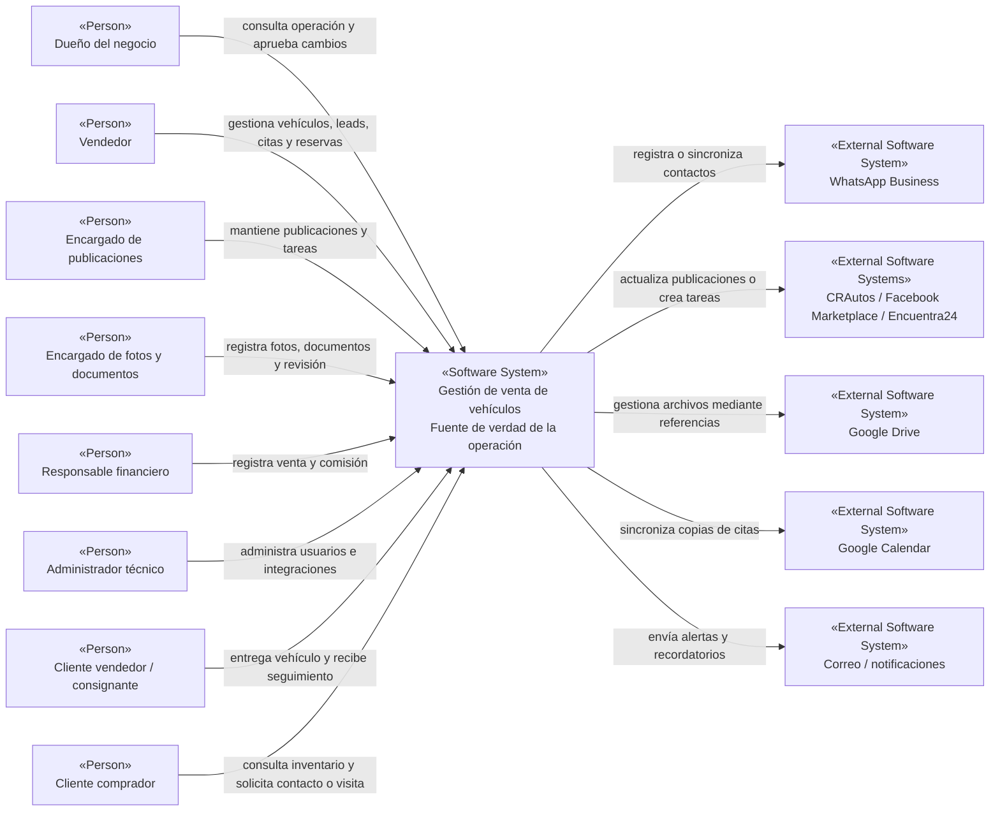
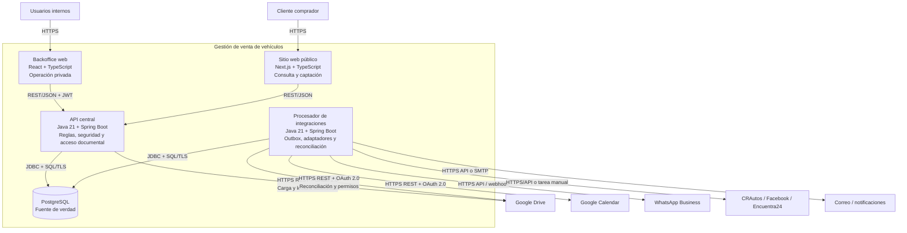
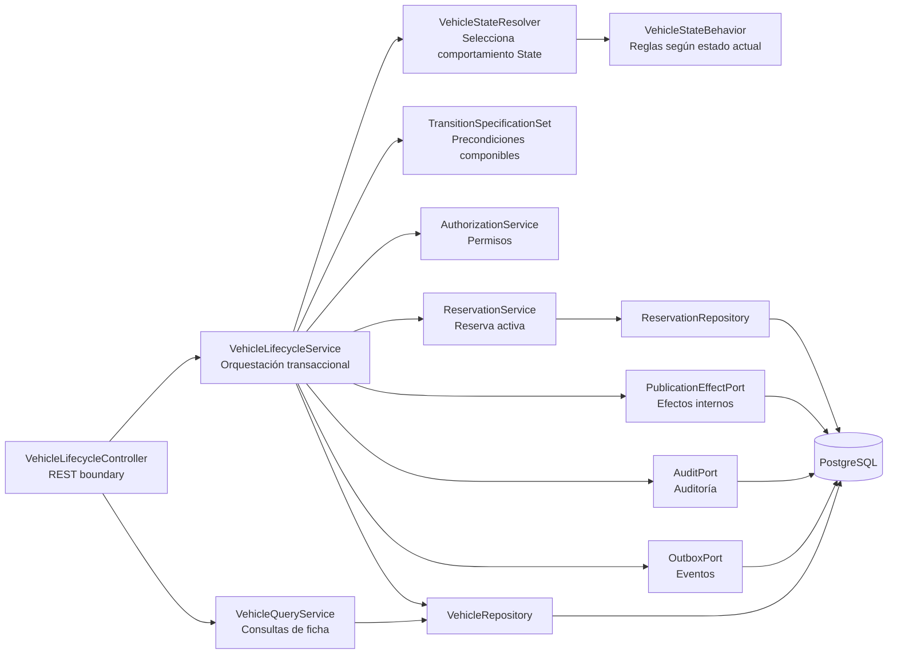
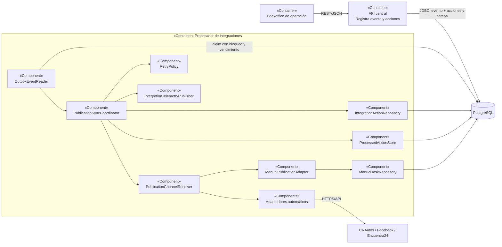
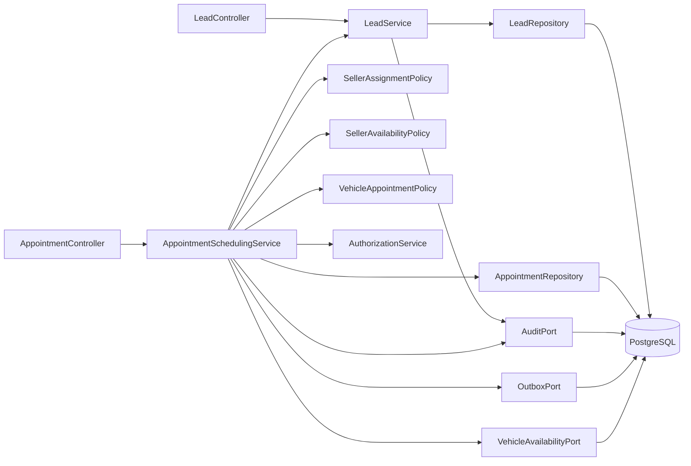
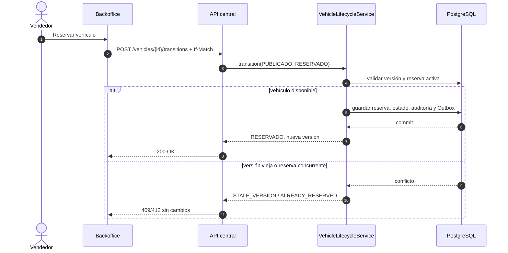
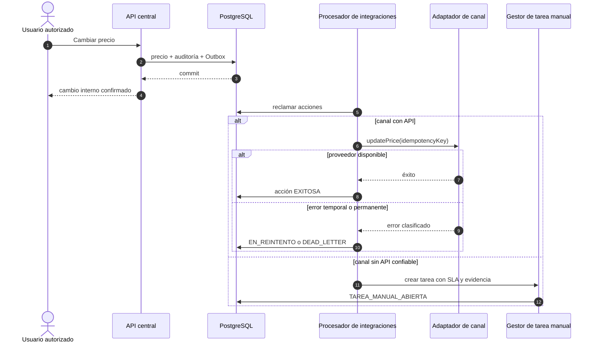
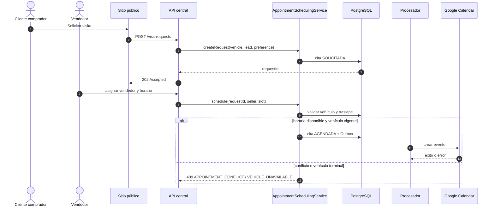
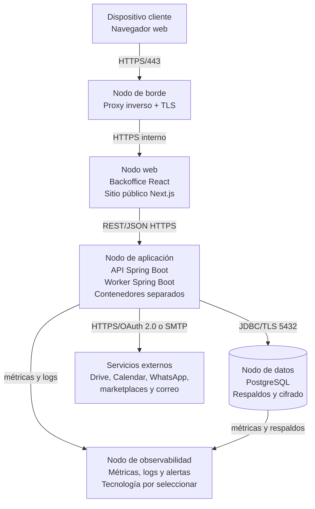
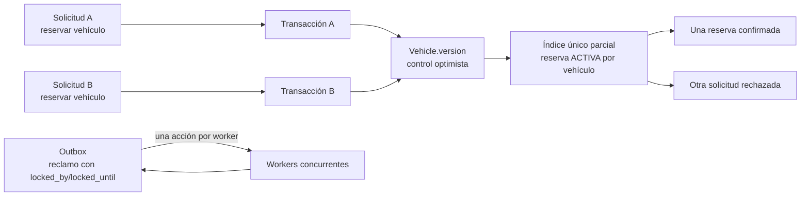

# Gestión de Venta de Vehículos
> Documento de Diseño de Software — PSWE-04  
> Universidad Cenfotec · Maestría Profesional en Ingeniería del Software

---

## Tabla de contenidos

1. [Descripción del sistema y alcance](#1-descripción-del-sistema-y-alcance)
2. [Stakeholders](#2-stakeholders)
3. [Drivers arquitectónicos](#3-drivers-arquitectónicos)
4. [Requerimientos de calidad — Escenarios](#4-requerimientos-de-calidad--escenarios)
5. [Restricciones](#5-restricciones)
6. [Principios de diseño adoptados](#6-principios-de-diseño-adoptados)
7. [Vistas arquitectónicas](#7-vistas-arquitectónicas)
8. [Estilo arquitectónico](#8-estilo-arquitectónico)
9. [Registro de decisiones — ADRs](#9-registro-de-decisiones--adrs)
10. [Diseño detallado de componentes](#10-diseño-detallado-de-componentes)
11. [Patrones de diseño aplicados](#11-patrones-de-diseño-aplicados)
12. [Principios y técnicas habilitadoras — evidencia](#12-principios-y-técnicas-habilitadoras--evidencia)
13. [Análisis de calidad del diseño](#13-análisis-de-calidad-del-diseño)
14. [Secciones específicas por tipo de sistema](#14-secciones-específicas-por-tipo-de-sistema)
15. [Tendencias y evolución del diseño](#15-tendencias-y-evolución-del-diseño)
16. [Glosario](#16-glosario)
17. [Referencias](#17-referencias)

---

# BLOQUE 1 — CONTEXTO Y PROBLEMA
*Hitos: Propuesta (S03) y Avance 1 (S07)*

---
## 1. Descripción del sistema y alcance

### 1.1 Descripción general

Gestión de Venta de Vehículos apoya la operación de un negocio que recibe vehículos de terceros para venderlos por consignación. El sistema registra el vehículo, el consignante, sus datos comerciales, el precio, las fotos, los documentos, los compradores interesados, las citas, las reservas y el cierre de la venta o el retiro del vehículo.

El problema que resuelve es la dispersión de información entre WhatsApp, hojas de cálculo, carpetas de archivos, calendarios y publicaciones externas. Esa dispersión produce precios contradictorios, seguimiento incompleto y poca claridad sobre la disponibilidad real. El valor del sistema consiste en mantener una fuente de verdad interna y hacer visible cualquier diferencia con los canales externos.

La solución no pretende reemplazar todos los canales. El sitio público, WhatsApp, Google Drive, Google Calendar y los marketplaces siguen cumpliendo funciones específicas, pero ninguna conversación, carpeta o publicación externa sustituye el registro operativo interno.

### 1.2 Contexto del negocio o dominio

La venta por consignación separa al **consignante**, que entrega el vehículo para su comercialización, del **comprador**, que consulta, visita, reserva o compra. El negocio debe mantener el vínculo con ambos, controlar quién puede cambiar el precio o la disponibilidad y conservar evidencia de las decisiones sensibles.

El vehículo atraviesa un ciclo comercial: ingreso, revisión documental y fotográfica, preparación de publicación, publicación, reserva, venta o retiro. Los clientes potenciales y las citas no forman parte del estado único del vehículo porque pueden existir varios en paralelo. La reserva sí afecta la disponibilidad y debe impedir una segunda reserva activa.

Los canales externos tienen capacidades diferentes. Algunos pueden admitir integración, otros requieren una operación manual y ninguno debe decidir el estado interno. Google Drive conserva archivos; Google Calendar recibe copias de citas; los marketplaces muestran publicaciones; WhatsApp funciona como canal de contacto. El sistema conserva metadatos, estados, permisos, auditoría y trabajo pendiente.

Los avances no documentan una evaluación jurídica completa ni una normativa específica obligatoria. Antes de una puesta en producción debe validarse el tratamiento legal aplicable a datos personales, documentos del vehículo, retención y acceso. Esta entrega define controles técnicos de privacidad, pero no sustituye esa revisión.

### 1.3 Alcance del sistema

**Dentro del alcance — el sistema HACE:**

- Registra vehículos en consignación, consignantes, datos comerciales, precio, disponibilidad y versión.
- Controla las transiciones del vehículo mediante estados, permisos, precondiciones y auditoría.
- Mantiene ciclos separados para clientes potenciales, citas y reservas.
- Permite registrar interesados desde sitio público, WhatsApp, redes sociales o marketplaces.
- Agenda, confirma, reprograma, cancela y registra el resultado de visitas.
- Conserva metadatos, clasificación y estado de revisión de fotos y documentos almacenados en Google Drive.
- Administra publicaciones por canal, incluyendo estados automáticos y tareas manuales verificables.
- Registra ventas, precio final, comisión y responsable.
- Genera auditoría funcional para cambios sensibles.
- Procesa efectos externos mediante Outbox, adaptadores, reintentos, dead-letter y recuperación.
- Aplica autenticación, autorización por rol y recurso, control de concurrencia e idempotencia.
- Expone inventario publicado mediante el sitio propio sin crear una fuente de datos independiente.

**Fuera del alcance — el sistema NO HACE:**

- No procesa pagos bancarios ni funciona como pasarela de pago.
- No ejecuta el traspaso legal completo del vehículo.
- No valida automáticamente información contra el Registro Nacional.
- No garantiza publicación automática en todos los marketplaces.
- No reemplaza un sistema contable.
- No realiza tasación oficial automática.
- No incorpora chatbot ni decisiones basadas en IA generativa.
- No convierte Google Drive, Calendar, WhatsApp o un marketplace en fuente de verdad.
- No sustituye una evaluación legal de privacidad, retención o cumplimiento normativo.

### 1.4 Usuarios y casos de uso principales

| Tipo de usuario | Casos de uso principales |
|---|---|
| Dueño del negocio | CU-01 consultar operación; CU-03 aprobar transición sensible; CU-08 revisar venta y comisión; CU-09 atender escalaciones. |
| Vendedor | CU-02 registrar o consultar vehículo; CU-04 registrar cliente potencial; CU-05 gestionar cita; CU-03 reservar o solicitar retiro autorizado. |
| Encargado de publicaciones | CU-06 crear, actualizar, verificar o retirar publicaciones; CU-09 atender tareas manuales y fallos funcionales. |
| Encargado de fotos y documentos | CU-07 cargar, clasificar, revisar y reconciliar documentos; atender alertas de permisos. |
| Responsable financiero | CU-08 cerrar venta, registrar precio final y comisión; consultar auditoría de cierre. |
| Administrador técnico | CU-09 administrar usuarios, credenciales, worker, dead-letter, replays y alertas. |
| Cliente vendedor o consignante | Consultar el avance comercial por medio del personal; autorizar cambios cuando corresponda; solicitar retiro. |
| Cliente comprador | CU-01 consultar inventario público; CU-04 registrar interés; CU-05 solicitar una visita. |

| ID | Caso de uso arquitectónicamente relevante |
|---|---|
| CU-01 | Consultar ficha, precio, estado y disponibilidad del vehículo. |
| CU-02 | Registrar y completar la ficha de un vehículo en consignación. |
| CU-03 | Cambiar el estado del vehículo, reservarlo, venderlo o retirarlo. |
| CU-04 | Registrar y dar seguimiento a un cliente potencial. |
| CU-05 | Solicitar, agendar, confirmar, reprogramar o cancelar una cita. |
| CU-06 | Crear y mantener publicaciones automáticas o manuales. |
| CU-07 | Gestionar documentos y fotos con control de acceso. |
| CU-08 | Registrar cierre de venta y comisión. |
| CU-09 | Operar integraciones, alertas, dead-letter, tareas manuales y recuperación. |

---

## 2. Stakeholders

| Stakeholder | Rol | Intereses principales | Preocupaciones o restricciones |
|---|---|---|---|
| Dueño del negocio | Responsable de la operación | Visibilidad de inventario, ventas, citas, comisiones y pendientes. | Información contradictoria, ventas sobre vehículos no disponibles y tareas externas sin atender. |
| Vendedor | Usuario operativo | Consultar datos confiables y registrar seguimiento con pocos pasos. | Lentitud, estados ambiguos y duplicidad de reservas. |
| Cliente vendedor o consignante | Propietario o representante que entrega el vehículo | Conocer publicación, interesados, cambios de precio y resultado. | Uso indebido de documentos y falta de trazabilidad. |
| Cliente comprador | Interesado en adquirir un vehículo | Ver precio, fotos y disponibilidad; solicitar visita. | Información desactualizada o citas para vehículos no disponibles. |
| Encargado de publicaciones | Responsable de canales | Saber qué debe publicar, corregir o retirar y conservar evidencia. | Marketplaces sin API confiable, credenciales vencidas y tareas vencidas. |
| Encargado de fotos y documentos | Responsable documental | Identificar faltantes y controlar revisión y acceso. | Enlaces públicos, permisos heredados, archivos maliciosos o metadatos desalineados. |
| Responsable financiero | Responsable del cierre | Registrar precio final, comisión y responsable. | Cierre sin autorización, datos incompletos o falta de auditoría. |
| Administrador técnico | Operación y soporte | Mantener usuarios, integraciones, métricas, alertas y recuperación. | Fallos silenciosos, secretos expuestos y replays duplicados. |
| Equipo de desarrollo | Evolución del software | Módulos comprensibles, pruebas aisladas y contratos estables. | Acoplamiento con proveedores y reglas duplicadas. |
| Operación del negocio | Continuidad operativa | Resolver fallos automáticos y manuales con responsables y SLA. | Trabajo pendiente oculto o sin dueño. |
| Proveedores externos | Drive, Calendar, WhatsApp, marketplaces y correo | Recibir solicitudes compatibles con sus capacidades. | Cuotas, cambios de contrato, indisponibilidad y autenticación. |
| Docente y equipo evaluador | Evaluación académica | Trazabilidad, consistencia, evidencia editable y justificación de decisiones. | Diagramas no editables, resultados no medidos presentados como hechos e inconsistencias entre vistas. |

---

## 3. Drivers arquitectónicos

### 3.1 Requerimientos funcionales clave

| ID | Requerimiento | Stakeholder | Por qué es un driver |
|---|---|---|---|
| RF-01 | Mantener inventario, precio, estado y disponibilidad en una fuente interna. | Dueño, vendedor, comprador | Obliga a centralizar las escrituras y evitar consultas en tiempo real a proveedores. |
| RF-02 | Controlar el ciclo de vida con transiciones válidas, permisos y precondiciones. | Dueño, vendedor | Impide resolver el dominio como un CRUD de estados libres. |
| RF-03 | Permitir varios clientes potenciales y citas sin cambiar por sí solos el estado del vehículo. | Vendedor, comprador | Exige separar agregados y ciclos de vida. |
| RF-04 | Actualizar publicaciones mediante integraciones automáticas o tareas manuales. | Encargado de publicaciones | Requiere puertos, adaptadores, estados por canal y consistencia eventual. |
| RF-05 | Confirmar una reserva o cambio interno aunque un proveedor falle. | Dueño, vendedor | Obliga a separar la transacción interna de los efectos externos. |
| RF-06 | Gestionar documentos en Drive sin delegar autorización ni reglas de negocio. | Consignante, encargado documental | Exige metadatos internos, acceso mediado, auditoría y reconciliación. |
| RF-07 | Registrar quién cambió precio, estado, documentos, cita o publicación. | Dueño, responsable financiero | Requiere auditoría funcional de solo inserción. |
| RF-08 | Recuperar integraciones fallidas sin repetir acciones ya exitosas. | Administrador técnico, operación | Requiere idempotencia, acciones por destino, dead-letter y replay controlado. |

### 3.2 Atributos de calidad prioritarios

| ID | Atributo | Importancia | Stakeholder | Justificación |
|---|---|---|---|---|
| QA-01 | Consistencia e integridad | Alta | Dueño, vendedor, comprador | Un estado o precio incorrecto puede producir una reserva o comunicación comercial inválida. |
| QA-02 | Resiliencia y operabilidad | Alta | Operación, administrador técnico | Los servicios externos pueden fallar y el trabajo pendiente debe permanecer visible y recuperable. |
| QA-03 | Seguridad y privacidad | Alta | Consignante, encargado documental | Se manejan documentos, teléfonos y datos comerciales sensibles. |
| QA-04 | Rendimiento | Alta | Vendedor, comprador | La ficha debe estar disponible durante la atención sin consultar proveedores externos. |
| QA-05 | Usabilidad | Media-alta | Vendedor, comprador | El registro de interesados y solicitudes debe ser rápido para evitar notas paralelas. |

### 3.3 Restricciones que actúan como drivers

| ID | Restricción | Tipo | Impacto en el diseño |
|---|---|---|---|
| REST-01 | No todos los marketplaces ofrecen una API confiable. | Técnica / externa | Se necesita una estrategia manual con SLA, evidencia y reconciliación. |
| REST-02 | Google Drive almacena los binarios, pero no controla el dominio. | Técnica | PostgreSQL conserva metadatos y la API media el acceso. |
| REST-03 | Google Calendar es un apoyo, no la agenda oficial. | Negocio / técnica | La cita se confirma primero en PostgreSQL y se sincroniza después. |
| REST-04 | El sistema no procesa pagos, traspasos legales ni contabilidad completa. | Alcance / negocio | Evita incorporar responsabilidades financieras o jurídicas ajenas al problema. |
| REST-05 | El sistema interno debe mantener la verdad oficial aunque un canal esté caído. | Negocio | Favorece consistencia local y consistencia eventual externa. |
| REST-06 | La línea tecnológica aprobada usa React, Next.js, Java 21, Spring Boot y PostgreSQL. | Técnica | Define contenedores, contratos y habilidades de implementación. |
| REST-07 | Los resultados de rendimiento o métricas de código no pueden declararse cumplidos sin pruebas ejecutadas. | Académica / evidencia | El documento separa diseño, criterio verificable y resultado medido. |

---

# BLOQUE 2 — REQUERIMIENTOS DE CALIDAD
*Hito: Avance 1 (S07)*

---

## 4. Requerimientos de calidad — Escenarios

### Escenario QS-01 — Rendimiento de consulta de inventario

| Elemento | Descripción |
|---|---|
| **Fuente del estímulo** | Vendedor o comprador desde el sitio público. |
| **Estímulo** | Consulta una ficha de vehículo durante la atención comercial. |
| **Entorno** | Horario comercial y carga normal. |
| **Artefacto** | API de consulta, proyección de inventario y PostgreSQL. |
| **Respuesta** | Retorna datos comerciales, precio, estado, disponibilidad, fotos autorizadas y estado resumido de publicaciones sin consultar proveedores externos. |
| **Medida de respuesta** | El 95 % de las consultas responde en menos de 3 segundos. |

*Tensión con:* QS-06, porque autorización, auditoría y controles adicionales consumen recursos; se evita aplicar acceso documental pesado a la consulta comercial.

### Escenario QS-02 — Cambio de precio y consistencia de publicaciones

| Elemento | Descripción |
|---|---|
| **Fuente del estímulo** | Dueño del negocio o vendedor autorizado. |
| **Estímulo** | Cambia el precio de un vehículo publicado. |
| **Entorno** | Existen uno o varios canales externos, automáticos o manuales. |
| **Artefacto** | Inventario, auditoría, publicaciones, Outbox y procesador. |
| **Respuesta** | Confirma el precio interno, conserva el valor anterior y crea una acción por publicación. |
| **Medida de respuesta** | Cambio interno en menos de 2 segundos; 100 % auditado; acciones visibles en menos de 1 minuto; intento automático antes de 20 minutos cuando el proveedor esté disponible. |

*Tensión con:* QS-04, porque priorizar la disponibilidad de la operación interna acepta un periodo de consistencia eventual con terceros.

### Escenario QS-03 — Reserva, venta o retiro consistente

| Elemento | Descripción |
|---|---|
| **Fuente del estímulo** | Vendedor o dueño autorizado. |
| **Estímulo** | Cambia un vehículo a reservado, vendido o retirado. |
| **Entorno** | Puede haber solicitudes concurrentes, clientes potenciales, citas y publicaciones activas. |
| **Artefacto** | Gestor del ciclo de vida, reservas, agenda, auditoría, publicaciones y PostgreSQL. |
| **Respuesta** | Valida transición, versión, permisos y precondiciones; impide nuevas operaciones incompatibles; genera efectos externos. |
| **Medida de respuesta** | Bloqueo interno en menos de 2 segundos; como máximo una reserva activa; ninguna transición sensible sin actor y motivo cuando aplique. |

*Tensión con:* QS-05, porque más validaciones y control de concurrencia agregan pasos, pero protegen la disponibilidad real.

### Escenario QS-04 — Falla de integración externa

| Elemento | Descripción |
|---|---|
| **Fuente del estímulo** | Drive, Calendar, WhatsApp, marketplace, correo o la red. |
| **Estímulo** | La integración no responde, rechaza la solicitud o confirma un resultado incierto. |
| **Entorno** | Operación normal con un proveedor parcial o totalmente indisponible. |
| **Artefacto** | Outbox, acción de integración, adaptador, dead-letter y tablero operativo. |
| **Respuesta** | Mantiene el cambio interno, clasifica el error, programa reintento o tarea manual, alerta y permite recuperación auditada. |
| **Medida de respuesta** | Error visible en menos de 1 minuto; toda acción conserva canal, entidad, intento, error sanitizado y responsable; alertas críticas a los umbrales definidos. |

*Tensión con:* QS-02, porque la recuperación asíncrona no garantiza actualización inmediata de todos los canales.

### Escenario QS-05 — Registro rápido de cliente potencial

| Elemento | Descripción |
|---|---|
| **Fuente del estímulo** | Vendedor o comprador desde el sitio público. |
| **Estímulo** | Registra un interés por un vehículo y una siguiente acción o solicitud de visita. |
| **Entorno** | El vendedor atiende varias conversaciones o el comprador usa un dispositivo móvil. |
| **Artefacto** | Sitio público, backoffice, LeadService y API. |
| **Respuesta** | Crea el cliente potencial con los datos mínimos y permite continuar el seguimiento. |
| **Medida de respuesta** | Registro básico en menos de 1 minuto y con no más de cinco campos obligatorios. |

*Tensión con:* QS-06, porque reducir campos mejora la usabilidad pero exige evitar recolectar datos innecesarios y validar acceso posterior.

### Escenario QS-06 — Acceso a documentos sensibles

| Elemento | Descripción |
|---|---|
| **Fuente del estímulo** | Vendedor, encargado documental, responsable financiero o administrador con excepción aprobada. |
| **Estímulo** | Intenta cargar, consultar o descargar un documento asociado a un vehículo. |
| **Entorno** | El contenido reside en Google Drive y puede ser confidencial o restringido. |
| **Artefacto** | API central, política de autorización, metadatos, inspección, auditoría y adaptador de Drive. |
| **Respuesta** | Valida rol, recurso, acción, finalidad, estado de revisión y permisos; media la transferencia y registra el resultado. |
| **Medida de respuesta** | El 100 % de accesos valida autorización; cero enlaces públicos para documentos internos, confidenciales o restringidos; todo acceso sensible queda auditado. |

*Tensión con:* QS-01 y QS-05, porque la protección añade validaciones; se limita el acceso documental a endpoints específicos.

---

## 5. Restricciones

| ID | Restricción | Tipo | Origen | Impacto en el diseño |
|---|---|---|---|---|
| REST-01 | Marketplaces con automatización desigual. | Técnica | Proveedores externos | Strategy + Adapter y proceso manual. |
| REST-02 | Binarios en Google Drive. | Técnica | Decisión de diseño aprobada | Metadatos y reglas en PostgreSQL; acceso mediado. |
| REST-03 | Agenda interna antes que Calendar. | Negocio | Operación comercial | Outbox para sincronización posterior. |
| REST-04 | Sin pagos ni traspaso legal. | Negocio / alcance | Definición del proyecto | Ventas registra cierre y comisión, no liquida dinero ni actos legales. |
| REST-05 | Consistencia fuerte dentro de una base transaccional. | Técnica / negocio | Drivers de estado y reserva | Monolito modular y PostgreSQL. |
| REST-06 | Consistencia eventual con terceros. | Técnica | Disponibilidad externa | Estados por acción, reintentos y tareas. |
| REST-07 | Protección de documentos y datos personales. | Seguridad | Stakeholders y escenario QS-06 | Autorización contextual, clasificación, auditoría e inspección. |
| REST-08 | No existe aún una implementación con resultados medidos. | Evidencia | Estado del proyecto | Los valores se presentan como metas y planes de prueba. |

---
---

## 6. Principios de diseño adoptados

| Principio | Justificación para este sistema |
|---|---|
| Fuente única de verdad | Evita decidir disponibilidad o precio a partir de mensajes, carpetas o publicaciones desactualizadas. |
| Responsabilidad única | El ciclo de vida, la agenda, las publicaciones, los documentos y la auditoría cambian por razones distintas. |
| Inversión de dependencias | Las reglas internas no deben importar clientes de Google ni SDK de marketplaces. |
| Abierto/cerrado | Debe poder agregarse un canal sin modificar el núcleo del dominio. |
| Defensa en profundidad | Permisos de aplicación, metadatos, auditoría, inspección y reconciliación protegen documentos y operaciones sensibles. |
| Mínimo privilegio | Cada rol recibe solo las acciones y documentos necesarios; el administrador técnico no tiene acceso general al contenido. |
| Idempotencia | Reintentos HTTP, worker y replays no deben duplicar reservas ni efectos externos. |
| Falla visible y recuperable | Una integración fallida conserva estado, error, responsable y procedimiento de recuperación. |
| KISS y YAGNI | Se adopta monolito modular en vez de microservicios y no se introduce un broker adicional sin necesidad demostrada. |
| Trazabilidad por diseño | Toda decisión crítica se conecta con escenario, ADR, contenedor, componente, contrato, métrica y prueba. |
---

# BLOQUE 3 — VISTAS ARQUITECTÓNICAS
*Hitos: Avance 1 (S07), Avance 2 (S11) y Entrega final (S14)*

---

## 7. Vistas arquitectónicas

La notación principal es C4 para contexto, contenedores, componentes y despliegue. Los flujos usan secuencia UML en Mermaid y la concurrencia se representa mediante un diagrama de actividad simplificado, porque esos modelos expresan mejor el orden de mensajes y las condiciones de carrera.
### 7.1 Vista de contexto

En este nivel se representa **un solo sistema de software**: Gestión de venta de vehículos. El sitio público y el backoffice no aparecen como elementos separados porque son contenedores internos y se muestran en la vista 7.2.



#### Límites del sistema

- Gestión de venta de vehículos conserva la fuente oficial de inventario, precio, estado, disponibilidad, clientes potenciales, citas, reservas, publicaciones, documentos, ventas y comisiones.
- El comprador interactúa con la solución mediante el sitio público, pero ese contenedor se detalla únicamente en la vista de contenedores.
- Los usuarios internos interactúan mediante el backoffice, también detallado en la vista siguiente.
- Google Drive almacena archivos; PostgreSQL conserva metadatos, clasificación y reglas de completitud.
- Google Calendar replica una cita interna; no sustituye la agenda comercial.
- Los marketplaces pueden operar por API o mediante tareas manuales.
- WhatsApp Business es un canal de contacto; el seguimiento formal queda dentro del sistema.

#### 7.1.1 Descripción de elementos

| Elemento | Tipo | Descripción de la relación |
|---|---|---|
| Gestión de venta de vehículos | Sistema principal | Centraliza el inventario, los estados, los precios, el seguimiento comercial, los documentos, las citas, las reservas, las ventas y el estado de las integraciones. |
| Dueño del negocio | Persona / Rol | Consulta la operación, aprueba cambios sensibles y atiende escalaciones. |
| Vendedor | Persona / Rol | Registra y consulta vehículos, clientes potenciales, citas y reservas. |
| Encargado de publicaciones | Persona / Rol | Ejecuta o verifica actualizaciones en canales automáticos y manuales. |
| Encargado de fotos y documentos | Persona / Rol | Registra archivos, revisa completitud y atiende incidencias documentales. |
| Responsable financiero | Persona / Rol | Registra el cierre de la venta y las comisiones. |
| Administrador técnico | Persona / Rol | Administra usuarios, credenciales, integraciones, alertas y recuperaciones. |
| Cliente vendedor o consignante | Persona externa | Entrega el vehículo y recibe seguimiento del proceso comercial. |
| Cliente comprador | Persona externa | Consulta el inventario y solicita información o una visita. |
| Google Drive | Sistema externo | Conserva los archivos; la aplicación mantiene metadatos, clasificación, permisos y auditoría. |
| Google Calendar | Sistema externo | Recibe una copia de las citas confirmadas sin convertirse en la agenda oficial. |
| WhatsApp Business | Sistema externo | Funciona como canal de contacto y posible origen de clientes potenciales. |
| CRAutos, Facebook Marketplace y Encuentra24 | Sistemas externos | Publican vehículos mediante integración o tareas manuales, según la capacidad del canal. |
| Correo / notificaciones | Sistema externo | Entrega alertas, recordatorios y escalaciones. |
### 7.2 Vista de estructura interna

#### 7.2.1 Justificación de notación

Se usa C4 nivel 2 porque la solución tiene cinco unidades desplegables o de almacenamiento con fronteras propias: Backoffice web, Sitio web público, API central, Procesador de integraciones y PostgreSQL. Dentro de la API y del procesador se usa C4 nivel 3 para mostrar componentes. Esta combinación es más honesta que representar todo como clases o como microservicios independientes.
#### 7.2.2 Diagrama de contenedores



#### 7.2.3 Descripción de elementos

##### Contenedores

| Contenedor | Tecnología | Responsabilidad |
|---|---|---|
| **Backoffice web** | React + TypeScript | Interfaz privada para inventario, leads, citas, documentos, reservas, ventas, comisiones, publicaciones y tareas. |
| **Sitio web público** | Next.js + TypeScript | Consulta de vehículos publicados, registro de interés y solicitud de visita. |
| **API central** | Java 21 + Spring Boot + Spring Security + Spring Data JPA | Aplica reglas de dominio, autorización, transacciones, auditoría, contratos REST y acceso síncrono mediado a documentos. |
| **Procesador de integraciones** | Java 21 + Spring Boot | Lee eventos Outbox, ejecuta adaptadores, aplica reintentos, reconcilia permisos de Drive y actualiza estados operativos. |
| **PostgreSQL** | PostgreSQL | Fuente de verdad, control de concurrencia, auditoría, metadatos documentales, estados de publicación y eventos Outbox. |

##### Relaciones y protocolos

| Origen | Destino | Protocolo | Uso |
|---|---|---|---|
| Backoffice | API central | HTTPS + REST/JSON + JWT | Operaciones autenticadas. |
| Sitio público | API central | HTTPS + REST/JSON | Inventario público, leads y solicitudes de visita. |
| API central | PostgreSQL | JDBC + SQL/TLS | Transacciones del dominio. |
| Procesador | PostgreSQL | JDBC + SQL/TLS | Reclamo de eventos, acciones y actualización de sincronizaciones. |
| API central | Google Drive | HTTPS REST + OAuth 2.0 | Carga y entrega de contenido después de autorizar en la aplicación. |
| Procesador | Google Drive | HTTPS REST + OAuth 2.0 | Reconciliación, corrección de permisos y tareas diferidas. |
| Procesador | Google Calendar | HTTPS REST + OAuth 2.0 | Copia y actualización de citas. |
| Procesador | WhatsApp Business | HTTPS API / webhook | Captación o seguimiento, según capacidades disponibles. |
| Procesador | Marketplaces | HTTPS/API o tarea manual | Publicación, precio y disponibilidad. |
| Procesador | Correo/notificaciones | HTTPS API o SMTP | Alertas y recordatorios. |

La API central accede a Drive únicamente para operaciones documentales autorizadas que necesitan respuesta síncrona. El procesador se ocupa de reconciliación, permisos y trabajos diferidos. Esta separación evita que la vista C4 contradiga el flujo detallado de documentos.
#### 7.2.4 Vista de componentes: inventario y ciclo de vida

**Contenedor:** API central.  
**Tecnología:** Java 21, Spring Boot, Spring Security y Spring Data JPA.  
**Responsabilidad del subsistema:** conservar la ficha oficial y ejecutar cambios de condición comercial sin permitir escrituras directas sobre `Vehicle.state`.



##### Responsabilidades

| Componente | Responsabilidad |
|---|---|
| `VehicleLifecycleController` | Convierte HTTP en comandos, valida encabezados y traduce errores; no decide reglas de transición. |
| `VehicleLifecycleService` | Mantiene el orden del caso de uso y delimita la transacción local. |
| `VehicleStateResolver` | Obtiene el comportamiento correspondiente al estado persistido del vehículo. |
| `VehicleStateBehavior` | Decide destinos permitidos, permiso requerido y efectos propios del estado actual. |
| `TransitionSpecificationSet` | Compone precondiciones como documentos, fotos, precio, comprador, aprobación y motivo. |
| `ReservationService` | Crea, cancela o convierte la única reserva activa permitida. |
| `PublicationEffectPort` | Marca publicaciones afectadas sin ejecutar llamadas externas. |
| `AuditPort` | Inserta evidencia funcional del cambio. |
| `OutboxPort` | Inserta la intención externa que se procesará después del `COMMIT`. |
| `VehicleQueryService` | Construye la ficha sin consultar servicios externos en tiempo real. |

**Consistencia C4:** ningún componente del backoffice, sitio público o procesador de integraciones escribe directamente en `VehicleRepository`. Toda transición entra por la API central y pasa por `VehicleLifecycleService`.
#### 7.2.5 Vista de componentes: procesador de integraciones

**Contenedor ampliado:** Procesador de integraciones.  
**Tecnología:** Java 21, Spring Boot, PostgreSQL y clientes HTTP/OAuth por proveedor.  
**Responsabilidad del contenedor:** ejecutar efectos externos sin permitir que la transacción del negocio dependa de un proveedor.

La API central aparece como contenedor de origen porque registra las acciones y el evento Outbox en PostgreSQL. Los elementos internos detallados pertenecen únicamente al Procesador de integraciones, manteniendo el nivel C4.



##### Responsabilidades

| Componente | Responsabilidad |
|---|---|
| `OutboxEventReader` | Reclama eventos elegibles con bloqueo y vencimiento para evitar consumo simultáneo y recuperar workers caídos. |
| `PublicationSyncCoordinator` | Coordina cada acción de publicación, conserva éxitos parciales y calcula el estado agregado del evento. |
| `IntegrationActionRepository` | Conserva el estado operativo de cada acción: pendiente, reintento, espera manual, éxito, dead-letter o cancelación. |
| `PublicationChannelResolver` | Selecciona el adaptador según canal y capacidad declarada. |
| `RetryPolicy` | Clasifica el error y calcula el siguiente intento sin aplicar reintentos ilimitados. |
| `ProcessedActionStore` | Evita repetir una acción ya confirmada para la pareja `eventId + targetId`. |
| Adaptadores automáticos | Traducen la intención interna al contrato real del proveedor. |
| `ManualPublicationAdapter` | Crea una tarea idempotente cuando no existe una API confiable. |
| `ManualTaskRepository` | Conserva asignación, SLA, evidencia, verificación y resultado de la tarea. |
| `IntegrationTelemetryPublisher` | Publica métricas y alertas sin guardar secretos ni datos personales. |

**Consistencia C4:** el procesador no posee un puerto de escritura sobre `Vehicle`. Solo modifica eventos, acciones de integración, publicaciones externas, tareas manuales y datos operativos.
#### 7.2.6 Vista de componentes: clientes potenciales y agenda

**Contenedor:** API central; la sincronización con Calendar se ejecuta en el Procesador de integraciones.  
**Tecnología:** Java 21, Spring Boot y PostgreSQL.  
**Responsabilidad del subsistema:** registrar el interés y convertir una solicitud de visita en una cita interna con responsable y horario válidos.



##### Responsabilidades

| Componente | Responsabilidad |
|---|---|
| `LeadService` | Registra o reutiliza un interesado con máximo cinco datos obligatorios y canal de origen. |
| `AppointmentSchedulingService` | Crea solicitudes, asigna responsable y horario, confirma, reprograma o cancela citas. |
| `SellerAssignmentPolicy` | Selecciona o valida el responsable interno antes de agendar. |
| `SellerAvailabilityPolicy` | Detecta conflictos del vendedor y restricciones del horario comercial. |
| `VehicleAppointmentPolicy` | Impide nuevas citas para vehículos `VENDIDO` o `RETIRADO`. |
| `VehicleAvailabilityPort` | Consulta el estado oficial del vehículo sin modificarlo. |
| `OutboxPort` | Solicita la sincronización posterior con Google Calendar y notificaciones. |

**Consistencia C4:** el sitio público crea una solicitud `SOLICITADA`; no asigna vendedores, no confirma citas y no llama a Google Calendar.
#### 7.2.7 Consistencia entre niveles C4

| Elemento del contexto | Contenedor responsable | Componentes principales | Regla de consistencia |
|---|---|---|---|
| Inventario y estado oficial | API central + PostgreSQL | `VehicleLifecycleService`, `VehicleQueryService` | Los canales externos nunca escriben el estado directamente. |
| Interacción del comprador | Sitio web público | `LeadService`, `AppointmentSchedulingService`, `VehicleQueryService` | El contenedor público pertenece al sistema; solo muestra vehículos autorizados y crea solicitudes, no reservas. |
| Publicaciones externas | Procesador de integraciones | `PublicationSyncCoordinator`, adaptadores | El registro interno se actualiza aunque el proveedor falle. |
| WhatsApp Business | Procesador + API central | Adaptador de contacto y `LeadService` | El canal origina o complementa un lead; no reemplaza su historial. |
| Google Calendar | Procesador de integraciones | Adaptador de calendario | La cita existe primero en PostgreSQL. |
| Google Drive | API central + procesador | `SecureDocumentService`, `DocumentStoragePort`, `DrivePermissionReconciler` | La API media carga/lectura autorizada; el procesador reconcilia permisos; PostgreSQL conserva metadatos y auditoría. |
| Usuarios internos | Backoffice | Controladores REST y servicios de aplicación | Las reglas se validan en la API, no en la interfaz. |

---
### 7.3 Vista de comportamiento

Los tres flujos siguientes cubren los casos que más presión ejercen sobre consistencia, resiliencia y concurrencia. Los diagramas detallados, clases y contratos se encuentran en la sección 10.

#### Flujo 1 — Reservar un vehículo publicado



**Descripción:** el cambio se confirma en una sola transacción. La versión optimista y el índice único de reserva activa impiden que dos solicitudes concurrentes confirmen la misma disponibilidad.

**Escenarios de calidad que valida:** QS-03 y QS-04.

#### Flujo 2 — Cambiar precio y sincronizar publicaciones



**Descripción:** el precio interno y el evento Outbox se confirman juntos. Cada destino recibe una acción independiente; un canal manual permanece pendiente hasta que exista evidencia y verificación.

**Escenarios de calidad que valida:** QS-02 y QS-04.

#### Flujo 3 — Solicitar y agendar una visita



**Descripción:** la solicitud pública no confirma por sí sola una cita. Un usuario interno asigna responsable y horario; la agenda valida el estado del vehículo y evita traslapes antes de sincronizar con Calendar.

**Escenarios de calidad que valida:** QS-03 y QS-05.
### 7.4 Vista de despliegue

La siguiente vista representa un **despliegue de referencia** coherente con los contenedores definidos. No fija un proveedor cloud; la selección de servicio administrado, región y tamaño de nodos debe ratificarse antes de implementación. La separación entre web, aplicación y datos permite aplicar TLS, respaldos, despliegue independiente del worker y límites de red.



| Nodo | Descripción | Artefactos desplegados | Conectividad |
|---|---|---|---|
| Dispositivo cliente | Navegador de usuario interno o comprador. | Aplicación web descargada o renderizada. | HTTPS/443 al borde. |
| Nodo de borde | Terminación TLS, encabezados de seguridad y proxy inverso. | Proxy inverso. | HTTPS hacia nodos web; sin acceso directo a PostgreSQL. |
| Nodo web | Sirve Backoffice y Sitio público. | React + TypeScript; Next.js + TypeScript. | HTTPS/REST hacia API. |
| Nodo de aplicación | Ejecuta lógica síncrona y trabajo asíncrono en procesos separados. | API Spring Boot; Procesador Spring Boot. | JDBC/TLS a PostgreSQL; HTTPS/OAuth 2.0 o SMTP a externos. |
| Nodo de datos | Fuente de verdad y persistencia de auditoría/Outbox. | PostgreSQL, respaldos y restauración verificada. | Puerto 5432 restringido al nodo de aplicación. |
| Nodo de observabilidad | Recibe métricas, logs y alertas. | Tecnología por seleccionar durante implementación. | Solo telemetría; acceso operativo autenticado. |

**Criterios de despliegue:**

- API y worker se despliegan como procesos separados aunque compartan código Java.
- PostgreSQL no se expone a Internet.
- Los secretos no se incluyen en imágenes ni repositorio; se inyectan mediante el mecanismo seguro del entorno.
- El worker puede detenerse sin impedir transacciones internas; el backlog y su edad deben generar alertas.
- Respaldos y restauración deben probarse antes de producción.
### 7.5 Vista de concurrencia

**¿Aplica esta sección?** Sí. El sistema recibe solicitudes simultáneas de reserva y cita, y ejecuta varios workers sobre acciones Outbox. Existen condiciones de carrera sobre reservas activas, versiones de vehículo, horarios de vendedores y reclamo de acciones.



| Recurso compartido | Mecanismo de sincronización | Riesgo | Mitigación |
|---|---|---|---|
| `Vehicle.version` | Control optimista con `If-Match` | Sobrescribir una transición reciente. | Actualización condicionada por versión y respuesta `412`. |
| Reserva activa por vehículo | Índice único parcial en PostgreSQL | Dos reservas confirmadas. | Restricción de base de datos y manejo de conflicto. |
| Agenda de un vendedor | Restricción de traslape y validación transaccional | Dos citas en el mismo intervalo. | Exclusión de intervalo o restricción equivalente en la base. |
| Acción de integración | Reclamo con `locked_by` y `locked_until` | Dos workers ejecutan el mismo efecto. | Arrendamiento temporal, estado `EN_PROCESO` e idempotency key. |
| Replay de dead-letter | Permiso, motivo e idempotencia | Repetir una acción exitosa. | Replay por `actionId`, reconciliación previa y conservación de éxitos. |
| Tarea manual | Clave única por acción y canal | Duplicidad de trabajo. | Una tarea activa por intención y cancelación de tareas incompatibles. |
---

# BLOQUE 4 — DECISIONES ARQUITECTÓNICAS
*Hito: Avance 2 (S11)*

---

## 8. Estilo arquitectónico

### 8.1 Estilo(s) adoptado(s)

| Estilo | Aplicación en el sistema | Justificación |
|---|---|---|
| Monolito modular | La API central se despliega como una aplicación y se divide en inventario, leads, agenda, reservas, publicaciones, documentos, ventas, auditoría e integraciones. | Permite transacciones locales para reserva, estado, auditoría y Outbox sin introducir coordinación distribuida prematura. |
| Puertos y adaptadores | El dominio consume interfaces para persistencia, Calendar, Drive, publicaciones y notificaciones. | Aísla contratos externos y permite canales automáticos y manuales. |
| Procesamiento dirigido por eventos | Los cambios internos generan eventos Outbox y acciones por destino. | Evita bloquear la operación por la latencia o indisponibilidad de terceros. |
| Capas de aplicación y dominio | Controladores traducen HTTP; servicios coordinan casos de uso; entidades y políticas conservan reglas. | Evita que la interfaz o un adaptador decidan transiciones del negocio. |

### 8.2 Alternativas consideradas y rechazadas

| Alternativa | Por qué se consideró | Por qué se rechazó |
|---|---|---|
| Microservicios desde el inicio | Despliegue y escalamiento independiente por dominio. | Una reserva cruza inventario, reserva, auditoría, publicación y Outbox; exigiría sagas, mensajería, tracing y contratos distribuidos sin una necesidad de escala demostrada. |
| Monolito CRUD por capas | Menor cantidad inicial de clases y desarrollo rápido. | Permitiría escribir estados desde distintos servicios y dispersaría permisos, precondiciones y efectos externos. |
| Llamadas síncronas a proveedores | Aparente actualización inmediata del canal. | Una falla o latencia externa bloquearía la transacción y podría dejar resultados inciertos. |
| Event Sourcing completo | Historial exhaustivo y reconstrucción temporal. | Agrega complejidad de proyecciones, evolución de eventos y operación no justificada para el alcance. |
| Broker de mensajería desde la primera versión | Desacoplamiento y throughput. | PostgreSQL Outbox cubre la necesidad inicial con menos infraestructura; un broker queda como punto de evolución. |
| Motor BPM/workflow | Modelado gráfico del proceso. | El ciclo actual es acotado y puede expresarse con State, políticas y pruebas sin una plataforma adicional. |

### 8.3 Análisis de trade-offs del estilo elegido

| Trade-off | Qué se gana | Qué se sacrifica | Escenario afectado |
|---|---|---|---|
| Transacción local vs. escalamiento independiente | Consistencia simple y menor complejidad operativa. | No se escala cada módulo de la API por separado. | QS-03. |
| Outbox vs. actualización externa inmediata | Resiliencia y no pérdida de la intención. | Consistencia eventual y estados operativos adicionales. | QS-02, QS-04. |
| Adaptadores por canal vs. una integración genérica | Aislamiento de cambios y manejo específico de errores. | Más interfaces y clases. | QS-04. |
| Seguridad documental mediada vs. enlace directo | Autorización, auditoría y revocación central. | Mayor latencia y dependencia de la API para descargar. | QS-06. |
| Estado + especificaciones vs. condicionales simples | Reglas localizadas y extensibles. | Mayor número de objetos y necesidad de disciplina de diseño. | QS-03. |
## 9. Registro de decisiones — ADRs

Los ADRs aceptados se conservan en archivos individuales dentro de `/decisiones`. No se reescriben para ocultar decisiones anteriores; una modificación significativa crea una nueva decisión o declara que otra fue superada.

| ADR | Decisión | Estado | Archivo |
|---|---|---|---|
| ADR-001 | PostgreSQL como fuente de verdad interna | Aceptado | [`ADR-001-postgresql-fuente-de-verdad.md`](../decisiones/ADR-001-postgresql-fuente-de-verdad.md) |
| ADR-002 | Separar ciclos de vida de vehículo, lead, cita y reserva | Aceptado | [`ADR-002-separar-ciclos-de-vida.md`](../decisiones/ADR-002-separar-ciclos-de-vida.md) |
| ADR-003 | Gestor central para transiciones de vehículo | Aceptado | [`ADR-003-gestor-ciclo-de-vida.md`](../decisiones/ADR-003-gestor-ciclo-de-vida.md) |
| ADR-004 | Adaptadores separados por sistema externo | Aceptado | [`ADR-004-adaptadores-externos.md`](../decisiones/ADR-004-adaptadores-externos.md) |
| ADR-005 | Estado de publicación y Outbox transaccional | Aceptado | [`ADR-005-outbox-transaccional.md`](../decisiones/ADR-005-outbox-transaccional.md) |
| ADR-006 | Archivos en Drive y metadatos en PostgreSQL | Aceptado | [`ADR-006-drive-y-metadatos.md`](../decisiones/ADR-006-drive-y-metadatos.md) |
| ADR-007 | Auditoría funcional append-only | Aceptado | [`ADR-007-auditoria-append-only.md`](../decisiones/ADR-007-auditoria-append-only.md) |
| ADR-008 | Observabilidad, dead-letter y recuperación del Outbox | Aceptado | [`ADR-008-observabilidad-outbox.md`](../decisiones/ADR-008-observabilidad-outbox.md) |
| ADR-009 | Operación controlada de canales manuales | Aceptado | [`ADR-009-canales-manuales.md`](../decisiones/ADR-009-canales-manuales.md) |
| ADR-010 | Seguridad y privacidad de documentos en Drive | Aceptado | [`ADR-010-seguridad-documentos-drive.md`](../decisiones/ADR-010-seguridad-documentos-drive.md) |

### ADR-001 — PostgreSQL como fuente de verdad interna

| Campo | Valor |
|---|---|
| **Estado** | Aceptado |
| **Fecha** | 2026-07-23 |
| **Autores** | Alejandro, William, Rodolfo |
| **Drivers relacionados** | Repositorio centralizado, trazabilidad, respuesta rápida |
| **Escenarios S07** | 1, 2, 3, 4 y 6 |

#### Contexto

Precio, disponibilidad y estado pueden aparecer en varios canales. Los servicios externos pueden quedar temporalmente desactualizados o no estar disponibles.

#### Decisión

PostgreSQL mantiene la versión oficial de vehículos, precios, estados, clientes potenciales, citas, reservas, publicaciones, metadatos de documentos, ventas, comisiones, auditoría y eventos Outbox.

Todos los cambios se realizan por la API central.

#### Alternativas consideradas

1. usar cada sistema externo como fuente de verdad de su área;
2. conservar inventario en hojas de cálculo;
3. mantener una base separada por módulo desde la primera versión.

#### Consecuencias positivas

- existe un único lugar para determinar la situación real del vehículo;
- las consultas no dependen de servicios externos;
- se facilita la auditoría;
- sitio público y backoffice consumen los mismos datos.

#### Consecuencias negativas

- PostgreSQL se vuelve crítico para la operación;
- se necesitan respaldos, monitoreo y recuperación;
- hay que sincronizar cambios hacia canales externos.

---

**Revisión requerida si:** la disponibilidad, el volumen o el crecimiento del equipo exigen partición, réplicas o separación de datos por servicio.

**Archivo individual:** [`ADR-001-postgresql-fuente-de-verdad.md`](../decisiones/ADR-001-postgresql-fuente-de-verdad.md)


---

### ADR-002 — Separar el ciclo de vida del vehículo de clientes potenciales y citas

| Campo | Valor |
|---|---|
| **Estado** | Aceptado |
| **Fecha** | 2026-07-23 |
| **Autores** | Alejandro, William, Rodolfo |
| **Drivers relacionados** | Ciclo de vida, consistencia de estado, trazabilidad |
| **Escenarios S07** | 3 y 5 |

#### Contexto

S07 describió `CON_CLIENTE_POTENCIAL_ACTIVO` y `CITA_AGENDADA` como hitos del proceso. En diseño detallado, un vehículo puede tener varios interesados y varias citas de manera concurrente.

#### Decisión

El estado del vehículo representa solamente su condición comercial:

```text
INGRESADO -> PENDIENTE_DOCUMENTACION -> PENDIENTE_FOTOS -> LISTO_PARA_PUBLICAR -> PUBLICADO -> RESERVADO -> VENDIDO
```

`RETIRADO` funciona como salida permitida desde estados definidos.

Los clientes potenciales, citas y reservas tienen ciclos de vida propios y se relacionan con el vehículo por identificador.

#### Alternativas consideradas

1. mantener todas las actividades en un único enum de `Vehicle.state`;
2. calcular el estado del vehículo únicamente a partir de citas, leads y reservas;
3. usar un motor BPM para modelar todo el proceso.

#### Consecuencias positivas

- permite varios interesados y varias citas simultáneas;
- el estado del vehículo expresa disponibilidad real;
- reduce transiciones artificiales como `CITA_AGENDADA -> PUBLICADO`;
- simplifica reglas de publicación y reserva.

#### Consecuencias negativas

- aumenta la cantidad de entidades y estados;
- algunas pantallas deben combinar información de vehículo, leads y citas;
- los reportes de “etapa comercial” requieren una proyección, no solo leer `Vehicle.state`.

---

**Revisión requerida si:** el negocio adopta un proceso configurable que requiera un motor de workflow o reglas dinámicas por tipo de vehículo.

**Archivo individual:** [`ADR-002-separar-ciclos-de-vida.md`](../decisiones/ADR-002-separar-ciclos-de-vida.md)


---

### ADR-003 — El Gestor del ciclo de vida controla toda transición de vehículo

| Campo | Valor |
|---|---|
| **Estado** | Aceptado |
| **Fecha** | 2026-07-23 |
| **Autores** | Alejandro, William, Rodolfo |
| **Drivers relacionados** | Ciclo de vida, seguridad, auditoría |
| **Escenarios S07** | 2, 3 y 6 |

#### Contexto

El estado del vehículo controla qué operaciones son válidas. Un `UPDATE state='VENDIDO'` directo permitiría saltarse permisos, precondiciones, auditoría y efectos sobre publicaciones.

#### Decisión

Todo cambio de estado pasa por `VehicleLifecycleService`, que valida:

- transición permitida;
- autorización del actor;
- versión concurrente del vehículo;
- precondiciones del dominio;
- cambios relacionados;
- auditoría;
- evento Outbox cuando existan efectos externos.

No se expone un endpoint CRUD para modificar `state` directamente.

#### Alternativas consideradas

1. validar únicamente en la interfaz;
2. distribuir las reglas entre controladores y servicios;
3. usar un motor de workflow desde la primera versión.

#### Consecuencias positivas

- existe un único punto para proteger las transiciones;
- las reglas pueden probarse unitariamente;
- una pantalla o integración no puede saltarse el ciclo de vida;
- el cambio se coordina con auditoría y publicaciones.

#### Consecuencias negativas

- el componente concentra reglas importantes;
- cambiar el ciclo de vida exige actualizar pruebas y políticas;
- debe evitarse convertir el servicio en una clase con demasiadas responsabilidades.

---

**Revisión requerida si:** las políticas de transición dejan de ser estables, varían por unidad de negocio o el componente concentra responsabilidades fuera del ciclo de vida.

**Archivo individual:** [`ADR-003-gestor-ciclo-de-vida.md`](../decisiones/ADR-003-gestor-ciclo-de-vida.md)


---

### ADR-004 — Adaptadores separados para cada sistema externo

| Campo | Valor |
|---|---|
| **Estado** | Aceptado |
| **Fecha** | 2026-07-23 |
| **Autores** | Alejandro, William, Rodolfo |
| **Drivers relacionados** | Integraciones con distinto nivel de madurez, crecimiento de canales |
| **Escenarios S07** | 4 |

#### Contexto

Google Drive, Google Calendar, WhatsApp Business y marketplaces tienen capacidades y contratos diferentes. Algunos canales pueden no ofrecer una API adecuada.

#### Decisión

El núcleo define puertos como:

```text
DocumentStoragePort
CalendarPort
PublicationChannelPort
NotificationPort
```

Cada proveedor implementa su adaptador. Un canal manual implementa la misma intención de negocio creando una tarea en vez de ejecutar una API.

#### Alternativas consideradas

1. llamadas directas a proveedores desde módulos internos;
2. un único servicio con condicionales por proveedor;
3. manejar canales manuales fuera del sistema.

#### Consecuencias positivas

- cambios de proveedor quedan aislados;
- reglas internas pueden probarse con dobles de prueba;
- agregar un canal no cambia el ciclo de vida del vehículo;
- canales automáticos y manuales usan un modelo común de publicación.

#### Consecuencias negativas

- aumenta el número de interfaces y clases;
- cada adaptador necesita manejo propio de autenticación y errores;
- se requiere monitoreo por canal.

---

**Revisión requerida si:** se incorpora una plataforma corporativa de integración o los proveedores convergen en un contrato común verificable.

**Archivo individual:** [`ADR-004-adaptadores-externos.md`](../decisiones/ADR-004-adaptadores-externos.md)


---

### ADR-005 — Publicaciones con estado propio y Outbox transaccional

| Campo | Valor |
|---|---|
| **Estado** | Aceptado |
| **Fecha** | 2026-07-23 |
| **Autores** | Alejandro, William, Rodolfo |
| **Drivers relacionados** | Consistencia con publicaciones externas, resiliencia |
| **Escenarios S07** | 2, 3 y 4 |

#### Contexto

Una reserva, venta, retiro o cambio de precio debe quedar confirmado aunque un marketplace no responda.

#### Decisión

Cada publicación externa tiene estado propio:

```text
ACTUALIZADA
PENDIENTE
EN_REINTENTO
MANUAL
FALLIDA_PERMANENTE
CERRADA
```

La API escribe el cambio de negocio y el evento Outbox en la misma transacción. El procesador de integraciones ejecuta después la actualización externa.

#### Alternativas consideradas

1. esperar la API externa dentro de la solicitud del usuario;
2. confirmar el dominio y publicar un mensaje después sin garantía transaccional;
3. introducir un broker de mensajería adicional desde el inicio.

#### Consecuencias positivas

- el negocio no depende del tiempo de respuesta de terceros;
- el evento no se pierde entre `COMMIT` y publicación;
- se soportan reintentos e idempotencia;
- el pendiente queda visible.

#### Consecuencias negativas

- existe consistencia eventual;
- se necesita un worker y monitoreo;
- aparecen estados operativos adicionales.

---

#### Enmienda de entrega final

La operación se completa con estados de evento, dead-letter, alertas y recuperación definidos en ADR-008.

**Revisión requerida si:** el volumen o la latencia requerida supera el sondeo sobre PostgreSQL y justifica un broker de mensajería.

**Archivo individual:** [`ADR-005-outbox-transaccional.md`](../decisiones/ADR-005-outbox-transaccional.md)


---

### ADR-006 — Archivos en Google Drive y metadatos en PostgreSQL

| Campo | Valor |
|---|---|
| **Estado** | Aceptado |
| **Fecha** | 2026-07-23 |
| **Autores** | Alejandro, William, Rodolfo |
| **Drivers relacionados** | Seguridad, privacidad, repositorio centralizado |
| **Escenarios S07** | 6 |

#### Contexto

Google Drive es adecuado para almacenar archivos, pero un archivo o enlace aislado no permite aplicar reglas de negocio ni saber su estado dentro del proceso.

#### Decisión

El archivo físico se conserva en Drive. PostgreSQL guarda:

- identificador interno;
- vehículo asociado;
- tipo de documento;
- referencia de Drive;
- estado de revisión;
- clasificación de sensibilidad;
- responsable y fechas;
- información de auditoría necesaria.

Las reglas de completitud documental consultan metadatos internos.

#### Alternativas consideradas

1. guardar binarios en PostgreSQL;
2. usar solo carpetas de Drive;
3. implementar almacenamiento propio desde el inicio.

#### Consecuencias positivas

- Drive no se convierte en motor de reglas;
- se puede saber si la documentación está completa sin consultar Drive en cada operación;
- se mantiene trazabilidad;
- la base transaccional no almacena binarios grandes.

#### Consecuencias negativas

- hay que detectar enlaces rotos;
- permisos de Drive y aplicación deben mantenerse alineados;
- se requieren verificaciones periódicas para archivos relevantes.

---

#### Enmienda de entrega final

El acceso a documentos sensibles se media por la API; no se permiten enlaces públicos permanentes. Clasificación, autorización, reconciliación y respuesta ante permisos excesivos se detallan en ADR-010.

**Revisión requerida si:** Drive deja de cumplir los requisitos de seguridad, volumen, retención o recuperación y se requiere almacenamiento dedicado.

**Archivo individual:** [`ADR-006-drive-y-metadatos.md`](../decisiones/ADR-006-drive-y-metadatos.md)


---

### ADR-007 — Auditoría de solo inserción para cambios sensibles

| Campo | Valor |
|---|---|
| **Estado** | Aceptado |
| **Fecha** | 2026-07-23 |
| **Autores** | Alejandro, William, Rodolfo |
| **Drivers relacionados** | Trazabilidad comercial, seguridad |
| **Escenarios S07** | 2, 3 y 6 |

#### Contexto

Cambios de precio, estado, reserva, documentos, citas y publicaciones deben conservar responsable, fecha y motivo cuando aplique.

#### Decisión

Se utiliza una bitácora funcional de solo inserción. Cada registro conserva como mínimo:

- entidad e identificador;
- acción;
- actor;
- fecha/hora;
- valor anterior y nuevo cuando corresponda;
- motivo;
- origen;
- `correlationId`.

La bitácora no reemplaza los logs técnicos.

#### Alternativas consideradas

1. confiar únicamente en logs de aplicación;
2. usar solo `updated_at` y `updated_by`;
3. adoptar Event Sourcing completo.

#### Consecuencias positivas

- permite reconstruir cambios sensibles;
- facilita investigar diferencias de precio o estado;
- soporta trazabilidad sin exigir Event Sourcing.

#### Consecuencias negativas

- aumenta el volumen de datos;
- hay que evitar guardar secretos o datos personales innecesarios;
- se debe controlar quién puede consultar la bitácora.

---

**Revisión requerida si:** una auditoría externa exige almacenamiento WORM, firma criptográfica o reconstrucción completa mediante Event Sourcing.

**Archivo individual:** [`ADR-007-auditoria-append-only.md`](../decisiones/ADR-007-auditoria-append-only.md)


---

### ADR-008 — Observabilidad, dead-letter y recuperación del Outbox

| Campo | Valor |
|---|---|
| **Estado** | Aceptado |
| **Fecha** | 2026-08-06 |
| **Autores** | Alejandro, William, Rodolfo |
| **Versión** | 1.1 |
| **Drivers** | Resiliencia, operabilidad, trazabilidad |
| **Escenarios S07** | 2 y 4 |

#### Contexto

El Outbox evita perder intenciones externas, pero una fila pendiente sin alertas, responsable ni procedimiento de recuperación puede permanecer sin atención. También existe riesgo de declarar una operación terminada cuando solo se creó una tarea manual, o de convertir un evento completo en fallo aunque otros canales ya hayan terminado correctamente.

#### Decisión

Se separan tres ciclos:

- evento Outbox: `PENDING`, `PROCESSING`, `RETRY_SCHEDULED`, `WAITING_MANUAL`, `PROCESSED`, `DEAD_LETTER`, `CANCELLED`;
- acción de integración: `PENDIENTE`, `EN_PROCESO`, `EN_REINTENTO`, `TAREA_MANUAL_ABIERTA`, `EXITOSA`, `DEAD_LETTER`, `CANCELADA`;
- estado de la entidad externa, como publicación o cita.

Dead-letter se controla por acción. El estado del evento se calcula a partir de sus acciones: una tarea manual abierta produce `WAITING_MANUAL`; una acción no resuelta en dead-letter produce `DEAD_LETTER`; el evento llega a `PROCESSED` solo cuando todas las acciones están `EXITOSA` o `CANCELADA`.

Los errores temporales usan espera creciente. Toda recuperación requiere permiso, motivo, auditoría, verificación del estado externo e idempotencia. El replay se dirige a acciones concretas y no repite acciones exitosas.

Se exponen métricas de edad, volumen, tasa de éxito, tareas manuales vencidas, dead-letter y replays. El administrador técnico responde por credenciales o worker; el responsable funcional atiende contenido, agenda o tareas manuales.

#### Alternativas consideradas

1. reintentar indefinidamente;
2. revisar la tabla Outbox solo cuando alguien reporte un problema;
3. marcar el evento procesado al crear una tarea manual;
4. mover todo el evento a dead-letter por el fallo de un único canal;
5. borrar eventos fallidos y recrearlos manualmente.

#### Consecuencias positivas

- fallos visibles y asignables;
- estados coherentes entre trabajo automático y manual;
- conservación de éxitos parciales;
- recuperación reproducible y auditada;
- menor riesgo de duplicar operaciones.

#### Consecuencias negativas

- más estados, métricas y reglas de agregación;
- se necesita mantener un runbook y responsables;
- dead-letter y tareas manuales requieren disciplina de cierre.

**Revisión requerida si:** cambian los SLO, aumenta significativamente el volumen de acciones o la operación requiere automatizar más decisiones de recuperación.

**Archivo individual:** [`ADR-008-observabilidad-outbox.md`](../decisiones/ADR-008-observabilidad-outbox.md)


---

### ADR-009 — Operación controlada de canales manuales

| Campo | Valor |
|---|---|
| **Estado** | Aceptado |
| **Fecha** | 2026-08-06 |
| **Autores** | Alejandro, William, Rodolfo |
| **Versión** | 1.1 |
| **Drivers** | Consistencia con publicaciones, trazabilidad, canales heterogéneos |
| **Escenarios S07** | 2, 3 y 4 |

#### Contexto

CRAutos, Facebook Marketplace o Encuentra24 pueden no ofrecer una API confiable para todas las operaciones. Una anotación informal no permite saber quién debe actualizar, cuándo vence, qué valor debe quedar visible ni cómo se confirma el resultado.

#### Decisión

`ManualPublicationAdapter` crea una tarea idempotente con vehículo, publicación, acción, valor esperado, responsable, SLA, evidencia y verificador. Mientras la tarea está abierta, la acción de integración queda `TAREA_MANUAL_ABIERTA` y el evento Outbox `WAITING_MANUAL`; crear la tarea no equivale a completar la sincronización.

La verificación de evidencia cambia la acción a `EXITOSA`, actualiza la publicación y recalcula el evento. La tarea permanece visible al vencer. Las acciones críticas de precio o disponibilidad requieren verificación por una persona distinta. Una reconciliación periódica compara tareas y publicaciones con la fuente interna.

#### Alternativas consideradas

1. manejar el trabajo por WhatsApp o correo;
2. marcar la acción como completada al crear la tarea;
3. excluir canales sin API del alcance;
4. automatizar con navegación no soportada o frágil.

#### Consecuencias positivas

- la consistencia eventual incluye trabajo humano trazable;
- se pueden medir vencimientos y tiempos de ejecución;
- se evita prometer automatización inexistente;
- los cambios posteriores cancelan tareas incompatibles.

#### Consecuencias negativas

- depende de disciplina operativa;
- requiere tablero, asignación y verificación;
- el marketplace todavía puede moderar o retrasar el cambio fuera del control del negocio.

**Revisión requerida si:** el canal obtiene una API estable o el SLA manual deja de ser sostenible para el volumen operativo.

**Archivo individual:** [`ADR-009-canales-manuales.md`](../decisiones/ADR-009-canales-manuales.md)


---

### ADR-010 — Seguridad y privacidad de documentos almacenados en Google Drive

| Campo | Valor |
|---|---|
| **Estado** | Aceptado |
| **Fecha** | 2026-08-06 |
| **Autores** | Alejandro, William, Rodolfo |
| **Versión** | 1.1 |
| **Drivers** | Seguridad, privacidad, trazabilidad |
| **Escenarios S07** | 6 |

#### Contexto

Los documentos del vehículo y del consignante contienen información sensible. Guardarlos en Drive reduce la carga de binarios en PostgreSQL, pero un enlace público, permiso heredado, archivo malicioso o acceso técnico amplio puede saltarse las reglas de la aplicación.

#### Decisión

Drive conserva el contenido y PostgreSQL los metadatos. La API central media la carga y lectura síncrona después de autorizar por rol, recurso, acción y finalidad. El Procesador de integraciones ejecuta reconciliación de existencia y permisos.

No se permiten enlaces públicos permanentes para información interna, confidencial o restringida. Todo archivo debe superar validación de tipo, tamaño y contenido antes de quedar disponible. Si la inspección no está disponible, el archivo permanece `PENDIENTE_REVISION`.

Los accesos distinguen autorización concedida, transferencia completada y transferencia fallida. El administrador técnico no recibe acceso general al contenido; una excepción requiere documento específico, aprobación, motivo, vencimiento y auditoría. Reducir la clasificación de un documento restringido requiere dos roles distintos.

#### Alternativas consideradas

1. compartir enlaces de Drive directamente;
2. usar únicamente permisos de carpetas como autorización;
3. guardar todos los binarios en PostgreSQL;
4. permitir acceso completo al administrador técnico;
5. aceptar cargas sin inspección cuando el validador no esté disponible.

#### Consecuencias positivas

- control uniforme desde la API;
- menor riesgo de enlaces reutilizables;
- detección de desalineación entre permisos internos y Drive;
- archivos no verificados no quedan disponibles;
- evidencia precisa del acceso y la entrega.

#### Consecuencias negativas

- la descarga depende de la API y del adaptador;
- se necesita reconciliación, inspección y respuesta a incidentes;
- clasificación, finalidades y retención deben mantenerse por tipo documental.

**Revisión requerida si:** cambia el proveedor de almacenamiento o una evaluación legal o de seguridad exige controles adicionales de cifrado, retención o residencia.

**Archivo individual:** [`ADR-010-seguridad-documentos-drive.md`](../decisiones/ADR-010-seguridad-documentos-drive.md)
